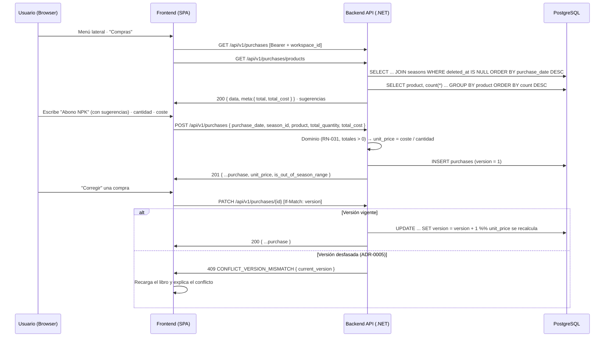

# TDD: MVP-303 — Registro de compras operativas

> **Referencia al spec**: [spec.md](./spec.md)

## Resumen técnico

Segunda entidad operativa del producto: `PURCHASE` (`purchases`, agregado y tabla nuevos) con
producto en **texto libre** (RN-031), cantidad, coste, fecha y **temporada** (RN-021). Los endpoints
ya estaban contratados en `contratos-api.md` §7.

La historia **materializa `P-050`**: `season_id` era obligatorio en el contrato y el ER no lo
declaraba. Y hereda sin cambios el patrón operativo que estrenó `MVP-301` —`version` + `If-Match` +
`409` (ADR-0005), `deleted_at` (RN-037) con el filtro de vivos en el puerto, y la guarda de vínculo
con `FOREIGN_KEY_WORKSPACE_MISMATCH`—, que es exactamente lo que aquella historia perseguía al
estrenarlo: que esta no tuviera que volver a decidirlo.

Añade una pieza propia: **sugerencias de material desde el histórico** (HU-2).

### Decisión previa obligada: el modelo del consumo de `MVP-304`

El spec de esta historia advertía que **el modelo del consumo condiciona a las compras** y que había
que decidirlo *antes* de cerrar este esquema (hallazgo `G-2`). Decisión tomada aquí:

> **El consumo será `PURCHASE_CONSUMPTION` con `purchase_id` anulable, no una entidad propia.**

Motivos:

- **Es el mismo hecho.** «Se han consumido X unidades de Y en el terreno Z el día D, con coste C» no
  cambia de naturaleza porque exista o no una compra detrás; lo único que cambia es de dónde sale el
  coste. Dos entidades para un mismo hecho obligarían al diario (`MVP-305`) y al dashboard
  (`MVP-004`) a unir dos tablas con las mismas columnas.
- **El ER ya lo anticipa** desde la 3ª pasada de `MVP-299`: `purchase_id` anulable, más `date`,
  `season_id` y `product` propios.
- **El contrato también**: `POST /purchases/{id}/consumptions` y `POST /consumptions` devuelven el
  mismo recurso, con `purchase_id: null` y `proportional_cost: 0` en el segundo caso.

Consecuencias que esta historia deja preparadas:

- **`unit_price` se persiste** en la compra aunque sea derivable. Es lo que `MVP-304` usará para el
  coste proporcional, y guardarlo permite explicar una imputación antigua aunque la compra se edite
  después (RN-032, «no se recalculan históricos»).
- **El consumo guardará su propio `product`**, copiado de la compra al imputar. La fila queda
  autoexplicativa y el diario no depende de un `JOIN` que a veces existe y a veces no.
- **Editar una compra no recalcula sus imputaciones.** Es coherente con RN-032 y con persistir
  `unit_price`; queda anotado aquí porque es una consecuencia del modelo, no del código de `MVP-304`.

### Otras decisiones de diseño

- **Cantidad y coste estrictamente positivos.** El contrato dice `> 0`; además `total_quantity = 0`
  haría **indefinido** el precio unitario. Se rechazan con `VALIDATION_PURCHASE_TOTALS_RANGE`.
- **`unit_price` se deriva de los valores ya redondeados** que se van a persistir, no de los que
  llegan: así el precio unitario guardado es exactamente el que explica la fila.
- **Las sugerencias son vocabulario, no catálogo** (RN-031). `GET /api/v1/purchases/products` agrupa
  el histórico **vivo** del Workspace por producto y devuelve los más usados primero. No se
  administran, no se normalizan y el usuario siempre puede escribir algo que no esté. Lo eliminado
  deja de sugerirse: si se retiró, no conviene volver a proponerlo.
- **No se normaliza el nombre del producto.** A diferencia del catálogo de tareas, aquí no hay
  invariante de unicidad que proteger: si alguien ha escrito «Abono NPK» y «abono npk», las
  sugerencias muestran las dos y a partir de ahora se elige una. Normalizar escondería el problema en
  vez de resolverlo, y reescribir el histórico está fuera de alcance.
- **El endpoint de listado devuelve `meta.total_cost`**, el gasto acumulado de lo filtrado. La
  cabecera del libro lo muestra y calcularlo en cliente obligaría a rehacerlo en cada consumidor.
- **Las temporadas cerradas siguen siendo válidas** para una compra: RN-024 dice que cerrar es
  informativo y no bloquea altas ni ediciones.
- **`is_out_of_season_range`** se deriva en lectura, igual que en la actividad (RN-023).
- **Alta en línea, corrección en modal.** La estructura del prototipo (`ComprasView`): cabecera con
  gasto acumulado, formulario en línea y tabla. Apuntar gastos es escribir varias líneas seguidas —el
  mismo razonamiento del catálogo de tareas en `MVP-205`—, mientras que corregir es puntual y en una
  tabla de seis columnas la edición en línea sería peor que un formulario con etiquetas.
- **El formulario en línea no pregunta la temporada**: usa la activa (RN-021) y lo dice bajo el
  formulario. Cambiarla es posible al corregir, que es el caso raro.

## Diagrama de flujo



## Componentes afectados

### Backend

| Componente | Tipo de cambio | Descripción |
| ---------- | -------------- | ----------- |
| `Domain/Purchases/Purchase.cs` | nuevo | Agregado; producto libre, totales positivos, `unit_price` derivado, versión y baja lógica |
| `Domain/Purchases/IPurchaseRepository.cs` | nuevo | Puerto + `PurchaseFilter` + `PurchaseView` + `ProductSuggestion` |
| `Domain/Purchases/PurchaseValidationException.cs` | nuevo | Error de validación con código de contrato (400) |
| `Application/Purchases/Commands/PurchaseCommands.cs` | nuevo | Comandos de alta, edición parcial y borrado |
| `Application/Purchases/PurchaseHandlers.cs` | nuevo | `PurchaseSeasonResolver` + los cinco casos de uso |
| `Infrastructure/Data/Repositories/PurchaseRepository.cs` | nuevo | Adaptador EF Core (filtro de vivos, proyección, filtros, agrupación de sugerencias) |
| `Infrastructure/Data/Migrations/20260729153948_AddPurchases.cs` | nuevo | Crea `purchases` con `ix_purchases_live_by_date` y los índices de filtro |
| `Controllers/PurchasesController.cs` | nuevo | `GET/POST/PATCH/DELETE /purchases` + `GET /purchases/products` |
| `Common/Errors/{ErrorCodes,ApiError}.cs` | modificado | Códigos de compra y su 404 |
| `Infrastructure/Data/TerrenarioDbContext.cs` | modificado | Mapeo de `Purchase` + `DbSet` + token de concurrencia |
| `Program.cs` | modificado | DI del repositorio, el resolutor de temporada y los handlers |

### Frontend

| Componente | Tipo de cambio | Descripción |
| ---------- | -------------- | ----------- |
| `types/purchase.types.ts` · `services/purchase.service.ts` | nuevo | Tipos y servicio sobre el cliente HTTP común, con `If-Match` |
| `components/purchases/ComprasView.tsx` | nuevo | Libro de gastos: cabecera con acumulado, alta en línea, filtros y tabla |
| `components/purchases/PurchaseFormModal.tsx` | nuevo | Corrección con aviso RN-023 y precio unitario en vivo |
| `App.tsx` | modificado | Ruta `/app/compras` (fuera de la guarda de oferta de temporada) |
| `components/layout/AppSidebar.tsx` | modificado | «Compras» deja de estar en «Pronto» |
| `components/layout/AppLayout.tsx` | modificado | Título de cabecera de la ruta |

## Diseño detallado

### Modelo de datos

```sql
CREATE TABLE purchases (
    id             UUID PRIMARY KEY,
    workspace_id   UUID NOT NULL REFERENCES workspaces(id) ON DELETE CASCADE,
    season_id      UUID NOT NULL REFERENCES seasons(id)    ON DELETE RESTRICT,
    purchase_date  DATE NOT NULL,
    product        VARCHAR(150)  NOT NULL,
    total_quantity NUMERIC(10,2) NOT NULL,
    total_cost     NUMERIC(10,2) NOT NULL,
    unit_price     NUMERIC(10,4) NOT NULL,
    created_by     UUID NOT NULL,
    created_at     TIMESTAMPTZ NOT NULL,
    updated_by     UUID NOT NULL,
    updated_at     TIMESTAMPTZ NOT NULL,
    version        BIGINT NOT NULL,
    deleted_at     TIMESTAMPTZ NULL
);

CREATE INDEX ix_purchases_live_by_date
    ON purchases (workspace_id, purchase_date) WHERE deleted_at IS NULL;
```

Más los índices de apoyo `(workspace_id, season_id)` para el filtro por campaña y
`(workspace_id, product)` para la agrupación de sugerencias. `season_id` es `RESTRICT` porque las
temporadas no se borran: se cierran (`MVP-203`).

### API / Contratos

```yaml
# GET /api/v1/purchases              [RequireWorkspaceScope]
query: { product?, season_id?, from?, to? }        # product = búsqueda parcial, insensible a mayúsculas
responses:
  200: { data: [ {...purchase} ], meta: { total, total_cost } }   # orden: purchase_date DESC

# GET /api/v1/purchases/products     [RequireWorkspaceScope]
query: { search? }
responses:
  200: { data: [ { product, times_used } ], meta: { total } }     # más usados primero, máx. 20

# POST /api/v1/purchases             [RequireWorkspaceScope]
request: { purchase_date*, season_id*, product*, total_quantity*, total_cost* }
responses:
  201: { ...purchase, unit_price, version: 1 }
  400: VALIDATION_PURCHASE_REQUIRED_FIELDS | VALIDATION_PURCHASE_REQUIRED_PRODUCT
     | VALIDATION_PURCHASE_PRODUCT_LENGTH | VALIDATION_PURCHASE_TOTALS_RANGE
     | FOREIGN_KEY_WORKSPACE_MISMATCH

# PATCH /api/v1/purchases/{id}       If-Match: <version>    (campos parciales)
# DELETE /api/v1/purchases/{id}      If-Match: <version>    (baja lógica, RN-037)
responses: 200/204 | 400 VALIDATION_REQUIRED_IF_MATCH | 404 | 409 CONFLICT_VERSION_MISMATCH
```

### Lógica de negocio

- **Alta.** El dominio valida forma y rangos **antes** de consultar la temporada, igual que en
  actividades. `unit_price = round(total_cost / total_quantity, 4)` sobre los valores ya redondeados.
- **Edición parcial.** `FieldUpdate<T>`: un campo ausente conserva su valor, pero `unit_price`
  **siempre se recalcula** porque es derivado; cambiar solo el coste cambia el precio unitario y no
  el producto ni la cantidad (hay test de regresión).
- **Sugerencias.** `GROUP BY product` sobre las compras vivas del Workspace, con `count(*)` y tope de
  20. La agrupación se proyecta a un tipo anónimo y no directamente al record del dominio: EF no sabe
  traducir un `ORDER BY` sobre los miembros de un record posicional, la misma lección que dejó
  `ActivityView` en `MVP-301` (`P-014`).
- **Borrado.** Lógico, con la versión vigente. Lo eliminado desaparece del libro, del total acumulado
  y de las sugerencias, pero la fila permanece.

## Alternativas descartadas

| Alternativa | Por qué se descartó |
| ----------- | ------------------- |
| Entidad de consumo propia en vez de `purchase_id` anulable | Duplicaría el mismo hecho en dos tablas y obligaría a unirlas en el diario y el dashboard |
| Derivar `unit_price` en cada lectura | Una imputación antigua no podría explicarse tras editar la compra (RN-032) |
| Catálogo cerrado de materiales | RN-031 fija texto libre; el catálogo es alcance de las tareas, no de las compras |
| Normalizar el producto o impedir duplicados | No hay invariante que proteger; escondería «Abono NPK» / «abono npk» en vez de dejar elegir |
| Calcular el gasto acumulado en cliente | Cada consumidor tendría que rehacerlo, y con paginación (`P-051`) dejaría de ser correcto |
| Bloquear compras en temporadas cerradas | RN-024: cerrar es informativo y no bloquea |
| Modal también para el alta | Apuntar gastos es escribir varias líneas seguidas; el prototipo ya usa formulario en línea |
| Edición en línea en la tabla | Seis columnas: sería peor que un formulario con etiquetas |

## Riesgos e impacto

| Riesgo | Probabilidad | Mitigación |
| ------ | ------------ | ---------- |
| Fuga de datos entre Workspaces | baja | Todo filtra por `workspace_id`, incluidas las sugerencias; verificado con dos Workspaces reales |
| Dos personas pisándose una corrección | media | `version` + `If-Match` + 409, verificado end-to-end en la UI |
| Precio unitario incoherente con lo persistido | baja | Se deriva de los valores ya redondeados; test de dominio del redondeo a 4 decimales |
| Consulta de sugerencias no traducible a SQL | media | Test contra SQLite real de la agrupación, el filtro parcial, el aislamiento y la exclusión de eliminadas |
| Vocabulario de producto disperso | media | Sugerencias por frecuencia; la normalización queda fuera de alcance por decisión, no por olvido |
| El libro crece sin paginación | media | Mismo punto que el diario: `MVP-999`, `P-051` |
| Bloqueo del borrado de una compra con imputaciones | media | Lo decide `MVP-304`, que es quien introduce la relación; anotado en su sección de modelo |

## Impacto en la usabilidad

- **Una entrada de menú que deja de estar en «Pronto»** («Compras»). El shell no cambia.
- **Registrar una compra son cuatro campos en una línea** y el foco vuelve al producto al guardar,
  para poder encadenar varias.
- **Las sugerencias aparecen mientras se escribe** (`datalist` nativo) sin impedir escribir algo
  nuevo.
- **La temporada no se pregunta en el alta**: se usa la activa y se dice bajo el formulario. Cambiarla
  es posible al corregir.
- **Sin temporada no se puede comprar** (RN-021): en vez de fallar al guardar, la vista lo explica y
  enlaza al maestro, igual que hace el diario con sus maestros.
- **El aviso de fecha fuera de temporada** aparece en el formulario y como etiqueta en la fila.
- **El conflicto de edición no es un callejón**: se recarga el libro y se explica.
- **En esta historia no se puede eliminar desde la UI**: el borrado con confirmación es `MVP-305`
  (la ruta y la semántica ya están entregadas). Limitación deliberada de la rebanada.
- **Defecto heredado detectado y no corregido aquí**: en `TareasView` (`MVP-205`) el foco **no**
  vuelve al campo tras añadir una tarea, aunque su `tech-design` lo afirma. La causa es que
  `focus()` se llama mientras el input sigue `disabled`. Se ha implementado bien en esta vista y el
  defecto queda registrado en `MVP-999` (`P-053`) en vez de corregirse fuera de alcance.

## Plan de testing

> Referencia: `docs/04-ingenieria/estrategia-testing.md`

- [x] Tests unitarios de dominio (`PurchaseTests`): alta con producto normalizado y precio unitario
  derivado, redondeo a 4 decimales, producto vacío y demasiado largo, los cuatro casos de totales no
  positivos, compra sin temporada, recálculo del precio al editar, `EnsureVersion` y borrado lógico
  idempotente.
- [x] Tests de handlers (`PurchaseHandlersTests`): alta y persistencia; temporada de otro Workspace →
  `FOREIGN_KEY_WORKSPACE_MISMATCH` sin persistir; validación de dominio **antes** de consultar el
  maestro; 404 fuera del Workspace; 409 con versión desfasada sin guardar; **regresión de `PATCH`
  parcial** (cambiar solo el coste conserva producto y cantidad y sí recalcula el precio unitario);
  borrado lógico y 409 al borrar con versión vieja.
- [x] Tests contra SQLite real (`PurchaseRepositorySqliteTests`): resolución de la temporada y
  aislamiento, exclusión de las eliminadas con la fila aún en base de datos, orden por fecha de
  compra, filtros por producto parcial / temporada / rango de fechas, `is_out_of_season_range`,
  **agrupación de sugerencias** por frecuencia, búsqueda parcial y exclusión de eliminadas y de otros
  Workspaces, y traducción de la colisión de versión.
- [x] Verificación end-to-end real (API :5127 + PostgreSQL + UI conducida :5173):
  - API: libro vacío; alta con espacios sobrantes → producto normalizado y `unit_price` derivado; los
    cuatro rechazos de validación (`TOTALS_RANGE` ×2, `REQUIRED_FIELDS` sin temporada,
    `FOREIGN_KEY_WORKSPACE_MISMATCH` con temporada de otro Workspace); sugerencias ordenadas por
    frecuencia y con búsqueda parcial; `meta.total_cost` coherente con el filtro; `PATCH` sin
    `If-Match` → 400; con versión vieja → 409 con `current_version`; `PATCH` parcial que conserva
    producto y cantidad y recalcula el precio; `DELETE` sin `If-Match` → 400, con versión → 204,
    repetido → 404; tras el borrado la compra sale del libro, del acumulado y de las sugerencias;
    `PATCH` desde otro Workspace → 404; el otro Workspace no ve ni compras ni sugerencias.
  - Datos: la compra eliminada **sigue en `purchases`** con `deleted_at`; producto con acentos
    almacenado correctamente en UTF-8 (`c3 b3` para «ó»).
  - UI conducida: alta en línea con sugerencias cargadas, gasto acumulado actualizado, foco de vuelta
    al producto y campos limpios; la sugerencia recién usada sube en la lista; modal de corrección con
    los valores actuales, precio unitario en vivo y aviso de fecha fuera de rango; **conflicto de
    versión provocado desde la API con el modal abierto** → el libro recarga, muestra el cambio ajeno
    y lo explica. Sin errores de consola de estas vistas.
- [ ] Tests de integración contra PostgreSQL: `MVP-501`. Tests unitarios de frontend: `P-012`/`P-023`.

Resultado local: `dotnet test` en verde (439 tests, 28 nuevos); `npm run build` y `npm run lint` sin
errores nuevos.

## Checklist de implementación

- [x] Diseño técnico revisado
- [x] Migración preparada y aplicada en local (`AddPurchases`)
- [x] Tests escritos y pasando (dominio + handlers + SQLite real)
- [x] Documentación de API actualizada (`contratos-api.md` §7)
- [x] Modelo de datos actualizado (`PURCHASE` completo; `P-050` cerrado)
- [x] Decisión de modelo de `MVP-304` tomada y documentada **antes** de cerrar este esquema
- [x] Puntos de coherencia registrados en `MVP-999` (`P-050` resuelto; `P-053` foco en `TareasView`,
  `P-054` campos del prototipo no portados)
- [x] Verificación end-to-end real (API + PostgreSQL + UI conducida)
- [x] Sin `TODO` sin resolver en este documento
