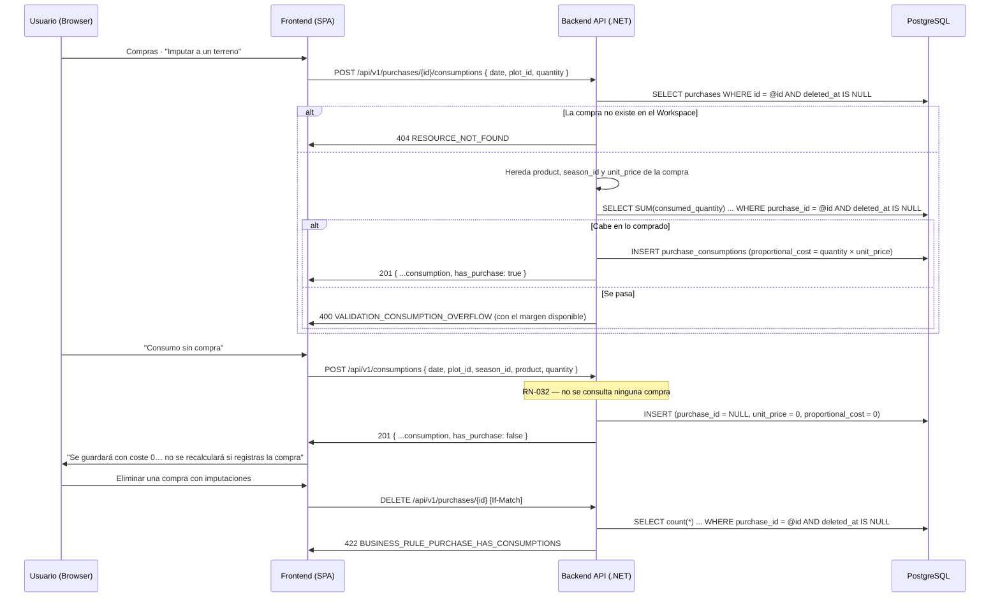

# TDD: MVP-304 — Imputación de compras y consumo sin compra previa

> **Referencia al spec**: [spec.md](./spec.md)

## Resumen técnico

Tercera y última entidad operativa de la épica: `PURCHASE_CONSUMPTION` (`purchase_consumptions`).
Cubre **los dos casos con una sola entidad**, según el mecanismo que ya se decidió en `MVP-303`
—porque aquel spec exigía cerrarlo antes de fijar el modelo de compras—:

- **Imputación** (`POST /purchases/{id}/consumptions`): reparte una compra entre terrenos con cantidad
  aproximada y coste proporcional (HU-1, CA-1).
- **Consumo sin compra previa** (`POST /consumptions`, `purchase_id: null`): la ausencia de compra
  **nunca** bloquea el registro; el coste es `0` y la respuesta lo señala (HU-2, CA-2, RN-032).

Hereda de `MVP-301` la concurrencia optimista y la baja lógica, y de `MVP-303` el `unit_price` que
hace posible el coste proporcional.

### Decisiones de producto y de diseño tomadas en esta historia

- **`unit_price` se congela en el consumo.** La fila guarda su propio precio unitario, copiado de la
  compra al imputar. Es lo que hace verdadero el **CA-3 por estructura** y no por convención: editar
  la compra después no reescribe el coste de lo ya consumido, y registrar una compra posterior no da
  coste retroactivo a un consumo que se guardó sin ella (RN-032). El ER no lo declaraba; se añade.
- **La fila guarda también su propio `product`**, heredado de la compra al imputar. La proyección de
  lectura **no une con `purchases`**: el consumo se explica solo, que es lo que necesita el diario de
  `MVP-305` cuando el registro no tiene compra detrás.
- **`has_purchase` en la respuesta.** `proportional_cost: 0` es ambiguo —¿fue gratis o no se sabe?—.
  El booleano lo desambigua y es la señal con la que la UI avisa (CA-2). El listado añade además
  `meta.without_purchase`: es la medida del «impacto en la calidad del dato» que pide el CA-3 de la
  épica, y permite avisar en conjunto y no solo fila a fila.
- **Guarda de sobre-imputación** (`VALIDATION_CONSUMPTION_OVERFLOW`): no se puede repartir más
  material del que se compró. Cuenta solo las imputaciones **vivas**, así que retirar una libera su
  cantidad. El mensaje dice **cuánto queda**: un error que no explica el margen no es accionable. Al
  editar se excluye la propia fila, o corregir una cantidad al alza sería imposible.
- **El reparto exacto sí se admite**: el límite es «no más de lo comprado», no «menos de lo
  comprado». Repartir el 100% de una compra es el caso normal, no un error.
- **Una compra con imputaciones vivas no se puede dar de baja** (`422
  BUSINESS_RULE_PURCHASE_HAS_CONSUMPTIONS`, decisión de esta historia; quedó anotada como riesgo
  abierto en `MVP-303`). Las tres alternativas eran: borrar en cascada, dejar las imputaciones
  huérfanas o bloquear. Se bloquea porque las imputaciones son **registros operativos propios**, con
  su terreno y su fecha, que están en el diario: llevárselas en cascada eliminaría datos que nadie
  pidió eliminar, y dejarlas sin compra les quitaría el origen de su coste sin avisar. El mensaje dice
  cuántas hay. La FK es además `RESTRICT` como red por debajo.
- **La temporada de una imputación se hereda de la compra y no se puede cambiar al imputar**:
  desalinearía el reparto respecto del gasto. Al corregir un consumo ya existente sí se admite, que es
  la vía para arreglar un error de captura.
- **El consumo sin compra no consulta ninguna compra.** No hay «buscar si existe una compra parecida»:
  RN-032 dice que la ausencia de compra no bloquea, y emparejar por nombre sería justo el recálculo
  retroactivo que la regla prohíbe.
- **Un solo formulario para los dos casos** en la UI, porque es un solo hecho. Lo que cambia —de dónde
  sale el coste— se dice explícitamente: con compra se muestra el coste proporcional que se va a
  guardar y cuánto queda por repartir; sin compra, un aviso de que el coste será 0 y de que registrar
  la compra más tarde no lo recalculará.

## Diagrama de flujo



## Componentes afectados

### Backend

| Componente | Tipo de cambio | Descripción |
| ---------- | -------------- | ----------- |
| `Domain/Consumptions/PurchaseConsumption.cs` | nuevo | Agregado con las dos fábricas (`ImputeFromPurchase`, `RegisterWithoutPurchase`), precio congelado, versión y baja lógica |
| `Domain/Consumptions/IConsumptionRepository.cs` | nuevo | Puerto + `ConsumptionFilter` + `ConsumptionView` + las sumas por compra |
| `Domain/Consumptions/ConsumptionValidationException.cs` | nuevo | Error de validación con código de contrato (400) |
| `Domain/Purchases/PurchaseBusinessRuleException.cs` | nuevo | Regla de negocio de compras (422) |
| `Application/Consumptions/Commands/ConsumptionCommands.cs` | nuevo | Comandos de imputación, consumo, edición y borrado |
| `Application/Consumptions/ConsumptionHandlers.cs` | nuevo | `ConsumptionLinkResolver`, `PurchaseImputationGuard` y los cinco casos de uso |
| `Application/Purchases/PurchaseHandlers.cs` | modificado | `DeletePurchaseHandler` rechaza la baja si hay imputaciones vivas |
| `Infrastructure/Data/Repositories/ConsumptionRepository.cs` | nuevo | Adaptador EF Core (filtro de vivos, proyección, sumas por compra) |
| `Infrastructure/Data/Migrations/20260729163341_AddPurchaseConsumptions.cs` | nuevo | Crea `purchase_consumptions` con `purchase_id` anulable e índice parcial de vivos |
| `Controllers/ConsumptionsController.cs` | nuevo | `GET/POST/PATCH/DELETE /consumptions` |
| `Controllers/PurchasesController.cs` | modificado | `POST /purchases/{id}/consumptions`, `imputed_quantity`/`pending_quantity` y el 422 de la baja |
| `Common/Errors/{ErrorCodes,ApiError}.cs` | modificado | Códigos de consumo, `VALIDATION_CONSUMPTION_OVERFLOW` y la regla de negocio |
| `Infrastructure/Data/TerrenarioDbContext.cs` | modificado | Mapeo de `PurchaseConsumption` + `DbSet` |
| `Program.cs` | modificado | DI del repositorio, resolutor, guarda y handlers |

### Frontend

| Componente | Tipo de cambio | Descripción |
| ---------- | -------------- | ----------- |
| `types/consumption.types.ts` · `services/consumption.service.ts` | nuevo | Tipos y servicio con las dos rutas de alta |
| `components/purchases/ConsumptionFormModal.tsx` | nuevo | Un formulario para los dos casos, con coste proyectado o aviso de coste 0 |
| `components/purchases/ComprasView.tsx` | modificado | Columna «imputado / total», acción de imputar, sección de consumos y aviso agregado |
| `types/purchase.types.ts` | modificado | `imputed_quantity` y `pending_quantity` |

## Diseño detallado

### Modelo de datos

```sql
CREATE TABLE purchase_consumptions (
    id                UUID PRIMARY KEY,
    workspace_id      UUID NOT NULL REFERENCES workspaces(id) ON DELETE CASCADE,
    purchase_id       UUID NULL     REFERENCES purchases(id)  ON DELETE RESTRICT,  -- RN-032
    plot_id           UUID NOT NULL REFERENCES plots(id)      ON DELETE RESTRICT,
    season_id         UUID NOT NULL REFERENCES seasons(id)    ON DELETE RESTRICT,
    date              DATE NOT NULL,
    product           VARCHAR(150)  NOT NULL,
    consumed_quantity NUMERIC(10,2) NOT NULL,
    unit_price        NUMERIC(10,4) NOT NULL,
    proportional_cost NUMERIC(10,2) NOT NULL,
    created_by        UUID NOT NULL,
    created_at        TIMESTAMPTZ NOT NULL,
    updated_by        UUID NOT NULL,
    updated_at        TIMESTAMPTZ NOT NULL,
    version           BIGINT NOT NULL,
    deleted_at        TIMESTAMPTZ NULL
);

CREATE INDEX ix_purchase_consumptions_live_by_date
    ON purchase_consumptions (workspace_id, date) WHERE deleted_at IS NULL;
```

Más `(workspace_id, purchase_id)` —la suma de la guarda de sobre-imputación— y
`(workspace_id, plot_id)`.

**Añadidos al ER** en esta historia, sobre lo que ya recogió la 3ª pasada de `MVP-299`:
`unit_price` (precio congelado), la trazabilidad completa (`created_by`, `updated_by`, `updated_at`),
`version` y `deleted_at`. El ER solo declaraba `created_at`, pese a que el spec pedía el patrón
operativo completo y el contrato lo exige para las entidades críticas.

### API / Contratos

```yaml
# POST /api/v1/purchases/{id}/consumptions    [RequireWorkspaceScope]
request: { date*, plot_id*, quantity* }        # product, season y unit_price los pone la compra
responses:
  201: { ...consumption, has_purchase: true, proportional_cost }
  400: VALIDATION_CONSUMPTION_QUANTITY_RANGE | VALIDATION_CONSUMPTION_OVERFLOW
     | FOREIGN_KEY_WORKSPACE_MISMATCH
  404: RESOURCE_NOT_FOUND                      # la compra no existe, es de otro Workspace o está eliminada

# POST /api/v1/consumptions                   [RequireWorkspaceScope]
request: { date*, plot_id*, season_id*, product*, quantity* }
responses:
  201: { ...consumption, purchase_id: null, has_purchase: false, proportional_cost: 0 }

# GET /api/v1/consumptions
query: { from?, to?, plot_id?, season_id?, purchase_id? }
responses: 200 { data, meta: { total, total_cost, without_purchase } }   # orden: date DESC

# PATCH /api/v1/consumptions/{id}   If-Match   ·   DELETE /api/v1/consumptions/{id}   If-Match
# DELETE /api/v1/purchases/{id}     →  422 BUSINESS_RULE_PURCHASE_HAS_CONSUMPTIONS si tiene imputaciones vivas
```

> **Nota de contrato heredada** (`P-043`): en el alta, un `product` en blanco responde
> `VALIDATION_REQUIRED` y no `VALIDATION_CONSUMPTION_REQUIRED_PRODUCT`, porque `[Required]` lo rechaza
> en el borde de transporte antes de llegar al dominio. Es el comportamiento ya documentado para el
> resto de altas de la API; el código específico aparece en el `PATCH`.

### Lógica de negocio

- **Imputación.** Se lee la compra (404 si no procede), se validan los vínculos que aporta el usuario
  —solo el terreno; la temporada viene de la compra y ya está validada—, el dominio construye el
  agregado y **después** se consulta la suma para la guarda. Ese orden evita gastar la suma en una
  petición que el dominio ya iba a rechazar.
- **Consumo sin compra.** No toca `IPurchaseRepository` en ningún punto (hay test que lo comprueba):
  es la garantía de que nada relacionado con compras puede bloquear el registro.
- **Edición.** `Update` no toca `UnitPrice`; recalcula el coste con el precio congelado. Si la fila es
  una imputación, se vuelve a comprobar la guarda excluyéndose a sí misma.
- **Listado.** Filtros y orden sobre columnas reales antes de proyectar (`P-014`); desempate por fecha
  de captura en memoria (`P-031`).
- **Sumas.** `SUM` sobre conjunto vacío es `NULL` en SQL, así que se proyecta a `decimal?` y se
  colapsa a `0`; hay test específico, porque si no la guarda reventaría en la primera imputación de
  cada compra.

### Cliente (frontend)

La sección «Consumos por terreno» vive **bajo el libro de compras** y no en otra pantalla: es la
contrapartida de la compra —dónde acabó el material—, y separarlas obligaría a saltar entre pantallas
para una misma tarea. La columna «imputado / total» del libro se calcula con **una sola** consulta
agrupada para todas las compras del listado.

## Alternativas descartadas

| Alternativa | Por qué se descartó |
| ----------- | ------------------- |
| Entidad de consumo propia, separada de la imputación | Duplicaría el mismo hecho; decidido ya en `MVP-303` |
| Derivar el coste desde el `unit_price` **actual** de la compra | Editar la compra reescribiría el coste de lo ya consumido (RN-032) |
| Unir con `purchases` en la lectura para obtener el producto | El consumo sin compra no tendría producto, y el diario dependería de un `JOIN` que a veces no existe |
| Emparejar un consumo sin compra con una compra posterior | Es exactamente el recálculo retroactivo que RN-032 prohíbe (CA-3) |
| Borrar en cascada las imputaciones al dar de baja la compra | Eliminaría registros operativos del diario que nadie pidió eliminar |
| Dejar las imputaciones huérfanas | Su coste perdería el origen sin avisar |
| Permitir cambiar la temporada al imputar | Desalinearía el reparto respecto del gasto |
| Rechazar el reparto exacto del 100% | Repartir toda la compra es el caso normal |
| Dos formularios distintos en la UI | Es un solo hecho; lo que cambia es de dónde sale el coste, y eso se dice |

## Riesgos e impacto

| Riesgo | Probabilidad | Mitigación |
| ------ | ------------ | ---------- |
| Repartir más de lo comprado | media | Guarda con suma de vivas, con el margen en el mensaje; test de límite exacto y de exclusión de la propia fila |
| Coste histórico reescrito al editar la compra | media | `unit_price` congelado en la fila; test de dominio y verificación end-to-end |
| Consumo sin compra que gana coste al aparecer la compra | media | No hay emparejamiento; test SQLite que crea la compra después y comprueba que el consumo sigue a 0 |
| Compra eliminada dejando imputaciones huérfanas | media | 422 con el número de imputaciones + FK `RESTRICT` |
| `SUM` nulo en la primera imputación | media | Proyección a `decimal?` con colapso a 0 y test específico |
| Fuga entre Workspaces | baja | Todo filtra por `workspace_id`, incluidas las sumas; verificado con dos Workspaces |
| El listado de consumos crece sin paginación | media | Mismo punto que el diario y el libro: `MVP-999`, `P-051` |

## Impacto en la usabilidad

- **No hay pantalla nueva.** La imputación es una acción por fila del libro de compras y los consumos
  se listan debajo: la tarea «he comprado esto y lo he gastado allí» se resuelve sin cambiar de sitio.
- **Se ve cuánto queda por repartir** en la columna «imputado / total» y dentro del formulario; el
  botón de imputar se deshabilita —explicando por qué— cuando la compra ya está repartida del todo.
- **El coste proporcional se muestra antes de guardar**, no después.
- **El aviso de coste 0 es explícito y dice sus dos consecuencias**: queda el registro de qué y dónde,
  pero no de cuánto, y registrar la compra más tarde no lo recalculará (CA-2/CA-3).
- **El impacto en la calidad del dato es visible en conjunto**: «Hay N consumos registrados sin compra
  previa», sobre la tabla, además del distintivo por fila.
- **El error de sobre-imputación dice cuánto cabe**, no solo que no cabe.
- **En esta historia no se puede eliminar un consumo desde la UI**: el borrado con confirmación es
  `MVP-305`. La ruta y la semántica ya están entregadas.
- **Punto detectado, no corregido aquí**: los modales de la aplicación no atrapan el foco, así que los
  controles del fondo siguen siendo alcanzables con el teclado mientras hay un modal abierto. Es
  transversal a todos los modales desde `MVP-202`, no algo que introduzca esta historia; registrado en
  `MVP-999` (`P-055`).

## Plan de testing

> Referencia: `docs/04-ingenieria/estrategia-testing.md`

- [x] Tests unitarios de dominio (`PurchaseConsumptionTests`): herencia desde la compra y coste
  proporcional; consumo sin compra con coste 0 y `has_purchase: false`, con fecha de negocio y
  temporada propias; recálculo con el **precio congelado** al editar; el consumo sin compra sigue a 0
  al editarlo; cantidad no positiva; producto obligatorio; terreno obligatorio; `EnsureVersion`;
  borrado lógico idempotente.
- [x] Tests de handlers (`ConsumptionHandlersTests`): imputación que hereda producto, temporada y
  precio; 404 si la compra no está en el Workspace; **sobre-imputación** rechazada sin persistir y con
  el margen en el mensaje; **reparto exacto admitido**; terreno de otro Workspace; consumo sin compra
  que **no consulta ninguna compra**; temporada de otro Workspace; edición que **excluye la propia
  fila** de la guarda; 409 por versión desfasada; y las dos caras de la guarda de baja de compra
  (422 con imputaciones vivas, permitida sin ellas).
- [x] Tests contra SQLite real (`ConsumptionRepositorySqliteTests`): proyección con terreno y
  temporada distinguiendo el consumo sin compra; orden por fecha de negocio y no de captura;
  aislamiento y exclusión de eliminados con la fila aún en base de datos; los cuatro filtros; suma por
  compra que ignora lo eliminado y sabe excluir una fila; **suma 0 sin imputaciones**; agrupación por
  compra para el listado; recuento de vivas; y **CA-3**: crear una compra del mismo material después
  no da coste al consumo ya guardado.
- [x] Verificación end-to-end real (API :5127 + PostgreSQL + UI conducida :5173):
  - API: imputación con coste proporcional y producto heredado; sobre-imputación → 400 con el margen;
    compra inexistente → 404; consumo sin compra → 201 con `has_purchase: false`, coste 0, fecha de
    negocio y temporada; **compra posterior del mismo material → el consumo sigue a 0** (CA-3); orden
    por fecha de negocio (CA-4); `meta.without_purchase`; validaciones de cantidad, producto y terreno
    ajeno; aislamiento con el segundo Workspace; `DELETE` de compra con imputaciones → **422** con el
    número; `PATCH` de consumo sin `If-Match` → 400, sobre-imputando → 400, subiendo la cantidad
    (excluyéndose) → 200 con coste recalculado al precio congelado, con versión vieja → 409; `DELETE`
    del consumo → 204, la compra vuelve a `0 / 25` y ya se puede dar de baja.
  - UI conducida: columna «imputado / total» actualizada tras imputar; formulario de imputación con
    material heredado, cantidad pendiente, precio por unidad y **coste proyectado**; formulario de
    consumo sin compra con producto y temporada editables y el **aviso de coste 0**; badge «sin
    compra» y «sin coste» en la tabla; aviso agregado que pasa de 1 a 2 consumos sin compra; error de
    sobre-imputación mostrado en el modal sin cerrarlo. Sin errores de consola de estas vistas.
- [ ] Tests de integración contra PostgreSQL: `MVP-501`. Tests unitarios de frontend: `P-012`/`P-023`.

Resultado local: `dotnet test` en verde (469 tests, 30 nuevos); `npm run build` y `npm run lint` sin
errores nuevos.

## Checklist de implementación

- [x] Diseño técnico revisado
- [x] Migración preparada y aplicada en local (`AddPurchaseConsumptions`)
- [x] Tests escritos y pasando (dominio + handlers + SQLite real)
- [x] Documentación de API actualizada (`contratos-api.md` §7)
- [x] Modelo de datos actualizado (`PURCHASE_CONSUMPTION` completo, con `unit_price`, trazabilidad,
  `version` y `deleted_at`)
- [x] Puntos de coherencia registrados en `MVP-999` (`P-055`, foco en modales)
- [x] Verificación end-to-end real (API + PostgreSQL + UI conducida)
- [x] Sin `TODO` sin resolver en este documento
