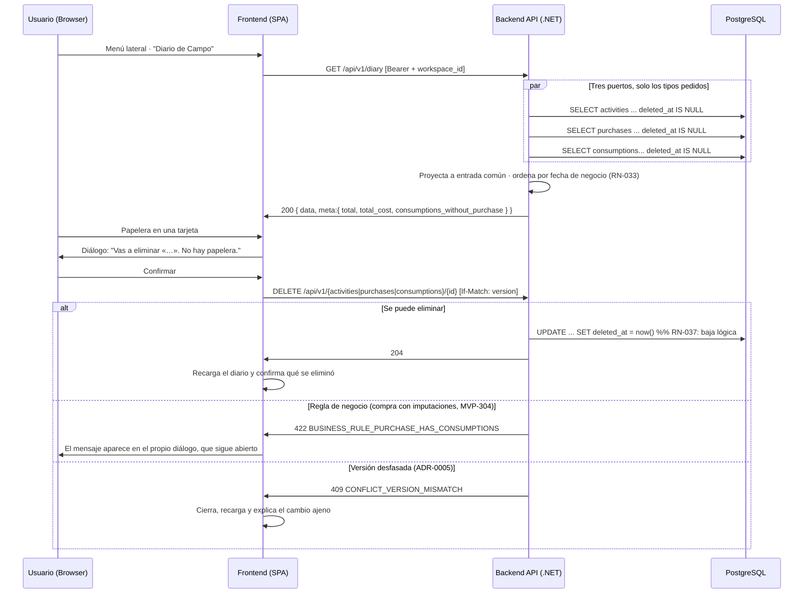

# TDD: MVP-305 — Diario cronológico unificado y borrado con confirmación

> **Referencia al spec**: [spec.md](./spec.md)

## Resumen técnico

Cierra la parte funcional de la épica: el **diario cronológico unificado** (RN-033) y el **borrado
con confirmación explícita** (RN-037).

- `GET /api/v1/diary` mezcla actividades, compras y consumos en una sola secuencia ordenada por
  **fecha de negocio** (CA-1/CA-2). Es de solo lectura: cada registro se crea, corrige y elimina por
  su propio recurso, que es donde viven sus reglas.
- La UI enciende el borrado de los tres tipos —desde el diario y desde los listados— tras una
  **confirmación explícita** que dice qué se va a eliminar y que no hay papelera (CA-3). La
  eliminación sigue siendo **lógica**: el registro desaparece de las vistas pero no de la base de
  datos.

No hay entidad nueva ni migración: el diario es una proyección de lo que ya existe.

### Decisiones de producto y de diseño tomadas en esta historia

- **El diario es un endpoint propio, no una mezcla en el cliente.** Con tres listados, mezclar en el
  navegador significaría tres peticiones, orden y paginación imposibles de mantener coherentes, y que
  cada consumidor futuro (`MVP-401`, el dashboard) repitiera la misma lógica. El servidor devuelve la
  secuencia ya ordenada y resumida.
- **Pero la mezcla se hace en memoria dentro del servidor, no con un `UNION` en SQL.** Reutiliza los
  tres puertos con su filtro de baja lógica y sus proyecciones ya probadas; un `UNION` obligaría a una
  cuarta consulta que duplicaría esas reglas. Como el diario **todavía no pagina** (`P-051`), en los
  dos casos se traen todas las filas del rango: la diferencia es de forma, no de volumen. Queda
  anotado que resolver `P-051` obliga a mover la mezcla a SQL, porque paginar sobre tres listas ya
  materializadas no es paginar.
- **Filtrar por tipo ahorra trabajo, no solo oculta el resultado**: si se pide solo «labores», los
  otros dos puertos no se consultan. Hay test que lo comprueba.
- **Filtrar por terreno deja fuera las compras por definición.** Una compra es del Workspace; el
  reparto por terrenos es la imputación (`MVP-304`). En vez de devolverlas igual —lo que haría que el
  filtro mintiera— se excluyen, y la vista lo explica con una nota para que no parezca un fallo.
- **Cada entrada lleva su `version`.** Es lo que permite eliminar desde el diario con `If-Match`
  (ADR-0005) sin abrir antes el registro. Sin ella, borrar exigiría un viaje extra por cada intento.
- **La entrada del diario es una proyección común**, con campos opcionales por tipo (`worker_name`,
  `hours`, `quantity`, `has_purchase`, `task_id`). El cliente pinta **una** tarjeta y no tres, y
  añadir la cosecha en `MVP-401` es un valor más del catálogo y un icono más en el mapa de estilos.
- **`GET /api/v1/activities/{id}` es nuevo** y lo estrena esta historia. La entrada del diario no
  lleva todos los campos de una actividad, y para abrir el formulario de corrección hacían falta.
  La alternativa —cargar además el listado completo de actividades solo para buscar por id— duplicaba
  datos en cada carga del diario; una lectura por id es la forma REST correcta y no vuelve a
  discutirse.
- **`task_id` viaja en la entrada de actividad** para poder ofrecer «guardar la tarea en el catálogo»
  (`MVP-302`) solo cuando la tarea es texto libre. Es el mismo patrón que `has_purchase` en el
  consumo: un campo opcional que responde a una pregunta concreta de la UI.
- **Compras y consumos se corrigen donde viven.** Desde el diario se eliminan, pero el lápiz lleva a
  `/app/compras`: allí están la imputación, las sugerencias de material y la cantidad pendiente, que
  no caben en un formulario genérico del muro. Las actividades sí se corrigen en el propio diario,
  porque es donde se registran.
- **El diálogo de confirmación es un componente compartido**, no un `window.confirm`. Hace falta
  explicar *qué* se elimina y *qué consecuencias* tiene —«no hay papelera»—, y sobre todo que el
  servidor pueda rechazar la operación con una regla de negocio (una compra con imputaciones vivas,
  `MVP-304`) y que ese mensaje **aparezca en el mismo diálogo**, sin cerrarlo, que es donde se está
  decidiendo.
- **El foco inicial del diálogo va a «Cancelar»**, no al botón destructivo: un `Intro` de más no debe
  borrar nada.
- **El resumen dice que el total se queda corto.** Cuando hay consumos sin compra previa, la suma de
  costes es incompleta por construcción (RN-032). El diario lo advierte en vez de presentar un total
  que parece exacto: es el CA-3 de la épica —«el sistema deja visible el impacto en calidad del
  dato»— aplicado a la vista principal.

## Diagrama de flujo



## Componentes afectados

### Backend

| Componente | Tipo de cambio | Descripción |
| ---------- | -------------- | ----------- |
| `Application/Diary/DiaryEntry.cs` | nuevo | Entrada común + catálogo `diary_entry_type` (con `cosecha` reservado) |
| `Application/Diary/DiaryQueryService.cs` | nuevo | Mezcla, orden por fecha de negocio y resumen |
| `Controllers/DiaryController.cs` | nuevo | `GET /api/v1/diary` (solo lectura) |
| `Application/Activities/ListActivitiesHandler.cs` | modificado | `GetActivityHandler` para la lectura por id |
| `Controllers/ActivitiesController.cs` | modificado | `GET /api/v1/activities/{activityId}` |
| `Program.cs` | modificado | DI del servicio de diario y del nuevo handler |

### Frontend

| Componente | Tipo de cambio | Descripción |
| ---------- | -------------- | ----------- |
| `components/common/ConfirmDialog.tsx` | nuevo | Confirmación compartida, con hueco para el error del servidor |
| `types/diary.types.ts` · `services/diary.service.ts` | nuevo | Entrada del diario, estilos por tipo y servicio de solo lectura |
| `components/diary/DiarioView.tsx` | reescrito | Muro unificado, resumen, filtro por tipo y borrado de los tres tipos |
| `components/purchases/ComprasView.tsx` | modificado | Borrado con confirmación también desde los listados |
| `services/activity.service.ts` · `types/activity.types.ts` | modificado | `getActivity(id)` y el código `RESOURCE_NOT_FOUND` |

## Diseño detallado

### API / Contratos

```yaml
# GET /api/v1/diary                 [RequireWorkspaceScope]
query: { from?, to?, plot_id?, season_id?, type? }     # type repetible: actividad|compra|consumo
responses:
  200:
    data: [ { type, id, date, title, description, plot_id, plot_name, season_id, season_name,
              cost, version, is_out_of_season_range, created_at,
              worker_name, hours, task_id, quantity, has_purchase } ]
    meta: { total, total_cost, activities, purchases, consumptions, consumptions_without_purchase }
  400: VALIDATION_REQUIRED          # fechas mal formadas o tipo no admitido

# GET /api/v1/activities/{activityId}    [RequireWorkspaceScope]
responses: 200 { ...activity } | 404 RESOURCE_NOT_FOUND
```

Los campos específicos de cada tipo llegan a `null` en los demás. `cosecha` **no es todavía** un valor
admitido: pedirlo responde 400 hasta que `MVP-401` lo encienda.

### Lógica de negocio

- **Orden.** Fecha de negocio descendente y, a igualdad, fecha de captura descendente: es el orden en
  que la persona recuerda haber apuntado las cosas.
- **Resumen.** Recuento por tipo, suma de costes y —lo importante— cuántos consumos no tienen compra
  detrás, para poder advertir de que el total se queda corto.
- **Borrado.** El diario no borra: delega en el `DELETE` de cada recurso, con su `If-Match`. Así las
  reglas propias de cada tipo (la de `MVP-304` sobre compras con imputaciones) siguen aplicando sin
  duplicarlas.
- **Registros que ya no están.** Si otra persona eliminó o cambió el registro entre la carga y la
  acción, se recarga el diario y se explica qué pasó, distinguiendo `404` («ya no existe») de `409`
  («lo modificaron»).

## Alternativas descartadas

| Alternativa | Por qué se descartó |
| ----------- | ------------------- |
| Mezclar los tres listados en el cliente | Tres peticiones, orden frágil y la misma lógica repetida en cada consumidor futuro |
| `UNION` en SQL desde el principio | Duplicaría el filtro de baja lógica y las proyecciones ya probadas, sin ganar nada mientras no haya paginación |
| Devolver las compras al filtrar por terreno | El filtro mentiría: una compra no pertenece a un terreno |
| No incluir `version` en la entrada | Borrar exigiría un viaje extra por intento |
| Cargar el listado de actividades para buscar por id | Duplica datos en cada carga; `GET /activities/{id}` es la forma correcta |
| Corregir compras y consumos desde el diario | Sus formularios necesitan imputación, sugerencias y cantidad pendiente: no caben en el muro |
| `window.confirm` para el borrado | No permite explicar consecuencias ni mostrar el 422 del servidor donde se está decidiendo |
| Foco inicial en el botón de eliminar | Un `Intro` de más borraría un registro |
| Ocultar que el total es incompleto | Contradice el CA-3 de la épica: el impacto en calidad del dato debe quedar visible |

## Riesgos e impacto

| Riesgo | Probabilidad | Mitigación |
| ------ | ------------ | ---------- |
| Borrado accidental | media | Confirmación explícita con el registro nombrado, foco en «Cancelar» y aviso de que no hay papelera. Además la baja es lógica: el dato no se pierde |
| Borrar algo que otra persona ya cambió | media | `If-Match` en los tres `DELETE`; el 409 recarga y explica |
| Compra eliminada dejando imputaciones huérfanas | baja | La regla de `MVP-304` sigue aplicando; el 422 se muestra en el diálogo |
| Diario que crece sin paginación | media | `MVP-999`, `P-051`; su resolución obliga además a mover la mezcla a SQL |
| Coste total engañoso | media | Se advierte cuándo y por qué el total se queda corto |
| La cosecha no aparece | — | No es una omisión: `HARVEST` no existe hasta MVP-004 (`G-4`). El catálogo ya reserva el valor y la tarjeta el estilo |

## Impacto en la usabilidad

- **La promesa de la épica se cumple aquí**: en una sola pantalla se ve qué se hizo, qué se compró y
  dónde se gastó, en orden cronológico y sin cambiar de sección.
- **El resumen de cabecera** da el tamaño de lo que se está mirando (registros, labores, compras y
  consumos, coste) y **avisa cuando el coste es incompleto**.
- **El filtro por tipo** permite volver a la lectura de un solo dominio sin salir del diario.
- **Cada tarjeta dice lo que le aplica** y nada más: la compra no finge tener terreno, el consumo sin
  compra dice «coste desconocido» en vez de «0 €».
- **El borrado pide confirmación nombrando el registro** y advierte de que no hay papelera; si el
  servidor lo rechaza, el motivo aparece en el mismo diálogo.
- **Tras eliminar se confirma qué se eliminó**, en vez de dejar que el usuario deduzca que funcionó
  porque algo desapareció.
- **Compras y consumos se corrigen donde viven**, con un enlace explícito desde la tarjeta.
- No se detectan roturas de usabilidad que requieran decisión adicional. Sigue pendiente el punto
  transversal de foco en modales (`P-055`), que afecta también a este diálogo.

## Plan de testing

> Referencia: `docs/04-ingenieria/estrategia-testing.md`

- [x] Tests del servicio de diario (`DiaryQueryServiceTests`): mezcla de los tres tipos ordenada por
  fecha de negocio; desempate por fecha de captura; resumen (recuentos, coste y consumos sin compra);
  **filtrar por tipo no consulta los otros puertos**; **filtrar por terreno excluye las compras**;
  propagación de los filtros a los tres puertos; proyección de cada tipo con solo lo que le aplica; y
  que `cosecha` **todavía no** es un tipo admitido (`G-4`).
- [x] Verificación end-to-end real (API :5127 + PostgreSQL + UI conducida :5173):
  - API: diario de 16 registros mezclando 8 actividades, 5 compras y 3 consumos, con orden por fecha
    de negocio comprobado; los tres filtros por tipo devuelven solo su tipo; `type=cosecha` → 400;
    filtro por rango de fechas; filtro por terreno que deja fuera las compras; fecha inválida → 400;
    el segundo Workspace ve 0 registros.
  - UI conducida: muro con las tres clases de tarjeta y sus distintivos (`LABOR`, `COMPRA`,
    `CONSUMO`, `SIN COMPRA`, `FUERA DE TEMPORADA`, «coste desconocido»); resumen de cabecera y aviso
    de que el total se queda corto; **borrado de una actividad** con diálogo que la nombra, foco
    inicial en «Cancelar», desaparición del muro (16 → 15) y confirmación de lo eliminado;
    **borrado de una compra con imputaciones** → el 422 aparece **dentro del diálogo**, que no se
    cierra; **borrado de un consumo desde el listado** de Compras, con el aviso agregado pasando de 2
    a 1. Sin errores de consola.
- [ ] Tests de integración contra PostgreSQL: `MVP-501`. Tests unitarios de frontend: `P-012`/`P-023`.

Resultado local: `dotnet test` en verde (477 tests, 8 nuevos); `npm run build` y `npm run lint` sin
errores nuevos.

## Checklist de implementación

- [x] Diseño técnico revisado
- [x] Sin migración: el diario es una proyección de lo que ya existe
- [x] Tests escritos y pasando (servicio de diario)
- [x] Documentación de API actualizada (`contratos-api.md`: §5.b diario y `GET /activities/{id}`)
- [x] Modelo de datos revisado: no cambia
- [x] Puntos de coherencia registrados en `MVP-999` (`P-051` ampliado con la mezcla en memoria)
- [x] Verificación end-to-end real (API + PostgreSQL + UI conducida)
- [x] Sin `TODO` sin resolver en este documento
