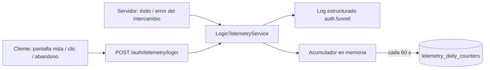

# TDD: MVP-601 — Telemetría mínima del embudo de login

> **Referencia al spec**: [spec.md](./spec.md)

## Resumen técnico

`MVP-105` ya dejó los cinco eventos del embudo emitiéndose, así que esta historia **no arranca de
cero**: arranca de una medida incompleta. Lo que faltaba, contrastado contra la KB:

| Exigencia de la KB | Antes | Después |
|---|---|---|
| Dimensión `session_id` | No existía | Aleatoria, de sesión de navegador, en los cinco eventos |
| Dimensión `device_type` | No existía | Taxonomía cerrada `desktop`/`mobile`/`tablet` |
| Dimensión `timestamp` | Solo la marca del renglón de log | Propiedad del evento, más log en JSON fuera de desarrollo |
| Abandono «por timeout de inactividad **o** salida» | Solo por salida (`pagehide`) | Las dos vías |
| KPI y SLO con ventanas de 7 y 30 días | No calculables | Contadores diarios agregados en base de datos |

La decisión de fondo es **qué se conserva**: contadores agregados por día y métrica, no una traza de
eventos. Ver «Alternativas descartadas».

## Componentes afectados

| Componente | Tipo de cambio | Descripción |
|---|---|---|
| `Infrastructure/Telemetry/TelemetryDimensions.cs` | nuevo | Validación y normalización de las dimensiones; `LoginEventContext` |
| `Infrastructure/Telemetry/TelemetryMetrics.cs` | nuevo | Nombres canónicos de los contadores |
| `Infrastructure/Telemetry/ITelemetryCounters.cs` · `TelemetryCounterAccumulator.cs` | nuevo | Acumulación en memoria por día y métrica |
| `Infrastructure/Telemetry/ITelemetryCounterStore.cs` · `Data/Repositories/TelemetryCounterStore.cs` | nuevo | Volcado sumando (`ON CONFLICT DO UPDATE`), lectura por rango y poda |
| `Infrastructure/Telemetry/TelemetryFlushWorker.cs` · `TelemetryOptions.cs` | nuevo | Volcado periódico y poda diaria |
| `Infrastructure/Telemetry/LoginFlowTimings.cs` | nuevo | Duración del intento, para el «tiempo medio de login exitoso» |
| `Infrastructure/Telemetry/ILoginTelemetry.cs` · `LoginTelemetryService.cs` | modificado | Emiten las seis dimensiones y suman contadores |
| `Controllers/AuthController.cs` · `Application/Auth/ExchangeGoogleCodeHandler.cs` | modificado | Aceptan y propagan `session_id` y `device_type` |
| `Program.cs` | modificado | Registro de servicios y log JSON fuera de desarrollo |
| Migración `AddTelemetryDailyCounters` | nuevo | Tabla `telemetry_daily_counters` |
| `frontend/.../lib/login-telemetry.ts` | modificado | `session_id`, `device_type`, reapertura de intento |
| `frontend/.../components/auth/LoginPage.tsx` | modificado | Abandono por inactividad |
| `frontend/.../services/telemetry.service.ts` · `auth.service.ts` · `OAuthCallback.tsx` | modificado | Envío de las dimensiones nuevas |
| `docs/02-arquitectura/contratos-api.md` · `docs/05-infraestructura/observabilidad.md` · `docs/07-seguridad/privacidad-datos.md` | modificado | Contrato, explotación e inventario de privacidad |
| `frontend/.../components/legal/PrivacyPolicyPage.tsx` | modificado | Qué se conserva de la medición |

## Diseño detallado

### Modelo de datos

```sql
CREATE TABLE telemetry_daily_counters (
    date       date                     NOT NULL,
    metric     varchar(96)              NOT NULL,
    value      bigint                   NOT NULL,
    updated_at timestamp with time zone NOT NULL,
    PRIMARY KEY (date, metric)
);
```

No cuelga de ningún Workspace ni de ninguna persona **a propósito**: son cifras del sistema, no datos
de nadie. Por eso tampoco tiene FK ni entra en la cascada de purga de `RN-041`.

La clave `(date, metric)` es lo que permite que el volcado sea un `INSERT … ON CONFLICT DO UPDATE`
sumando. Un léelo-modifícalo-escríbelo habría dado el resultado equivocado en cuanto dos instancias
volcasen a la vez: las dos sumarían sobre el mismo valor leído y una de las dos se perdería.

### Camino de un evento



Dos salidas y ninguna sustituye a la otra: el log deja el caso concreto mientras esté a mano, el
contador deja la serie con la que se miran siete o treinta días.

### Las dimensiones, y qué pasa cuando no llegan

`flow_id` sigue siendo **obligatorio y validado**: sin él no hay embudo que reconstruir, así que un
`flow_id` mal formado responde `400`. `session_id` y `device_type` **degradan a `unknown`** en lugar de
rechazar el evento. Descartar el evento entero por una dimensión secundaria perdería la conversión
—que es lo que se quiere medir— y, peor, dejaría al cliente decidir qué se cuenta con solo enviar un
valor inválido.

`device_type` se deriva de `pointer: coarse` y del ancho de ventana, no del agente de usuario. Se
descartó `maxTouchPoints`: un portátil con pantalla táctil tiene puntos táctiles pero su puntero
principal es el ratón, así que se habría colado como «tablet».

### El abandono que faltaba

`observabilidad.md` pide emitir abandono «por timeout de inactividad **o** cierre/salida sin exito», y
solo existía la segunda vía. La que faltaba es justo la del caso más silencioso: la pestaña que se
queda abierta en el login y a la que nadie vuelve nunca dispara `pagehide`, así que ese intento
desaparecía del embudo sin contarse ni como éxito ni como abandono —y un embudo que pierde intentos
sobreestima la conversión.

El plazo son **90 s sin interacción**: el doble del objetivo de «tiempo medio de login exitoso»
(≤ 45 s). Interactuar rearma el reloj, así que leer la pantalla no cuenta como abandono.

Una consecuencia que había que resolver: si tras el abandono la persona vuelve y entra, ese mismo
intento tendría abandono **y** éxito, y la conversión contaría dos veces lo mismo. Por eso volver a
interactuar **abre un intento nuevo** (`restartLoginFlow`) y emite su propia «pantalla vista»: dos
intentos, dos pantallas vistas, un éxito. La aritmética del embudo se mantiene.

### Duración del login

`LoginFlowTimings` recuerda en memoria cuándo empezó cada intento. Se guardan **suma y divisor**
(`login.success.duration_ms.sum`, `login.success.timed`) y no la media, porque las medias no se agregan
entre días. El divisor es `login.success.timed` y no `login.success`: tras un reinicio hay éxitos cuyo
inicio se desconoce, y contarlos con duración cero rebajaría la media y haría creer que el acceso es
más rápido de lo que es.

Se acota por edad (30 min) y por tamaño (10 000 intentos vivos) para que un cliente que emitiera
«pantalla vista» en bucle no pueda hacerlo crecer sin límite.

### Manejo de errores

La telemetría **nunca** puede afectar al usuario ni al proceso:

| Fallo | Qué pasa |
|---|---|
| El cliente no puede emitir el evento | Silencio deliberado (`fetch` con `catch` vacío); el login sigue |
| El volcado a base de datos falla | Se registra, lo drenado **vuelve al acumulador** y se reintenta en la pasada siguiente |
| La aplicación se para | Un último volcado con margen propio, para no perder la ventana en curso |
| Dimensión mal formada | `unknown`, no `400` (salvo `flow_id`) |

## Alternativas descartadas

| Alternativa | Por qué se descartó |
|---|---|
| Solo logs estructurados, sin persistir nada | Es lo que la KB declara para fase C, pero en App Service los logs no se retienen de forma fiable: las ventanas *rolling* de 7 y 30 días que exigen los SLO no serían calculables, y `MVP-602` (CA-3) pide poder revisar los KPI de verdad |
| Tabla con **una fila por evento** y retención de 90 días | Permitiría análisis no previstos, pero añade una categoría de dato conservado a `RN-041` y al inventario de `RN-042`, y activa la propia cláusula de `privacidad-datos.md` sobre «más retención». Los KPI de la KB no la necesitan: todos salen de contadores |
| Application Insights / Sentry para el embudo | Proveedor nuevo, coste nuevo y una transferencia que habría que declarar en la Política de Privacidad ya publicada. Desproporcionado para cinco eventos |
| Escribir en base de datos por evento | Una escritura por pulsación en la ruta crítica del login. El acumulador cuesta, como mucho, la última ventana si el proceso cae |
| `session_id` como *claim* del JWT | Habría sido más difícil de falsear, pero obliga a tocar la emisión de tokens para una medida de producto. El cliente ya envía `flow_id` con el mismo nivel de confianza |

## Riesgos e impacto

| Riesgo | Probabilidad | Mitigación |
|---|---|---|
| Un reinicio pierde la ventana sin volcar | media | Volcado cada 60 s y último volcado al parar; el impacto es una cifra de producto, no un dato de nadie |
| Contadores inflados por un cliente malicioso | baja | Los eventos de éxito y error son **autoritativos del servidor**; el cliente solo puede inflar entrada y abandono, que empeoran su propia conversión aparente |
| El log JSON cambia el formato que alguien esté leyendo | baja | Solo fuera de desarrollo, y es el formato que la KB exige |
| Crecimiento de la tabla | baja | Poda diaria a 400 días; el orden de magnitud es de decenas de filas por día |

## Plan de testing

- [x] Tests unitarios (backend): emisión de los cinco eventos, las seis dimensiones, **conjunto cerrado
      de campos** (la garantía de «sin PII» es que no quepa uno más), contadores, duración con y sin
      inicio conocido, acumulador (agregación, corte por día UTC, restauración tras fallo), tiempos de
      intento y volcado periódico.
- [x] Tests de integración (backend, PostgreSQL real): el almacén suma en vez de sustituir, separa días
      y métricas, respeta el rango y poda por ventana. Aquí el motor real no es un lujo: toda la
      corrección está en la sentencia `ON CONFLICT`.
- [x] Tests unitarios (frontend): `session_id` estable y superviviente al cierre del intento,
      `device_type` por tipo de puntero, reapertura de intento, y el abandono por inactividad sobre la
      propia `LoginPage` (que no salta antes de tiempo, que no cuenta dos veces con `pagehide` y que no
      castiga a quien está leyendo).
- [x] Verificación end-to-end contra API y base de datos reales: eventos emitidos con las seis
      dimensiones, `device_type` inválido degradado a `unknown`, `login_google_success` rechazado desde
      el cliente (400), contadores volcados a `telemetry_daily_counters` y **sumados** entre volcados
      (1 → 4, no sustituidos).
- [x] Verificación en navegador: `session_id` y `flow_id` en `sessionStorage`, evento emitido con las
      dimensiones reales, abandono por inactividad a los 90 s exactos y apertura de intento nuevo al
      volver la actividad.

## Checklist de implementación

- [x] Diseño técnico revisado y aprobado
- [x] Migraciones de base de datos preparadas
- [x] Tests escritos y pasando
- [x] Documentación de API actualizada
- [x] Módulo afectado actualizado en `docs/03-modulos/` (no aplica: no hay módulo funcional propio)
- [x] Sin `TODO` sin resolver en este documento
