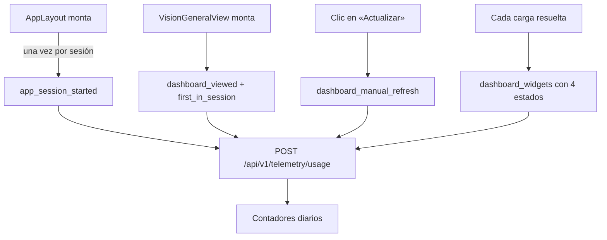

# TDD: MVP-602 — Métricas de uso del dashboard

> **Referencia al spec**: [spec.md](./spec.md)

## Resumen técnico

Reutiliza entero el mecanismo de `MVP-601` —log estructurado más contador diario agregado— y le añade
un segundo emisor para el uso del producto. Lo que tiene contenido propio no es la tubería, sino
**tres decisiones sobre qué significa cada cifra**, porque los tres KPI de la KB se pueden medir mal de
formas que parecen razonables:

| KPI de la KB | La forma fácil de medirlo mal | Lo que se hace |
|---|---|---|
| % de sesiones que usan el dashboard | Contar visitas: quien entra ocho veces pesa como ocho sesiones y el porcentaje puede pasar del 100 % | Contador aparte de **sesiones con uso**, deduplicado por sesión |
| — su divisor | Contar la sesión al abrir el dashboard, con lo que el porcentaje sale siempre 100 % | La sesión se cuenta **al entrar al área autenticada**, en el shell |
| Cobertura de widgets | Contar el widget vacío como fallo, con lo que la cobertura baja con cada Workspace nuevo | `empty` cuenta como cubierto; solo `error` resta |

## Componentes afectados

| Componente | Tipo de cambio | Descripción |
|---|---|---|
| `Infrastructure/Telemetry/UsageEvents.cs` | nuevo | Catálogo cerrado de eventos, widgets y estados |
| `Infrastructure/Telemetry/IUsageTelemetry.cs` · `UsageTelemetryService.cs` | nuevo | Emisión y contadores de uso |
| `Controllers/TelemetryController.cs` | nuevo | `POST /api/v1/telemetry/usage` |
| `Infrastructure/Telemetry/TelemetryMetrics.cs` | modificado | Contadores de uso y desglose por widget |
| `Program.cs` | modificado | Registro del emisor |
| `frontend/.../lib/usage-telemetry.ts` · `use-usage-telemetry.ts` | nuevo | Catálogo, marcas de sesión y emisor para vistas |
| `frontend/.../services/telemetry.service.ts` | modificado | `logUsageEvent` |
| `frontend/.../components/layout/AppLayout.tsx` | modificado | Señal de sesión activa |
| `frontend/.../components/dashboard/VisionGeneralView.tsx` | modificado | Entrada, recarga manual y cobertura de widgets |
| `docs/02-arquitectura/contratos-api.md` · `05-infraestructura/observabilidad.md` · `01-producto/kpis.md` | modificado | Contrato, explotación y origen de cada KPI |
| `docs/01-producto/reglas-de-negocio.md` (RN-042) · `07-seguridad/privacidad-datos.md` | modificado | La evaluación de exención, rehecha para el alcance nuevo |
| `frontend/.../legal/PrivacyPolicyPage.tsx` · `settings/PrivacyPanel.tsx` | modificado | Qué se mide y qué se conserva, en lo publicado |

## Diseño detallado

### Dónde se cuenta cada cosa, y por qué ahí

`app_session_started` vive en el **shell**, no en el dashboard: es el divisor, y contarlo en el
dashboard haría que solo entrasen en él las sesiones que ya lo han abierto —el KPI daría 100 % siempre
y no mediría nada—.

`dashboard_viewed` va en un efecto **sin dependencias**, separado de la carga de datos: cambiar un
filtro relanza la carga pero no es entrar otra vez a la pantalla.

`dashboard_manual_refresh` se emite **solo en el clic del botón**, no dentro de `reload()`. Cambiar un
filtro también recarga, pero responde a otra pregunta —«qué quiero ver», no «dame lo último»— y
mezclarlas inflaría el KPI de recargas con el uso normal de los filtros.

### La deduplicación por sesión

`first_in_session` se resuelve en el **cliente**, con una marca en `sessionStorage`. En servidor
habría exigido recordar qué sesiones han pasado por aquí, y esa memoria se pierde en cada reinicio:
justo después de cada despliegue se contaría dos veces la misma sesión.

Efecto lateral útil comprobado en la verificación: el doble montaje de React en desarrollo
(`StrictMode`) emite dos «dashboard_viewed», pero el segundo llega con `first_in_session: false`, así
que **el KPI de sesiones queda intacto**; el que se infla en desarrollo es `dashboard.viewed`, que no
participa en ningún KPI de la KB.

Ausencia de la marca equivale a `false`. Ante la duda no se infla el numerador: contar de más una
sesión con uso subiría el porcentaje justo en el sentido que le interesa a quien mide.

### Cobertura de widgets

Las cuatro peticiones del dashboard van en un `Promise.all`, así que un fallo tumba la pantalla
entera: en ese caso los cuatro widgets se informan como `error`. En una carga correcta cada widget se
resuelve como `ok` o `empty` según tenga datos.

La evolución cuenta como `ok` también cuando **solo trae histórico**: es el caso que `MVP-404` resolvió
expresamente para que la pantalla no quedara en blanco antes de la primera cosecha, así que hay algo
que enseñar y el widget está cubierto.

El servidor **normaliza en vez de rechazar**: descarta uno a uno los widgets o estados que no reconoce
—un cliente más nuevo debe seguir aportando lo que este servidor sí conoce— y descarta repetidos, para
que nadie pueda subir la cobertura mandando veinte veces el mismo widget en `ok`.

### Por qué la telemetría no usa el cliente HTTP común

El cliente común reacciona a `AUTH_UNAUTHENTICATED` **cerrando la sesión**. Una llamada de telemetría
que llegase con el token recién caducado echaría a la persona de la aplicación por haber medido algo.
`logUsageEvent` hace su propio `fetch` y se traga cualquier error: medir no puede cerrarle la sesión a
nadie.

### Privacidad

El endpoint es autenticado —si no, cualquiera podría inflar los contadores desde fuera— pero la señal
**no lleva usuario ni Workspace**, aunque el servidor los conozca. Es una decisión sostenida por un
test que fija el conjunto cerrado de campos de la traza, no una casualidad que el próximo cambio pueda
deshacer sin enterarse.

No exige Workspace activo a propósito: una sesión en onboarding también es una sesión activa, y
dejarla fuera del divisor subiría el KPI justo con los casos en los que el producto todavía no sirve de
nada.

## Alternativas descartadas

| Alternativa | Por qué se descartó |
|---|---|
| Contar el acceso al dashboard en **servidor**, mirando las peticiones a `/api/v1/dashboard/*` | No distingue entrar de recargar ni de cambiar un filtro —CA-2 pide justo esa separación— y no puede saber si un widget se pudo mostrar |
| Deduplicar la sesión en servidor | La memoria de qué sesiones han pasado se pierde en cada reinicio, y contaría doble tras cada despliegue |
| Emitir por el cliente HTTP común | Un 401 de telemetría cerraría la sesión de la persona |
| `Promise.allSettled` para atribuir el error a cada widget | Es mejor idea, pero cambia el comportamiento de una pantalla ya entregada (mostrar tres widgets y un error en vez de un error). Fuera del alcance de esta historia: se propone en `MVP-999` |
| Medir también las demás pantallas (diario, cosechas) | El spec acota a dashboard y recarga manual, y el propio alcance de la épica excluye la analítica de comportamiento |

## Riesgos e impacto

| Riesgo | Probabilidad | Mitigación |
|---|---|---|
| Una señal de uso falla y afecta a la pantalla | baja | `fetch` propio, `keepalive` y `catch` vacío; no toca el cliente común ni el estado de la vista |
| El KPI de cobertura baja por Workspaces vacíos | — | Resuelto por diseño: `empty` cuenta como cubierto |
| La señal de widget bloqueado no llega en una caída total | media | Es un límite conocido y declarado: viaja por la propia API. La disponibilidad la mide `MVP-603` |
| Un cliente infla los contadores | baja | Endpoint autenticado, catálogo cerrado, deduplicación de widgets repetidos |

## Plan de testing

- [x] Tests unitarios (backend): separación visitas/sesiones, recarga manual como contador aparte,
      `empty` como cubierto, desglose por widget y estado, y **conjunto cerrado de campos** de la traza
      (que es lo que sostiene que la señal no lleva usuario ni Workspace).
- [x] Tests unitarios (backend, controlador): evento desconocido rechazado, marca ausente tratada como
      `false`, dimensiones degradadas a `unknown`, widgets desconocidos descartados uno a uno
      conservando el resto, repetidos contados una sola vez y lote sin nada reconocible rechazado.
- [x] Tests unitarios (frontend): la marca de sesión, y sobre la propia `VisionGeneralView` que la
      entrada se marca como primera solo una vez, que **cambiar de temporada no cuenta como recarga
      manual**, y los cuatro estados de cobertura (todo `ok`, todo `empty`, evolución solo con
      histórico como `ok`, y todo `error` cuando la carga falla).
- [x] Verificación end-to-end contra API y base de datos reales, con sesión autenticada: `401` sin
      token; señales emitidas con sus dimensiones; el clic en «Actualizar» emite recarga manual y el
      cambio de temporada **no**; contadores volcados con `dashboard.session_with_view = 1` frente a
      `dashboard.viewed = 2` y `dashboard.widget.rendered = 16`.
- [x] Verificación en navegador de lo publicado: el panel de Ajustes lista ocho tecnologías con la
      medición del uso incluida, y la Política de Privacidad describe qué se mide y qué se conserva.

## Checklist de implementación

- [x] Diseño técnico revisado y aprobado
- [x] Migraciones de base de datos preparadas (no aplica: reutiliza `telemetry_daily_counters`)
- [x] Tests escritos y pasando
- [x] Documentación de API actualizada
- [x] Módulo afectado actualizado en `docs/03-modulos/` (no aplica: no hay módulo funcional propio)
- [x] Sin `TODO` sin resolver en este documento
