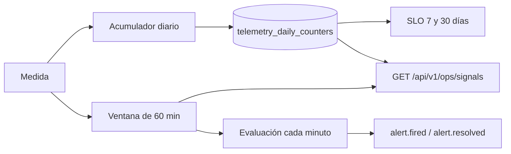

# TDD: MVP-603 — Alertas básicas y señales de degradación

> **Referencia al spec**: [spec.md](./spec.md)

## Resumen técnico

`MVP-601` y `MVP-602` dejaron contadores; esta historia los convierte en **algo que avisa**. Cuatro
piezas:

| Pieza | Qué resuelve |
|---|---|
| `RequestMetricsMiddleware` | Mide cada petición: cuántas, cuántas fallan y cuánto tardan (CA-1) |
| `RollingWindowMetrics` | Ventana de 30 min en memoria, que es sobre la que están definidas las alertas de la KB |
| `AlertMonitor` + `AlertEvaluator` | Evalúa cada minuto las cinco alertas y avisa **solo en la transición** (CA-2) |
| `GET /api/v1/health` · `GET /api/v1/ops/signals` | La sonda externa y la revisión operativa en una sola petición (CA-1, CA-3) |

## Componentes afectados

| Componente | Tipo de cambio | Descripción |
|---|---|---|
| `Common/Http/RequestMetricsMiddleware.cs` | nuevo | Peticiones, 4xx/5xx, histograma de latencia y altas por recurso |
| `Infrastructure/Telemetry/RollingWindowMetrics.cs` | nuevo | Cubos de un minuto y `CompositeTelemetryCounters` |
| `Infrastructure/Telemetry/HealthProbe.cs` | nuevo | Comprobación de salud (proceso + base de datos) |
| `Infrastructure/Telemetry/Alerts/*` | nuevo | Umbrales, evaluación pura, estado, vigilancia y aviso |
| `Infrastructure/Telemetry/OpsOptions.cs` | nuevo | Llave de servicio y destinatario de avisos |
| `Application/Ops/OperationalSignalsService.cs` | nuevo | El informe de la revisión operativa |
| `Controllers/HealthController.cs` · `OpsController.cs` | nuevo | Las dos superficies |
| `Program.cs` | modificado | Registro y middleware |
| `.github/workflows/deploy.yml` | modificado | El smoke espera a la salud, no a la raíz |
| `infra/azure/configurar-api.sh` | modificado | Sonda del alojamiento y secretos de operación |
| `docs/05-infraestructura/observabilidad.md` · `entornos.md` · `runbooks/revision-operativa.md` | modificado/nuevo | Umbrales, punto ciego y el procedimiento |
| `docs/02-arquitectura/contratos-api.md` | modificado | Contrato de los dos endpoints |

## Diseño detallado

### Por qué hacen falta dos ventanas

Las alertas de la KB están definidas sobre 30 minutos («abandono &gt; 25 % **durante 30 min**») y un
contador diario no puede responder a eso: a las 23:00 lleva acumuladas veintitrés horas, así que una
caída de media hora queda diluida y la alerta no salta nunca. Y al revés: los SLO piden 7 y 30 días,
que no caben en memoria.

`CompositeTelemetryCounters` reparte cada medida a las dos salidas, así que **nada de lo que ya medía
`MVP-601`/`MVP-602` tuvo que cambiar**: siguen llamando a `ITelemetryCounters`.

### Los umbrales salen de la KB, y no se configuran

Todos los valores de `AlertThresholds` tienen origen citado: 1 % de 5xx y 500 ms de P95 son los
umbrales de alerta de `kpis.md`; 25 % de abandono y 70 % de conversión son las condiciones de
`observabilidad.md`. **No son configurables por despliegue**: poder bajarlos desde un ajuste
convertiría un SLO acordado en una preferencia.

### Volumen mínimo: lo que separa una alerta útil de una que se ignora

20 peticiones para juzgar error y latencia; 10 pantallas de acceso para juzgar el embudo. Sin esto,
una madrugada con tres peticiones y un 500 daría un 33 % de error y dispararía una alerta crítica por
nada. Una alerta que salta sin motivo se acaba ignorando —y entonces tampoco sirve cuando el motivo es
real—.

### P95 sobre histograma

La latencia se guarda en cubos (50, 100, 200, 300, 500, 1000, 2000, ∞) que rodean los dos umbrales que
importan. El P95 devuelve el **corte superior** del cubo donde cae el percentil: es una cota, que es lo
que un histograma permite afirmar, y basta para comparar contra un umbral. Sin muestras devuelve
`null`, no `0`: cero milisegundos sería una latencia excelente inventada.

No se guarda la media porque **un percentil no se reconstruye a partir de una media**, y el SLO habla
de P95.

### Avisar solo en la transición

`AlertStateStore` recuerda el estado de cada alerta. Sin esa memoria, una degradación de dos horas
mandaría ciento veinte correos idénticos y el canal de incidentes dejaría de leerse justo cuando hace
falta. Se avisa también de la **resolución**, con lo que duró: una alerta que nadie cierra no informa
de nada.

### El punto ciego, dicho en voz alta

**Un proceso muerto no se vigila a sí mismo.** Dentro de la aplicación, `ServiceDown` cubre la
degradación observable —la base de datos inalcanzable, que deja el producto inservible aunque el
proceso viva—. La caída total la detecta la sonda externa del alojamiento contra `/api/v1/health`, que
esta historia configura en `infra/azure/configurar-api.sh`.

Por eso el informe expone `healthy_minutes_30d` y **no** `uptime`: cuenta minutos *observados*, y los
minutos en los que no había nadie observando no aparecen. Publicar eso como disponibilidad sería la
mentira clásica del sistema que se mide a sí mismo.

Con el mismo criterio, la señal de widget bloqueado de `MVP-602` viaja por la propia API: cubre un
widget roto, no una caída —en ese caso tampoco llegaría—.

### Las dos superficies

`GET /api/v1/health` es **anónima**, porque la sonda no tiene sesión, y por eso mismo no cuenta nada de
dentro: ni versión, ni cadena de conexión, ni el motivo del fallo. Responde **`503`** cuando no puede
prestar servicio: las sondas miran el código de estado, y un `200` con «unhealthy» dentro es un
servicio caído que nadie detecta.

`GET /api/v1/ops/signals` usa **llave de servicio** y no sesión de usuario: el producto no tiene roles
con los que distinguir a un operador de un agricultor, y `autenticacion-autorizacion.md` contempla
justamente llaves M2M para esto. Sin llave configurada **el endpoint no existe** (404): desplegar sin
configurarlo debe impedir consultarlo, no abrirlo. La comparación es en tiempo constante.

### `registros_creados_semana` sin tocar ningún manejador

El monitoreo de negocio mínimo de la KB pide tres cifras. Dos ya existían; la tercera —registros
creados— sale del middleware contando los `POST` que responden `201`, con el recurso tomado de la
**ruta**. Cero cambios en la capa de aplicación y conjunto de nombres cerrado.

### Manejo de errores

| Fallo | Qué pasa |
|---|---|
| La vigilancia revienta en una pasada | Se registra y no se propaga; se reintenta al minuto |
| El envío del aviso falla | Se registra; el aviso ya quedó en la traza |
| No hay destinatario ni cuenta de envío | Solo traza, y está documentado |
| La sonda no alcanza la base de datos | `503` hacia fuera, motivo solo en la traza |

## Alternativas descartadas

| Alternativa | Por qué se descartó |
|---|---|
| Application Insights / Prometheus + Alertmanager | Proveedor y coste nuevos, y una transferencia que declarar en la Política de Privacidad. Desproporcionado para cinco alertas y un equipo de una persona |
| Alertas solo como log, sin correo | Una alerta que nadie recibe no es una alerta. El transporte SMTP ya existía (ADR-0010): no usarlo habría sido dejar la mitad del trabajo |
| Alertas por umbral configurable | Un SLO que se puede bajar desde un ajuste de despliegue deja de ser un acuerdo |
| Evaluar sobre los contadores diarios | Una caída de 30 min queda diluida en el acumulado del día: la alerta no saltaría nunca |
| Media de latencia en vez de histograma | El SLO habla de P95 y un percentil no se reconstruye desde una media |
| Publicar `uptime` calculado desde dentro | Mediría «minutos en los que estaba vivo para contarlo»: siempre 100 % |
| Endpoint de señales con `[Authorize]` de usuario | Expondría los KPI de producto a cualquier cuenta, y no hay roles para distinguir |

## Riesgos e impacto

| Riesgo | Probabilidad | Mitigación |
|---|---|---|
| Alertas falsas con poco tráfico | alta sin mitigación | Volumen mínimo antes de juzgar, y documentado |
| El reinicio vacía la ventana y retrasa una alerta | media | Aceptado: la ventana vuelve a llenarse en 30 min y el volumen mínimo evita juzgar con datos parciales |
| La llave de operación se filtra | baja | Solo lee agregados sin PII; rotable cambiando un ajuste |
| El middleware añade coste por petición | baja | Un cronómetro y cuatro incrementos en memoria; la ventana solo se poda al cambiar de minuto |
| Sin destinatario, las alertas pasan desapercibidas | media | Declarado en `entornos.md` y exigido por `configurar-api.sh` |

## Plan de testing

- [x] Tests unitarios de la **evaluación** (función pura): los cinco umbrales con su borde exacto
      (`> 1 %` no es `>= 1 %`), los volúmenes mínimos, las severidades que declara la KB, el P95 sobre
      histograma —incluido que sin muestras es `null`— y que las cinco alertas se devuelven siempre,
      también tranquilas.
- [x] Tests unitarios del **estado**: aviso solo en la transición, aviso de resolución con duración,
      conservación y reinicio del instante de inicio, y orden que pone lo disparado delante.
- [x] Tests unitarios del **middleware**: separación 4xx/5xx, exclusión de lo que no es API, altas por
      recurso, y que una excepción sin capturar cuenta como 5xx.
- [x] Tests unitarios de la **ventana**: suma dentro, exclusión fuera, borde exacto, caducidad, y que
      el compuesto lleva cada medida a las dos salidas.
- [x] Tests unitarios del **informe**: los KPI de embudo, uso y negocio; `null` en vez de `0` cuando no
      hay divisor; minutos observados en vez de uptime.
- [x] Tests de la **vigilancia** contra una base de datos inalcanzable: `ServiceDown` tras dos sondas y
      no antes, un solo aviso aunque la caída dure, contador de alerta disparada, y disparo de la
      alerta del embudo desde la ventana.
- [x] Tests de integración contra la API real: salud sana y anónima, señales inexistentes sin llave
      configurada, y `401`/`200` según la llave.
- [x] **Verificación end-to-end real**: `/api/v1/health` sano (`200`) y **degradado (`503`,
      `"database":"unreachable"`) parando el contenedor de PostgreSQL**; `ServiceDown` disparada tras 2
      minutos con **un solo aviso** pese a durar más, y `alert.resolved` con su duración al recuperar;
      `LoginAbandonmentSpike` y `LoginSuccessDrop` disparadas con los umbrales exactos de la KB
      («Abandono 47.62 % sobre 21 pantallas», «Conversión 0 %»); y el informe de `/ops/signals` con las
      cinco alertas, los SLO y `healthy_minutes_30d = 28` / `degraded_minutes_30d = 2`.

## Checklist de implementación

- [x] Diseño técnico revisado y aprobado
- [x] Migraciones de base de datos preparadas (no aplica: reutiliza `telemetry_daily_counters`)
- [x] Tests escritos y pasando
- [x] Documentación de API actualizada
- [x] Módulo afectado actualizado en `docs/03-modulos/` (no aplica: no hay módulo funcional propio)
- [x] Sin `TODO` sin resolver en este documento
