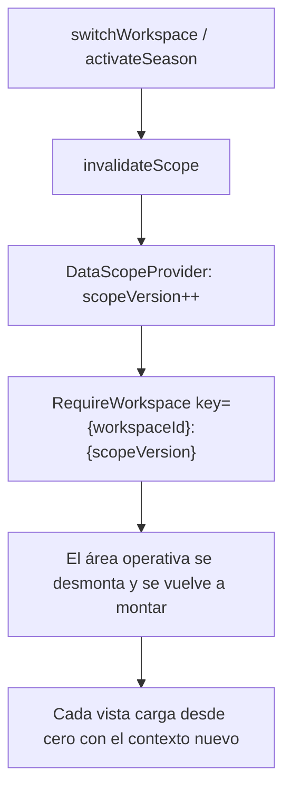

# TDD: MVP-701 — Coherencia de contexto: Workspace y temporada

> **Referencia al spec**: [spec.md](./spec.md)

## Resumen técnico

Los tres puntos comparten causa: **el contexto activo no gobernaba lo que se muestra**. Se corrige en
dos sitios, uno por eje, y ninguno de los dos es una vista concreta:

| Eje | Dónde vivía el fallo | Punto único elegido |
|---|---|---|
| Workspace (`P-081`) | Ninguna cadena `useMemo`/`useCallback` mencionaba el Workspace, así que el efecto de carga no volvía a dispararse en 9 de 10 vistas | Clave de **remontaje** del área operativa en `RequireWorkspace` |
| Temporada (`P-082`) | El defecto lo resolvía el servidor solo para el dashboard; diario, cosechas y compras arrancaban en «todas» por su cuenta | `SeasonScopeResolver` en servidor, compartido por las cuatro lecturas |
| Cambio de campaña (`P-083`) | La píldora era un `` cuando sí había campaña de trabajo | `SeasonSwitcher`, con la misma interacción que el selector de Workspace |

La decisión con más consecuencia es **remontar en vez de recargar**. Recargar (añadir `workspaceId` a
las dependencias) habría cerrado `P-081` pero no su agravante: durante el cambio siguen en pantalla las
filas del Workspace anterior, con sus botones de corregir y eliminar activos, y un formulario abierto
conserva `plot_id`/`season_id` del Workspace viejo. Al remontar, todo eso se va con el árbol.

## Componentes afectados

| Componente | Tipo de cambio | Descripción |
|---|---|---|
| `Application/Seasons/SeasonScope.cs` | nuevo | `SeasonScope` + `SeasonScopeResolver`: el defecto de RN-008 en un único sitio |
| `Controllers/DiaryController.cs` · `HarvestsController.cs` · `PurchasesController.cs` · `ConsumptionsController.cs` | modificado | `season_id` pasa a `string?` (id \| `all`), resuelve el ámbito y lo publica en `meta.scope` |
| `Program.cs` | modificado | Registro del resolutor |
| `frontend/.../contexts/DataScopeContext.tsx` | nuevo | Señal única de «el contexto activo ha cambiado» |
| `frontend/.../contexts/WorkspaceContext.tsx` | modificado | `applyActiveWorkspace`: invalida solo si el Workspace **cambia de verdad** |
| `frontend/.../contexts/SeasonContext.tsx` | modificado | `activateSeason`/`createSeason` invalidan el ámbito |
| `frontend/.../routes/RequireWorkspace.tsx` | modificado | Clave de remontaje del área operativa |
| `frontend/.../components/seasons/SeasonSwitcher.tsx` | nuevo | Conmutador de campaña en la píldora de cabecera |
| `frontend/.../components/layout/AppTopbar.tsx` | modificado | La píldora deja de ser un rótulo |
| `frontend/.../lib/season-scope.ts` | nuevo | Estado del filtro con el defecto resuelto en servidor |
| `frontend/.../components/{diary,harvests,purchases}/*View.tsx` | modificado | Consumen el ámbito en vez de arrancar en «todas» |
| `frontend/.../types/{season,diary,harvest,purchase,consumption}.types.ts` | modificado | `meta.scope` y `ALL_SEASONS` |
| `docs/01-producto/reglas-de-negocio.md` (RN-008) · `02-arquitectura/contratos-api.md` | modificado | La regla y el contrato del ámbito |

## Diseño detallado

### Eje Workspace: una clave, no nueve dependencias

`DataScopeProvider` va **por encima** de `WorkspaceProvider` y `SeasonProvider` porque los dos avisan
por él. La clave es un **contador** y no el identificador del Workspace: el identificador también
cambia en la carga inicial (de «no hay» a «este»), lo que remontaría el árbol recién montado y
duplicaría la primera petición de todas las vistas. El identificador se conserva **además** en la
clave, para cubrir las vías por las que el activo cambia sin pasar por el conmutador (un Workspace dado
de baja que hace que el servidor resuelva otro).

Renombrar un Workspace (MVP-206) llama a `refreshContext` sin cambiar de Workspace: por eso
`applyActiveWorkspace` compara identificadores antes de invalidar. Remontar por un cambio de nombre
sería recargarlo todo para nada.

### Eje temporada: el defecto, resuelto en servidor

`season_id` tiene ahora **tres** significados, y por eso deja de ser un `Guid?`:

| Valor | Significado |
|---|---|
| ausente | Aplica el defecto de RN-008: la temporada de trabajo del usuario |
| `all` | Histórico completo, elección explícita |
| identificador | Esa campaña |

El ámbito aplicado vuelve en `meta.scope`. Sin él, la pantalla no podría posicionar su control sin
reimplementar la regla del defecto, que es exactamente lo que produjo `P-082`.

**Un identificador desconocido cae al defecto** en vez de dar error o de ampliar el ámbito: desde
`MVP-705` el filtro viaja en la URL, así que al cambiar de Workspace puede quedar el de otro.

En el cliente, `useSeasonScope` separa dos cosas que parecen una: lo que se **pide** (`requested`,
vacío mientras el usuario no elija) y lo que se **muestra** (`value`, que cae en lo que el servidor
aplicó). Si la respuesta escribiera en el estado que dispara la petición, cada carga provocaría la
siguiente.

`ComprasView` pinta compras **y** consumos: las dos listas resuelven el mismo ámbito, porque aplicar el
defecto solo a una sería `P-082` dentro de una única pantalla.

## Alternativas descartadas

| Alternativa | Por qué no |
|---|---|
| Añadir `workspaceId` a las dependencias de las nueve vistas | Decisión del PO: deja la trampa puesta para la décima vista, que nacería rota. Y no cierra el agravante de las acciones sobre filas del Workspace anterior |
| Cambiar la identidad del cliente HTTP con el Workspace | Cierra `P-081` pero no desmonta nada: las filas y los formularios abiertos siguen ahí mientras llega la respuesta. Además duplicaría la recarga de `SeasonContext`, que ya depende del Workspace |
| Resolver el defecto de temporada en el cliente | La regla viviría en dos sitios y volvería a divergir, que es literalmente el origen del punto |
| `all_seasons=true` como parámetro aparte | Dos parámetros para una sola decisión; y en la URL de `MVP-705` se leería peor que `season_id=all` |
| `400` ante un `season_id` desconocido | Una URL compartida o un cambio de Workspace dejarían la pantalla en error en vez de en su ámbito por defecto |

## Riesgos e impacto

- **Cambio de comportamiento del contrato**: `GET /diary`, `/harvests`, `/purchases` y `/consumptions`
  sin `season_id` ya no devuelven el histórico. Es el objetivo de la historia, pero es un cambio
  observable para cualquier consumidor: queda escrito en `contratos-api.md` y en RN-008.
- **El remontaje descarta el estado de la vista** al cambiar de campaña desde la cabecera: si había un
  filtro puesto a mano o un formulario abierto, se pierden. Se acepta —cambiar de campaña es un cambio
  de contexto deliberado, y un formulario con la campaña vieja autoseleccionada sería peor— y desde
  `MVP-705` el diario conserva los suyos porque viven en la URL.
- Los tests de integración del diario se apoyaban en que «sin filtro» era «todo»: ahora fijan la
  campaña de trabajo en el seed, que es lo que hace un usuario real.

## Plan de testing

| Nivel | Qué cubre |
|---|---|
| Integración (`SeasonScopeIntegrationTests`) | El contraste numérico de `P-082`: `GET /harvests` sin filtro == `GET /dashboard/summary`; `season_id=all`; seguimiento al cambiar de campaña; mismo ámbito en diario/compras/consumos; caída al defecto con una campaña ajena |
| Unitario frontend (`season-scope.test.ts`) | Que registrar la respuesta no cambie lo que se pide (sin bucle), y la precedencia de la elección del usuario |
| Unitario frontend (`SeasonSwitcher.test.tsx`) | Que la píldora sea pulsable **con** campaña de trabajo, que fije la elegida y que avise si falla |
| UI conducida | Cambio de Workspace y de campaña sobre la aplicación en marcha |

## Verificación realizada

Contra la API y la base de datos reales, en el Workspace «Rafa», que es donde se midió `P-082`:

| Comprobación | Antes | Ahora |
|---|---|---|
| `GET /harvests` sin filtro | 5.460,5 kg · 5 partidas | **4.460,5 kg · 4 partidas** |
| `GET /dashboard/summary` | 4.460,5 kg · 4 partidas | 4.460,5 kg · 4 partidas |
| `GET /harvests?season_id=all` | — | 5.460,5 kg · 5 partidas |
| `season_id` de otro Workspace | — | Cae al defecto: 4.460,5 kg, `scope.season = Campaña 2026` |
| Diario / compras / consumos | sin `scope` | `scope.season = Campaña 2026` en los tres |

En UI conducida (1280x720):

- Cosechas rotula «4461 kg · 4 partidas» y el filtro aparece posicionado en «Campaña 2026».
- Cambiar a «Campana 2025» desde la píldora deja la pantalla en 1.000 kg · 1 partida **sin recargar**.
- Cambiar de Workspace estando en Cosechas deja la vista en el estado vacío del destino, sin ninguna
  fila —ni ningún botón de corregir o eliminar— del Workspace anterior.
- Lo mismo estando en el Diario: pasa de vacío a los registros del destino, ya acotados a su campaña.

## Checklist de implementación

- [x] `SeasonScopeResolver` compartido por las cuatro lecturas operativas
- [x] `season_id=all` como elección explícita y `meta.scope` en la respuesta
- [x] Invalidación central del contexto y remontaje del área operativa
- [x] Conmutador de campaña en la píldora de cabecera
- [x] Las tres vistas consumen el ámbito en vez de arrancar en «todas»
- [x] RN-008 y `contratos-api.md` actualizados
- [x] 827 tests de backend y 139 de frontend en verde
- [x] Verificación contra API real y UI conducida
