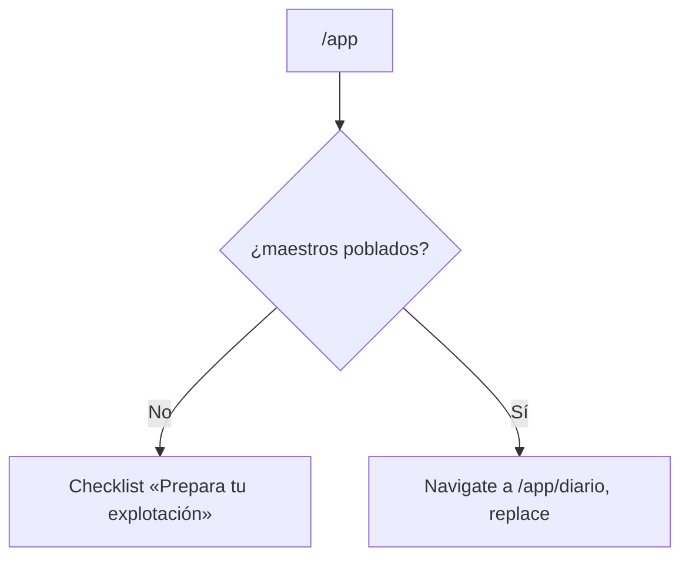

# TDD: MVP-703 — Arranque en el diario y definición de sesión activa

> **Referencia al spec**: [spec.md](./spec.md)

## Resumen técnico

Dos puntos que **tienen que ir juntos**: cambiar el arranque cambia lo que mide el KPI de uso del
panel, y resolver uno sin el otro dejaría una métrica que nadie sabe leer.

| Punto | Cambio | Tamaño |
|---|---|---|
| `P-087` | Con la explotación preparada, `/app` lleva al **Diario de campo** en vez de renderizar la Visión General | Tres líneas en `HomeView` |
| `P-078` | «Sesión activa» se define como **la que llega al área operativa**, que es lo que el sistema mide de verdad, y el KPI se reformula | Comentarios y KB |

El código de `P-078` **no cambia**: la señal ya se emitía donde se emite. Lo que cambia es que el
comentario del endpoint decía otra cosa —que una sesión en onboarding también contaba— y esa
afirmación no la construyó nadie. Se corrige la descripción, no la conducta, y se deja escrito que
emitirla también en onboarding se descartó a propósito.

## Componentes afectados

| Componente | Tipo de cambio | Descripción |
|---|---|---|
| `frontend/.../home/HomeView.tsx` | modificado | La segunda cara pasa de renderizar el panel a redirigir al diario |
| `frontend/.../home/HomeView.test.tsx` | nuevo | Las dos caras del Home, que hasta ahora no tenían cobertura |
| `frontend/.../layout/AppLayout.tsx` | modificado | El comentario de la señal, alineado con la definición |
| `Controllers/TelemetryController.cs` | modificado | El comentario que afirmaba lo contrario de lo que se emite |
| `docs/05-infraestructura/observabilidad.md` · `01-producto/kpis.md` | modificado | Definición de sesión activa, KPI reformulado y ruptura de serie declarada |
| `docs/09-desarrollos/.../MVP-499/spec.md` · `MVP-999/spec.md` | modificado | `P-040` anotado como parcialmente revertido |

## Diseño detallado

### El Home sigue siendo el punto de decisión

**No se sustituye por una redirección en el router.** Quién arranca dónde depende de si quedan
maestros por poblar, y eso solo se sabe tras consultarlos: el Home ya hacía esa consulta para decidir
qué cara mostrar, así que la decisión se queda donde estaba y solo cambia el destino de una de las dos
ramas.

`replace` y no `push`: sin él, «atrás» desde el diario volvería a `/app`, que redirige otra vez, y el
botón de retroceso quedaría inservible. Verificado en navegador.

### Por qué el panel estaba mal como arranque

`MVP-499` decidió que el Home **fuese** la Visión General (`P-040`) y la decisión no era mala. Lo que
faltaba era un dato del dominio: **la cosecha se concentra al final de campaña**, así que durante la
mayor parte del año lo primero que se veía al entrar era «Sin cosechas en {temporada}». Además
contradecía a `RN-033`, que declara el diario cronológico unificado vista principal del MVP: el
producto decía que su vista principal era una y arrancaba en otra.

La primera cara —el checklist mientras falten maestros— **no cambia**, y tiene ahora cobertura propia
para que no se pierda al mover la segunda.

### La definición de «sesión activa»

`app_session_started` se emite desde `AppLayout`, que cuelga de `RequireWorkspace`. Una sesión que se
queda en el onboarding no la manda **nunca**. Pero el comentario de `TelemetryController` decía que no
exigir ámbito de Workspace era deliberado *porque* «una sesión en onboarding también es una sesión
activa, y dejarla fuera del divisor haría subir el KPI». Describía una intención que nadie había
construido (`P-078`).

Se fija la definición **que se cumple**, con las mismas palabras en los tres sitios —endpoint, shell y
`observabilidad.md`—: sesión activa es **la que llega al área operativa**. Emitirla también en
onboarding se descarta explícitamente: metería en el divisor sesiones en las que el panel todavía no
existe. Lo que se conserva es no exigir el ámbito, pero por el motivo honesto: la señal no necesita
Workspace y pedirlo solo añadiría un motivo de fallo a una medida.

### La ruptura de serie del KPI

Es la consecuencia que obliga a que los dos puntos vayan juntos:

| | Antes de MVP-703 | Desde MVP-703 |
|---|---|---|
| Qué medía | Casi toda sesión activa abría el panel **por el mero hecho de entrar** | De las sesiones que entran al área operativa, cuántas **eligen** abrir el panel |
| Valor esperado | ~100 % por construcción | Bastante menor |

La bajada **no es una pérdida de uso**, y el KPI pasa a medir algo que antes no se podía preguntar. Se
declara el corte en `kpis.md` y en `observabilidad.md` con la fecha del despliegue, porque una métrica
que cambia de significado en silencio es peor que una serie rota.

## Alternativas descartadas

| Alternativa | Por qué no |
|---|---|
| Destino de arranque configurable por usuario | Descartado por el PO: una preferencia más en un producto con un solo perfil de usuario |
| Redirigir desde el router sin pasar por el Home | La decisión depende de los maestros, y eso exige consultarlos |
| Emitir la señal de sesión también en onboarding | Metería en el divisor sesiones en las que el panel todavía no existe |
| Dejar el KPI como estaba | Seguiría llamándose igual midiendo otra cosa, sin que nadie pudiera leer la serie |
| Reiniciar el contador para «empezar limpio» | Se perdería el histórico sin ganar nada: lo que hace falta es saber **dónde** está el corte |

## Riesgos e impacto

- **El KPI de uso del dashboard va a bajar** en la próxima revisión semanal. Está declarado, con la
  causa y la fecha del corte.
- El arranque cambia para todos los usuarios con la explotación preparada. Es el objetivo de la
  historia y la Visión General sigue a un clic.
- Entrar por `/app` cuesta una carga de maestros antes de redirigir. Ya la costaba: es la misma
  consulta con la que el Home decidía qué cara mostrar.

## Plan de testing

| Nivel | Qué cubre |
|---|---|
| Unitario frontend (`HomeView.test.tsx`) | Con maestros poblados se llega al diario; con un maestro pendiente sigue el checklist; sin temporada, también |
| UI conducida | Las dos caras sobre el Workspace real, y que «atrás» no rebote |

## Verificación realizada

Sobre la aplicación en marcha, en el Workspace «Rafa»:

| Comprobación | Resultado |
|---|---|
| `/app` con 1 maestro pendiente (catálogo de tareas vacío) | Checklist «Prepara tu explotación · 3/4» (CA-2) |
| `/app` tras crear la tarea que faltaba | Redirige a `/app/diario`, cabecera «Diario de campo» (CA-1) |
| «Visión General» en la navegación lateral | Un clic, `/app/vision-general` (CA-3) |
| «Atrás» desde la Visión General | Vuelve a `/app/diario`, no rebota en `/app` |

Los datos de desarrollo se dejaron como estaban (la tarea creada para la comprobación se retiró).

## Checklist de implementación

- [x] Arranque en el Diario de campo con la explotación preparada
- [x] Checklist intacto mientras falten maestros, y ahora con cobertura
- [x] Visión General a un clic desde la navegación
- [x] «Sesión activa» descrita igual en el endpoint, en el shell y en la KB, y coincidiendo con lo que
      se emite
- [x] KPI de uso del dashboard reformulado con la ruptura de serie declarada
- [x] `P-040` anotado como parcialmente revertido en `MVP-499` y en el registro de `MVP-999`
- [x] 828 tests de backend y 145 de frontend en verde
