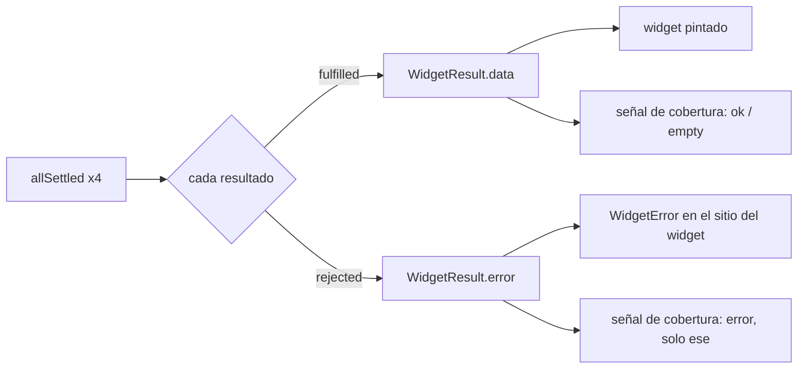

# TDD: MVP-706 — Comportamiento de la Visión General

> **Referencia al spec**: [spec.md](./spec.md)

## Resumen técnico

Dos cambios en la misma pantalla, y el segundo arrastra más KB que código:

| Punto | Cambio | Lo que arrastra |
|---|---|---|
| `P-075` | `Promise.all` → `Promise.allSettled`, con el error **acotado al widget** | La cobertura de `MVP-602` pasa a atribuir el fallo al widget que lo causó |
| `P-085` | Retirada del botón «Actualizar» (decisión del PO) | `RN-006` reescrita, `dashboard.manual_refresh` discontinuada y el `CA-2` de `MVP-602` superado |

El detalle que no se ve en el diff: los cuatro widgets **no comparten suerte, pero sí ámbito**. Como el
`scope` viaja en las cuatro respuestas, la pantalla lo toma de la primera que haya llegado bien. Antes
lo leía solo del resumen, así que si esa era justo la petición que fallaba, la Visión General no sabía
ni de qué campaña estaba hablando aunque los otros tres widgets sí lo supieran.

## Componentes afectados

| Componente | Tipo de cambio | Descripción |
|---|---|---|
| `frontend/.../dashboard/VisionGeneralView.tsx` | modificado | `allSettled`, `WidgetResult`, `WidgetError`, ámbito desde cualquier respuesta, botón retirado |
| `frontend/.../lib/usage-telemetry.ts` | modificado | `dashboard_manual_refresh` sale del catálogo del cliente |
| `Application/Ops/OperationalSignalsService.cs` | modificado | Se retiran `ManualRefreshPerSession` y `ManualRefresh` del informe |
| `Controllers/OpsController.cs` | modificado | Los dos campos salen de la respuesta |
| `Infrastructure/Telemetry/UsageEvents.cs` | modificado | El evento queda documentado como discontinuado pero **tolerado** |
| `docs/01-producto/reglas-de-negocio.md` (RN-006, RN-007) | modificado | Estrategia de refresco vigente y su motivo |
| `docs/05-infraestructura/observabilidad.md` · `01-producto/kpis.md` | modificado | La señal y su KPI, marcados como retirados |
| `docs/02-arquitectura/contratos-api.md` | modificado | El evento sigue aceptándose y se dice por qué |
| `docs/09-desarrollos/.../MVP-602/spec.md` | modificado | `CA-2` marcado como superado por esta historia |

## Diseño detallado

### Fallo parcial

Queda **un** error de pantalla completa: cuando ninguna de las cuatro pudo cargarse. Se detecta por que
no hay `scope` en ninguna respuesta, y en ese caso la pantalla no intenta además adivinar un estado
vacío —«todavía no hay temporada que mirar» sería mentira si lo que pasó es que la API no responde—.

`hasProduction` también deja de depender solo del resumen: si esa petición falló pero destinos o
terrenos trajeron filas, la campaña tiene producción y la pantalla no debe dar por vacía una campaña
que no lo está.

### Retirada del botón y su señal

La señal no se borra, se **discontinúa**, y la diferencia importa en los tres sitios:

| Sitio | Qué se hace | Por qué |
|---|---|---|
| Cliente | Deja de emitirla | Su única fuente era el botón |
| Endpoint de telemetría | La **sigue aceptando** | Un cliente cacheado puede seguir mandándola tras el despliegue; responderle `400` convertiría un resto inofensivo en un error de cliente contado —justo lo que `MVP-713` corrige en otro sitio— |
| Informe de `ops/signals` | Deja de publicarla | Publicarla daría siempre `0`, que se lee como «nadie refresca» en vez de como «esto ya no se mide» |

El contador se sigue escribiendo, así que la serie histórica de la tabla no se rompe: simplemente ya
nadie la lee.

## Alternativas descartadas

| Alternativa | Por qué no |
|---|---|
| Botón «Reintentar» en el widget caído | Reintroduciría por la puerta de atrás el control que el PO acaba de retirar, y `RN-006` acaba de quedar en que el refresco es recargar o volver a entrar. El widget dice cómo reintentar en su texto |
| Refresco automático o al recuperar el foco | Descartado explícitamente por el PO en el spec |
| Borrar el evento del catálogo del servidor | Los clientes cacheados empezarían a recibir `400` durante horas tras el despliegue |
| Dejar `manual_refresh_per_session` publicándose a cero | Un cero es una afirmación: diría que nadie refresca, cuando lo que pasa es que ya no se puede |

## Riesgos e impacto

- **Respuesta de `GET /api/v1/ops/signals` con dos campos menos** (`product_usage_7d.manual_refresh_per_session`
  y `daily[].manual_refresh`). El consumidor es la revisión operativa semanal, documentada en la KB.
- El `CA-2` de `MVP-602` queda **superado**, no incumplido: se cumplió cuando se escribió y deja de
  aplicar porque la conducta que medía ya no existe. Queda anotado en su propio `spec.md` para que
  nadie lea una épica cerrada apuntando a una señal muerta.

## Plan de testing

| Nivel | Qué cubre |
|---|---|
| Unitario frontend | Fallo de **un** widget: los otros tres se pintan y la cobertura lo atribuye solo a él; la pantalla sigue sabiendo la campaña aunque falle el resumen; ya no hay botón «Actualizar»; cambiar de filtro sigue recargando |
| Integración backend | `ops/signals` no publica `manual_refresh_per_session` ni `daily[].manual_refresh`, y sí sigue publicando `widget_coverage` |
| UI conducida | Fallo real de una sola petición contra la API en marcha |

## Verificación realizada

Sobre la aplicación en marcha, interceptando **solo** `GET /dashboard/kg-by-plot` para que devuelva
`500` mientras las otras tres responden normalmente:

- Resumen, kg por destino y evolución se pintan con sus datos reales (4.461 kg · 4 partidas).
- En el sitio de «Kg por terreno» aparece su error, con el mensaje que devolvió la API.
- La señal emitida es `summary: empty, kg_by_destination: empty, kg_by_plot: error, yield_evolution: ok`.
  Antes de esta historia habrían sido los cuatro `error`.
- La pantalla ya no tiene botón «Actualizar» y el pie dice que el refresco es recargar o volver a entrar.

`CA-5` no es comprobable contra el entorno local: `Ops__ApiKey` vive fuera del repositorio y sin ella
`/api/v1/ops/signals` responde `404` a propósito. Queda cubierto por el test de integración, que sí
configura la llave.

## Checklist de implementación

- [x] `Promise.allSettled` con error acotado al widget
- [x] Atribución del fallo al widget concreto en la señal de cobertura
- [x] Botón «Actualizar» retirado
- [x] `RN-006` reescrita con su motivo
- [x] `dashboard.manual_refresh` fuera del informe operativo y declarada discontinuada
- [x] `CA-2` de `MVP-602` ajustado en su spec
- [x] 828 tests de backend y 142 de frontend en verde
