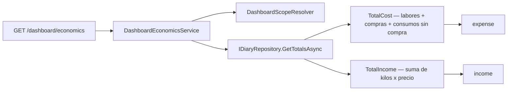

# TDD: MVP-707 — Valor económico de la campaña

> **Referencia al spec**: [spec.md](./spec.md)

## Resumen técnico

Es el **único punto de la épica que amplía el alcance funcional**, y el diseño está construido para que
esa ampliación sea lo más pequeña posible: un campo opcional, un importe derivado y dos cifras en el
panel. Tres decisiones sostienen todo lo demás:

| Decisión | Por qué |
|---|---|
| El importe es **derivado, no columna** | Guardarlo permitiría que divergiera de `kilos × precio` tras una corrección, y entonces habría dos verdades sobre el mismo dinero (CA-3) |
| `null` es **«no se sabe»**, nunca cero | Una partida sin precio no ha ingresado 0 €. Afirmar el cero sería afirmar algo falso sobre la campaña (CA-2, CA-5) |
| El panel **no calcula el gasto: se lo pregunta al diario** | El diario es donde el producto decidió qué cuenta como gasto, y esa decisión costó un hallazgo (`R-01`). Reimplementarla crearía dos verdades, que es exactamente cómo nació `P-082` (CA-4) |

## Componentes afectados

| Componente | Tipo de cambio | Descripción |
|---|---|---|
| `Domain/Harvests/Harvest.cs` | modificado | `UnitPrice` opcional, `Amount` derivado, validación de rango |
| `Domain/Harvests/HarvestCatalogs.cs` | modificado | `HarvestDestinations.Sale` / `IsSale`: pista para la UI, no restricción |
| `Domain/Harvests/IHarvestRepository.cs` | modificado | `HarvestView.UnitPrice` + `Amount` derivado |
| `Infrastructure/Data/TerrenarioDbContext.cs` · migración `AddHarvestUnitPrice` | modificado/nuevo | Columna `unit_price numeric(12,4)` **nullable y aditiva** |
| `Application/Harvests/*` · `Controllers/HarvestsController.cs` | modificado | `unit_price` en alta y edición parcial; `unit_price` + `amount` en la respuesta |
| `Domain/Diary/IDiaryRepository.cs` · `DiaryRepository.cs` | modificado | `DiaryRow.Amount`, `DiaryFilter.PlotIds`, `DiaryTotals.TotalIncome`/`HarvestsWithPrice` |
| `Application/Diary/*` · `Controllers/DiaryController.cs` | modificado | `amount` por entrada y `total_income` en la cabecera |
| `Application/Dashboard/DashboardEconomics.cs` | nuevo | Lectura económica, apoyada en los totales del diario |
| `Controllers/DashboardController.cs` · `Program.cs` | modificado | `GET /api/v1/dashboard/economics` |
| `Infrastructure/Telemetry/UsageEvents.cs` | modificado | Quinto widget `economics` en el catálogo cerrado de cobertura |
| `frontend/.../harvests/HarvestFormModal.tsx` | modificado | Campo de precio e importe en vivo |
| `frontend/.../harvests/CosechasView.tsx` · `diary/DiarioView.tsx` | modificado | Columna de importe, importe en la tarjeta y tarjeta de ingreso |
| `frontend/.../dashboard/VisionGeneralView.tsx` | modificado | Tarjetas de gasto e ingreso como quinto widget |
| `docs/01-producto/reglas-de-negocio.md` (RN-029, RN-009) · `02-arquitectura/{modelo-de-datos,contratos-api}.md` | modificado | La regla, el ER y el contrato |

## Diseño detallado

### El gasto no se recalcula: se pregunta

Es la pieza con más contenido de la historia. El gasto tiene una regla que **ya se equivocó una vez**:
las imputaciones reparten dinero que la compra ya aportó, así que sumarlas contaría el mismo gasto dos
veces (`R-01` de `MVP-399`). Esa regla vive en el diario. Preguntándosela, las cifras del panel y las de
la cabecera del diario **no pueden** discrepar; reimplementándola, discreparían en cuanto una de las dos
cambiase.

Para poder preguntarla con el filtro del panel —que es **multi-terreno** (`plot_ids`), mientras que el
del diario es de uno— `DiaryFilter` gana `PlotIds`. Va al final del registro para no desplazar a los
llamadores posicionales existentes.

**Se pasa el filtro tal y como llegó, no el ámbito ya resuelto.** El ámbito rellena «todos los activos»
por defecto, y acotar por terrenos deja las compras fuera —una compra es del Workspace, no de un
terreno—. Distinguir «no he filtrado» de «he filtrado por todos» es lo que hace que el gasto por
defecto incluya las compras, exactamente igual que en el diario sin filtro de terreno.

### Cero contra «no se sabe»

La distinción se mantiene en los cinco sitios por los que pasa el dato, y en cada uno costaba poco
perderla:

| Sitio | Cómo se conserva |
|---|---|
| Agregado | `UnitPrice` es `decimal?`; un `0` explícito se **rechaza** (`VALIDATION_HARVEST_UNIT_PRICE_RANGE`) |
| Totales del diario | `TotalIncome` es `null` si `HarvestsWithPrice == 0`, no la suma de ceros |
| Contrato | `income`, `unit_price` y `amount` viajan como `null` |
| Listado y tarjeta | «Sin dato», nunca «0,00 €» |
| Panel | La tarjeta dice «Sin dato» y explica que ninguna partida tiene precio |

`harvests_with_price` acompaña siempre al ingreso: sin él, 800 € sobre dos de tres partidas parecería
el ingreso de la campaña entera.

### Dónde se ofrece el precio

El destino de venta decide **dónde se ofrece** el campo con etiqueta propia («Precio de venta por
kilo»), no dónde se admite: en el resto de destinos sigue estando, con etiqueta secundaria («Precio por
kilo, si la vendes»). Quien vende parte de una partida destinada a consumo propio también quiere
apuntarlo, y una restricción de dominio ahí solo produciría un rodeo.

## Alternativas descartadas

| Alternativa | Por qué no |
|---|---|
| Persistir el importe como columna | Divergiría de `kilos × precio` en cuanto alguien corrigiera los kilos (CA-3) |
| Tratar la ausencia de precio como `0` | Convertiría «no lo sé» en «no he ingresado nada», que es una afirmación falsa sobre la campaña |
| Calcular el gasto en el servicio del dashboard | Dos implementaciones de la misma regla, con el precedente de `R-01` y de `P-082` |
| Meter el ingreso dentro de `total_cost` con signo | Un signo es una convención que cada consumidor puede leer al revés; son magnitudes distintas y van en campos distintos |
| Restringir el precio a destinos de venta | Deja fuera un caso real y no protege de nada |
| Añadir margen o rentabilidad | El PO acotó el alcance al mínimo: **dos cifras, no un módulo de contabilidad** |

## Riesgos e impacto

- **Migración aditiva y nullable**: ninguna cosecha existente cambia de significado, porque `null` es
  lo que ya tenían todas. Verificado sobre la base de datos de desarrollo, con partidas previas.
- **`GET /api/v1/dashboard/economics` es un endpoint nuevo** y el panel pasa de cuatro peticiones a
  cinco. Con `MVP-706` recién entrado, un fallo suyo se queda acotado a su propio widget.
- El catálogo cerrado de cobertura gana un quinto widget: sin ello, un panel con la lectura económica
  rota seguiría midiendo 100 % de cobertura.
- La cabecera del diario gana una tarjeta de **ingreso**. No estaba escrito en el alcance del spec,
  pero sin ella el `CA-4` no sería comprobable: el criterio pide que el panel coincida «con lo que suma
  el diario», y el diario no sumaba ingresos.

## Plan de testing

| Nivel | Qué cubre |
|---|---|
| Dominio (`HarvestEconomicsTests`) | Precio opcional sin importe cero, importe derivado, recálculo al corregir kilos, retirada del precio, rechazo del cero explícito, precio admitido en destinos que no son de venta |
| Integración (`DashboardEconomicsIntegrationTests`) | «Sin dato» cuando nadie tiene precio, suma solo de las partidas con precio, **coincidencia exacta con la cabecera del diario**, exclusión de la compra al acotar por terrenos, recálculo del importe vía `PATCH` |
| Unitario frontend | Tarjetas de gasto e ingreso, «Sin dato» en vez de «0 €», sobre cuántas partidas se suma, quinto widget en la señal de cobertura |
| UI conducida | Formulario, listado, diario y panel sobre la aplicación en marcha |

## Verificación realizada

Contra la API y la base de datos reales, en el Workspace «Rafa»:

| Comprobación | Resultado |
|---|---|
| Migración sobre datos existentes | `ALTER TABLE harvests ADD unit_price numeric(12,4)` aplicada al arrancar; las 5 partidas previas siguen sin importe |
| Sin ninguna partida con precio | `income: null`, `harvests_with_price: 0` — **no** `0` |
| Gasto del panel contra el del diario | `390,00 €` en los dos. Es la misma cifra que `P-092` decía que solo se veía en el diario |
| `PATCH unit_price = 0,62` sobre 1.400 kg | `amount = 868,00 €`, derivado |
| `PATCH kgs = 1.000` sin tocar el precio | `amount = 620,00 €` — el importe sigue a sus factores (CA-3) |
| Ingreso del panel contra el del diario | `620,00 €` en los dos |

En UI conducida (1280x720):

- **Visión General**: «GASTO DE LA CAMPAÑA 390,00 €» e «INGRESO DE LA CAMPAÑA 620,00 € · Sobre 1 de 4
  partidas con precio».
- **Cosechas**: columna «Importe» con `620,00 € / 0,62 €/kg` en la partida con precio y **«Sin dato»**
  en las tres que no lo tienen.
- **Formulario**: con destino de venta la etiqueta es «Precio de venta por kilo»; al cambiar a consumo
  propio pasa a «Precio por kilo (si la vendes)» y el campo sigue disponible. Escribir `0,75` sobre
  1.000 kg actualiza el importe a `= 750,00 €` **mientras se escribe**, sin teclearlo (CA-1).
- **Diario**: cabecera con «GASTO 390,00 €» e «INGRESO 620,00 €», y el importe en la tarjeta de la
  cosecha.

Los datos de desarrollo se dejaron como estaban (partida restaurada a 1.400 kg y sin precio).

## Checklist de implementación

- [x] `unit_price` opcional con migración aditiva y nullable
- [x] Importe derivado, nunca columna
- [x] `null` = «no se sabe» conservado de extremo a extremo
- [x] Importe en el listado de cosechas y en la entrada del diario
- [x] Tarjetas de gasto e ingreso en la Visión General, con el ámbito aplicado
- [x] El gasto del panel se lo pregunta al diario: no pueden discrepar
- [x] `RN-029` matizada y `RN-009` ampliada; ER y `contratos-api.md` al día
- [x] 841 tests de backend y 145 de frontend en verde
