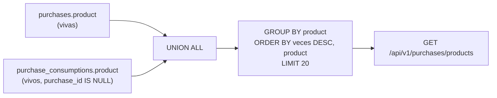

---
id: "MVP-708"
tipo: feature
titulo: "TDD: Roces de captura en compras y consumos"
estado: completado
tickets: []
epica: "MVP-007--ajustes-mvp-01"
responsable: "@andres"
revisores: []
ai_context:
  dominios: ["operativa", "ux"]
  modulo_path: "03-modulos/diario-y-operativa"
  componentes: ["purchases", "consumptions", "diario"]
  etiquetas: ["mvp", "ajustes", "ux"]
  nivel_riesgo: bajo
creado_en: "2026-08-08"
actualizado_en: "2026-08-08"
---

# TDD: MVP-708 — Roces de captura en compras y consumos

> **Referencia al spec**: [spec.md](./spec.md)

## Resumen técnico

Dos puntos del **mismo formulario**, en la misma pantalla, que ensucian los datos sin que nadie se dé
cuenta. Separarlos obligaría a tocarlo dos veces.

| Punto | Cambio | Tamaño |
|---|---|---|
| `P-057` | El vocabulario de materiales (`RN-031`) se aprende de **los dos libros** y deja de colgar del puerto de compras | Puerto y repositorio nuevos, un `datalist` más |
| `P-058` | Aviso no bloqueante cuando el consumo es anterior a su compra: **`RN-043`**, señal en el formulario y etiqueta en la fila | Un `LEFT JOIN`, dos campos derivados y tres etiquetas |

Ninguno de los dos cambia lo que se **puede** guardar: no hay validación nueva, ni código de error
nuevo, ni migración. Lo que cambia es lo que el producto ofrece antes de escribir y lo que señala
después.

## Componentes afectados

| Componente | Tipo de cambio | Descripción |
|---|---|---|
| `Domain/Materials/IMaterialRepository.cs` | nuevo | Puerto del vocabulario de materiales y `MaterialSuggestion` |
| `Infrastructure/.../MaterialRepository.cs` | nuevo | `UNION ALL` + `GROUP BY` sobre los dos libros |
| `Application/Materials/ListMaterialSuggestionsHandler.cs` | nuevo | Sustituye a `ListPurchaseProductsHandler` |
| `Domain/Purchases/IPurchaseRepository.cs` · `PurchaseRepository.cs` · `PurchaseHandlers.cs` | modificado | Se les retira la consulta de sugerencias |
| `Controllers/PurchasesController.cs` · `Program.cs` | modificado | Nuevo handler tras la **misma** ruta contratada |
| `Domain/Consumptions/IConsumptionRepository.cs` | modificado | `PurchaseDate` en `ConsumptionView` y `IsBeforePurchaseDate` derivado |
| `Infrastructure/.../ConsumptionRepository.cs` | modificado | `LEFT JOIN` a `purchases` para traer solo su fecha |
| `Controllers/ConsumptionsController.cs` | modificado | `purchase_date` e `is_before_purchase_date` en la respuesta |
| `Domain/Diary/IDiaryRepository.cs` · `DiaryRepository.cs` · `DiaryQueryService.cs` · `DiaryEntry.cs` · `DiaryController.cs` | modificado | El mismo aviso en la vista principal (RN-033) |
| `frontend/.../ConsumptionFormModal.tsx` | modificado | Sugerencias en el campo de material y aviso de fecha |
| `frontend/.../ComprasView.tsx` · `DiarioView.tsx` | modificado | Etiqueta «antes de la compra» / «ANTES DE LA COMPRA» |
| `frontend/.../ComprasView.test.tsx` | nuevo | La vista no tenía cobertura propia |
| `Tests/Materials/MaterialRepositoryPostgresTests.cs` · `Integration/PurchaseCaptureFrictionTests.cs` | nuevo | El SQL unido y los dos CA contra la API real |
| `docs/01-producto/reglas-de-negocio.md` · `02-arquitectura/contratos-api.md` · `03-modulos/diario-y-operativa/README.md` | modificado | `RN-043`, contrato y superficie del módulo |

## Diseño detallado

### `P-057` — Un vocabulario, no dos ámbitos

El spec dejaba abiertas dos vías: **combinar** los dos históricos o que el endpoint aceptara un
**ámbito**. Se combinan.

Un parámetro de ámbito resolvería el síntoma —el campo de consumo dejaría de estar vacío— dejando
intacta la causa: seguirían existiendo dos vocabularios en la misma pantalla, y quien registra un
consumo no vería el nombre que él mismo escribió en una compra. El punto no es que falten
sugerencias, es que **el material del Workspace es uno**. Un ámbito además pediría decidir cuál es el
defecto de cada formulario, que es exactamente la decisión que produjo el defecto.

Tres decisiones dentro:

- **Las imputaciones no cuentan.** Una imputación copia el material de su compra, así que no puede
  aportar un nombre nuevo: incluirla solo inflaría `times_used` y ordenaría el vocabulario por
  «cuánto se repartió» en vez de por «cuánto se escribió». El vocabulario nuevo nace **solo** en el
  consumo sin compra previa, que es justo el campo que no sugería nada.
- **La unión se hace en SQL, no juntando dos listas ya recortadas.** Con un tope de 20 por lista, un
  material que fuera el 21.º en compras y el 21.º en consumos se quedaría fuera aunque sumando fuera
  de los más usados. Es la misma lección que `MVP-506` aplicó al diario. Hay test dedicado con
  `limit: 1`.
- **Puerto propio (`IMaterialRepository`) y no un método más en `IPurchaseRepository`.** El
  vocabulario dejó de ser de las compras; un método que lee dos entidades escondido tras el puerto de
  una sola es una firma que miente. Precedente: `MVP-506` sacó el diario unificado a
  `IDiaryRepository` en vez de repartirlo entre los puertos operativos.

**La ruta no se mueve.** `GET /api/v1/purchases/products` es la contratada en `contratos-api.md` §7 y
renombrarla sería romper el contrato sin que nadie gane nada: lo que cambió es de dónde se aprende,
no qué se pide. Queda como una arruga de nombre, anotada aquí y en el contrato.

En el cliente, el `datalist` del modal de consumo se alimenta de la **misma** lista que ya cargaba
`ComprasView` para el alta en línea. No hay petición nueva: la vista ya pedía el vocabulario en cada
recarga y solo faltaba pasárselo al modal.

### `P-058` — Avisar sin impedir, como ya hace `RN-023`

`RN-043` se redacta calcada de `RN-023` porque es el mismo problema con otra referencia: una fecha
que probablemente esté mal y que **puede** estar bien.

| | `RN-023` | `RN-043` |
|---|---|---|
| Referencia | Rango de la temporada | Fecha de la compra imputada |
| Se bloquea | No | No |
| Dónde se ve | Formulario y fila | Formulario y fila |
| Cuándo no aplica | Nunca (siempre hay temporada) | Consumo sin compra previa: no hay contra qué comparar |

**Se deriva en lectura, no se persiste.** No hay columna nueva ni migración: `ConsumptionView` recibe
la fecha de la compra por `LEFT JOIN` y expone `IsBeforePurchaseDate`. Congelarlo al guardar dejaría
un aviso mintiendo en cuanto alguien corrigiese la fecha de la compra —que es una de las dos formas
de arreglar el problema que el aviso señala—. Hay test para eso: corregir la compra apaga el aviso
sin tocar el consumo.

El `LEFT JOIN` es la única cosa que este cambio le pide a la compra, y el comentario que decía que la
compra **no** se unía se corrige en vez de dejarse: la razón de no unirla sigue vigente para el coste
y el material —el consumo los congela (`RN-032`) y la fila se explica sola—, pero ya no es cierto que
no se una nada.

La igualdad de fechas **no** avisa: comprar por la mañana y gastar por la tarde es la jornada normal
de una explotación.

Dónde se ve, en las tres superficies que ya usan el patrón de `RN-023`:

| Superficie | Señal |
|---|---|
| `ConsumptionFormModal` | Aviso ámbar bajo las fechas, `role="status"`, con la fecha de la compra escrita: «Este consumo es anterior a su compra, del 31 jul 2026». Aparece **al teclear**, y el botón de guardar sigue activo |
| Fila de «Consumos por terreno» (`ComprasView`) | Etiqueta `antes de la compra` junto al material, al lado de `sin compra`, en el mismo estilo que `fuera de rango` del libro |
| Tarjeta del diario (`DiarioView`) | `ANTES DE LA COMPRA`, junto a `FUERA DE TEMPORADA` y `SIN COMPRA` |

El diario entra **a propósito**: es la vista principal del MVP (`RN-033`) y donde `RN-023` ya rotula
«FUERA DE TEMPORADA». Un aviso que existiera en el libro y no en el diario sería un aviso que se ve
solo si vas a buscarlo.

## Alternativas descartadas

| Alternativa | Por qué no |
|---|---|
| Ámbito (`scope=`) en el endpoint de materiales | Deja vivos dos vocabularios en la misma pantalla, que es la causa del punto, y obliga a decidir un defecto por formulario |
| Contar también las imputaciones en `times_used` | No aportan nombres nuevos y desordenan el vocabulario según cuánto se repartió cada compra |
| Juntar en memoria dos listas ya recortadas | Un material presente en los dos libros puede caerse del tope aunque sumando sea el más usado |
| Renombrar la ruta a `/api/v1/materials` | Rompe el contrato de `contratos-api.md` §7 sin que nadie gane nada; el cambio es de origen del dato, no de petición |
| **Bloquear** el consumo anterior a su compra | Prohibido por el spec y contrario a `RN-032`: la captura retroactiva es real |
| Persistir el aviso al guardar | Mentiría en cuanto se corrigiera la fecha de la compra, que es una de las dos formas de resolverlo |
| Normalizar los nombres (acentos, similitud) para agrupar variantes | Fuera de alcance desde `MVP-205`; agrupar «Abono NPK» y «abono npk» escondería que el histórico tiene las dos |
| Dejar el aviso solo en el libro de compras | El diario es la vista principal (`RN-033`) y ya rotula el aviso hermano de `RN-023` |

## Riesgos e impacto

- **`times_used` cambia de significado**: pasa de «veces comprado» a «veces escrito en los dos
  libros». Solo lo consume el orden de las sugerencias, que no se muestra al usuario.
- **La proyección de consumos tiene un `JOIN` más.** Es un `LEFT JOIN` por clave ajena indexada
  dentro de consultas que ya unían terreno y temporada; en el diario entra en una rama del
  `UNION ALL` que ya hacía un `LEFT JOIN` (la tarea de la actividad).
- **El aviso aparece en registros antiguos**, porque se deriva en lectura. Es deseado: si hay
  consumos con la fecha mal, esta historia existe para que se vean.
- Ningún cambio de esquema, de código de error ni de estado HTTP. La imputación retroactiva sigue
  respondiendo `201`, y hay test que lo fija para que nadie la «arregle» convirtiéndola en un `400`.

## Plan de testing

| Nivel | Qué cubre |
|---|---|
| Repositorio sobre PostgreSQL real (`MaterialRepositoryPostgresTests`) | Que la unión se traduce a SQL, que agrupa sobre el conjunto unido, que las imputaciones no cuentan, que el tope se aplica **después** de unir y que sigue aislando por Workspace y respetando la baja lógica |
| Repositorio sobre PostgreSQL real (`ConsumptionRepositoryPostgresTests`) | El aviso de `RN-043`: anterior, posterior, mismo día, sin compra, y que corregir la fecha de la compra lo apaga |
| Integración contra la API (`PurchaseCaptureFrictionTests`) | CA-1 (vocabulario combinado, también en la búsqueda parcial), CA-2 (`201` + aviso en la respuesta) y CA-3 (la señal llega al listado y al diario) |
| Unitario frontend (`ComprasView.test.tsx`) | Que el campo de material del consumo ofrece el vocabulario, que la fila lleva la etiqueta solo cuando toca y que el aviso del formulario aparece al teclear **sin** deshabilitar el botón de guardar |

## Verificación realizada

| Comprobación | Resultado |
|---|---|
| `dotnet test src/backend/Terrenario.sln` | 912 correctas, 0 con error |
| `npm run build` (cliente) | Correcto |
| `npm run lint` (cliente) | 7 avisos, los mismos que antes de la historia (`exhaustive-deps` de `OAuthCallback.tsx` y seis `only-export-components` de contextos) |
| `npm test` (cliente) | 175 correctas en 23 ficheros |
| `POST /purchases/{id}/consumptions` con `date` anterior a la compra | `201` con `is_before_purchase_date: true` y `purchase_date: "2026-07-31"` (CA-2, test de integración) |

**No verificado en navegador**: el aspecto real de las tres etiquetas y del aviso del formulario, y
el comportamiento del `datalist` nativo al escribir. Queda para la revisión conducida del PO; la
lógica que decide cuándo aparece cada uno sí está cubierta por los tests de vista.

## Checklist de implementación

- [x] El vocabulario de materiales combina compras y consumos sin compra previa, unido en SQL
- [x] El campo de material del consumo sin compra previa sugiere ese vocabulario
- [x] `RN-043` documentada, con su analogía con `RN-023` y el porqué de no bloquear
- [x] Aviso no bloqueante en el formulario, con la fecha de la compra escrita
- [x] Etiqueta en la fila del listado y en la tarjeta del diario
- [x] Imputar con fecha anterior sigue respondiendo `201`, fijado por test de integración
- [x] Contrato y módulo actualizados; `P-057` y `P-058` cerrados en el registro de `MVP-999`
