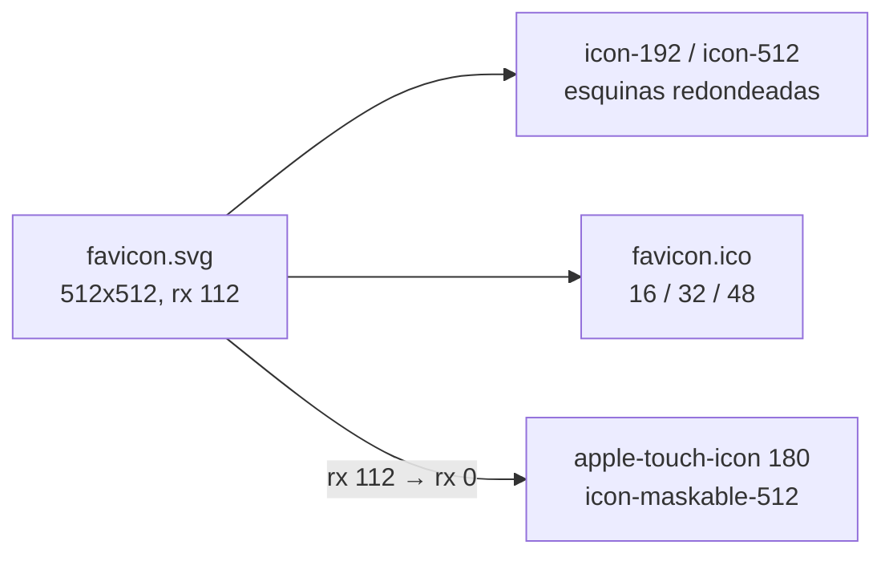

---
id: "MVP-710"
tipo: feature
titulo: "TDD: Identidad de marca y presencia del producto"
estado: completado
tickets: []
epica: "MVP-007--ajustes-mvp-01"
responsable: "@andres"
revisores: []
ai_context:
  dominios: ["marca", "ux", "frontend"]
  modulo_path: "03-modulos/plataforma-de-aplicacion"
  componentes: ["assets", "index-html", "landing"]
  etiquetas: ["mvp", "ajustes", "marca"]
  nivel_riesgo: bajo
creado_en: "2026-08-08"
actualizado_en: "2026-08-08"
---

# TDD: MVP-710 — Identidad de marca y presencia del producto

> **Referencia al spec**: [spec.md](./spec.md)

## Resumen técnico

No hay que **diseñar** nada: la marca existe y la aplicación la pinta en cuatro sitios —lateral,
Home, acceso y landing— siempre igual, baldosa verde oliva `#33450d` con el glifo `eco` en blanco. Lo
que falta es sacarla del `<div>`: al documento, al escritorio del móvil y a la tarjeta de un enlace
compartido.

| Superficie | Antes | Ahora |
|---|---|---|
| Pestaña del navegador | El rayo morado de Vite (`#863bff`), versionado desde `MVP-101` | `favicon.svg` propio, con respaldo `.ico` de 16/32/48 |
| Inicio del móvil | Marcador con captura de pantalla | `manifest.webmanifest` + `apple-touch-icon` + icono `maskable` |
| Barra del navegador | Gris del sistema | `theme-color` verde oliva |
| Enlace compartido | Tarjeta vacía | `description`, Open Graph y Twitter Card con imagen autoalojada |

Y una restricción que gobierna todo lo anterior: **cero recursos de terceros**. `MVP-502` inyecta
`default-src 'self'` en el build de producción, así que un icono de un CDN o una imagen social alojada
en un generador no llegarían a cargar; y aunque cargaran, reabrirían la evaluación de `RN-042` que
`MVP-505` cerró autoalojando las tipografías.

## Componentes afectados

| Componente | Tipo de cambio | Descripción |
|---|---|---|
| `frontend/public/favicon.svg` | modificado | Deja de ser el logo del andamiaje y pasa a ser el distintivo del producto |
| `frontend/public/favicon.ico` · `apple-touch-icon.png` · `icon-192.png` · `icon-512.png` · `icon-maskable-512.png` · `og-image.png` | nuevo | Los rasterizados que el SVG no cubre |
| `frontend/public/manifest.webmanifest` | nuevo | Nombre, iconos, `theme_color`, `background_color`, `start_url` |
| `frontend/index.html` | modificado | Iconos, manifest, `theme-color`, `description`, Open Graph y Twitter Card |
| `frontend/scripts/generar-iconos.mjs` | nuevo | Generador ad hoc de los rasterizados; **no** entra en `npm run build` |
| `frontend/src/test/recursos-de-marca.test.ts` | nuevo | Que lo declarado exista y que el favicon no vuelva a ser el de Vite |
| `frontend/src/test/sin-recursos-externos.test.ts` | modificado | La guarda de `MVP-599` se extiende a `index.html` y al manifest |
| `backend/Tests/Http/BrandAssetsContentTypesTests.cs` | nuevo | Que `UseStaticFiles` sepa nombrar `.webmanifest` y no lo responda con 404 |
| `docs/03-modulos/plataforma-de-aplicacion` · `07-seguridad/*` · `01-producto/reglas-de-negocio.md` | modificado | La afirmación «nada se carga de terceros» ahora cubre también la marca |

## Diseño detallado

### El punto de partida, comprobado antes de tocar nada

El spec afirmaba que `public/favicon.svg` era el logo de Vite. Lo es: 9.522 bytes de rayo con
degradado `#863bff` → `#47bfff`, máscara y filtros de desenfoque. Importa dejarlo escrito porque
explica por qué el defecto sobrevivió tanto: **había favicon y se servía con 200**. Cualquier
comprobación del tipo «¿hay favicon?» pasaba. Por eso el test de regresión no pregunta si el fichero
existe, sino si dentro está el verde de la marca y **no** está el morado del andamiaje.

### El dibujo: la baldosa que la aplicación ya pinta



El vector es la fuente de verdad y todo lo demás sale de él. Dos detalles que no son obvios:

**El glifo va como trazado, no como texto.** Es el mismo `eco` de Material Symbols que ya se
autoaloja (`@material-symbols/svg-400`, Apache-2.0, la familia que `MVP-505` trajo al repositorio),
pero un favicon se pinta **antes de que exista CSS**: si dependiera de la fuente, no se vería.

**El glifo no está centrado en su caja em.** Su tinta mide 678x683 sobre la rejilla de 960 y su
centro cae en `(458.5, -422)`, no en `(480, -480)`. Centrarlo por la caja lo dejaría visiblemente
alto y a la derecha. Los números no se estimaron: se midieron rasterizando el glifo y recorriendo el
canal alfa, y de ahí sale la transformación que lo recoloca. Se escala al 50 % de la baldosa —algo
más que el ~42 % de la cabecera de la app— porque a 16 px el margen no aporta nada y la hoja sí.

**A sangre para el sistema operativo, redondeado para la pestaña.** iOS aplica su propio squircle al
`apple-touch-icon` y Android recorta el icono `maskable` dentro de un círculo: redondear también en el
fichero recortaría dos veces y dejaría las esquinas mordidas. Por eso esas dos variantes se generan
con el mismo dibujo y `rx="0"`, y además aplanadas sobre fondo opaco, porque iOS no admite
transparencia. El glifo mide 256 px sobre 512 y su diagonal (≈363 px) cabe holgada en la zona segura
del `maskable`, que es el círculo interior de 409 px.

### El `.ico`: DIB y no PNG dentro del ICO

Un `.ico` con PNG embebido es más corto de escribir y lo entiende cualquier navegador moderno. Pero
**el único motivo para seguir publicando un `.ico` es el consumidor que no entiende el SVG**, que es
justamente el viejo. Se escribe por tanto como DIB clásico: `BITMAPINFOHEADER` con `biHeight`
duplicado, píxeles BGRA de abajo arriba y máscara AND —redundante con el alfa, pero obligatoria por
formato—.

Se validó **leyéndolo con otro programa**, no con el que lo escribió: `System.Drawing.Icon` extrae los
tres tamaños y devuelve `RGB(51,69,13)` —que es `#33450d`— en el borde y blanco en el centro. El
tamaño del fichero, 15.086 bytes, coincide exactamente con el que predice el formato.

### Los recursos rasterizados y su generador

`scripts/generar-iconos.mjs` produce los seis PNG y el `.ico` a partir de `public/favicon.svg` con
`@resvg/resvg-js` y `sharp`. **No forma parte de `npm run build`** y sus dependencias **no están en
`package.json`**: son ~50 MB de binarios nativos que cada `npm ci` del CI pagaría para producir unos
ficheros que cambian una vez al año. El precio de esa decisión es que el script no arranca solo, así
que la orden que le falta está escrita en su propia cabecera, para que quien lo abra sepa que le
faltan dependencias y no crea que está roto.

Para la tarjeta social hace falta texto, y ahí aparece un detalle: resvg no descomprime `woff2`, que
es lo único que publica `@fontsource`. El script convierte a TTF con `wawoff2` en `node_modules/.cache`
antes de rasterizar, de modo que la imagen se compone con **las tipografías reales del producto** —Plus
Jakarta Sans para los titulares, Inter para el cuerpo— y no con la que el sistema tenga a mano.

### La tarjeta social en una SPA

`index.html` es **un único documento para todas las rutas**, y los raspadores de WhatsApp o Telegram
no ejecutan JavaScript: leen el HTML que llega. Por eso las etiquetas viven en el documento y
describen la **landing**, que es la superficie pública y la que se comparte. Etiquetas por ruta
exigirían renderizado en servidor o prerenderizado, que es otra arquitectura y no es alcance de unos
ajustes.

Las URL de `og:url` y `og:image` son absolutas porque el formato lo exige —ningún raspador resuelve
rutas relativas de forma fiable— y el origen va literal, igual que ya está en `appsettings.json` para
las invitaciones y para CORS. Un marcador de posición que alguien olvidara sustituir sería peor:
rompería la tarjeta en silencio.

### La CSP, comprobada y no supuesta

La política real del build de producción se leyó de `dist/csp.policy`, que es el fichero del que la
API la toma para emitirla como cabecera:

```text
default-src 'self'; script-src 'self'; style-src 'self' 'unsafe-inline'; font-src 'self';
img-src 'self' data:; connect-src 'self'; frame-ancestors 'none'; base-uri 'self';
form-action 'self'; object-src 'none'
```

Tres consecuencias concretas: `img-src 'self' data:` bloquearía cualquier icono o imagen social
remota; `manifest-src` no está declarada, así que hereda de `default-src` y solo admite el propio
origen; y la política **no cambia** con esta historia, que era el objetivo —si hubiera hecho falta
tocarla, la solución habría sido la equivocada—.

### El manifest y un 404 que nadie vería

`UseStaticFiles` **no sirve lo que no sabe nombrar**: ante una extensión que su proveedor de tipos no
reconoce responde 404, no un tipo genérico. Y un 404 en `manifest.webmanifest` es invisible: solo lo
pide el navegador al añadir la aplicación al inicio, así que no aparece en ningún log ni en ninguna
pantalla; lo único que se ve es que el icono del escritorio vuelve a ser una captura. Se comprueba
contra el mismo `FileExtensionContentTypeProvider` que usa el pipeline, en vez de darlo por supuesto.

`start_url` es `/app` y no `/`: quien se instala la aplicación quiere entrar en ella, y sin sesión la
guarda ya lleva al acceso. `display: standalone` con `scope: /` deja dentro las páginas legales y la
vuelta de Google.

### La guarda de `MVP-599`, ampliada

`sin-recursos-externos.test.ts` recorría **solo `src/`**. Los iconos, el manifest y la tarjeta social
viven fuera de esa carpeta: es exactamente el hueco por el que ya se coló la fotografía de la landing
desde `images.unsplash.com`. Ahora cubre también `index.html` y el manifest, con un matiz necesario:
Open Graph obliga a URL absolutas, así que la comprobación no puede ser «cero `https://`», sino «cero
`https://` que no seamos nosotros».

## Alternativas descartadas

| Alternativa | Por qué no |
|---|---|
| Un generador de favicons en línea | Sube el logotipo a un tercero y devuelve un paquete que nadie revisa; además invita a enlazar los recursos desde su CDN, que la CSP bloquearía |
| Imagen social generada al vuelo por un servicio | Es un recurso de terceros en la superficie pública: reabre `RN-042` justo donde `MVP-505` lo cerró |
| PNG embebido dentro del `.ico` | Más corto, pero solo lo entienden los consumidores modernos, que son precisamente los que ya leen el SVG |
| SVG como `og:image` | Ni WhatsApp ni Telegram ni X lo renderizan; la tarjeta llegaría igual de vacía |
| Añadir `sharp` y `resvg` a `devDependencies` | ~50 MB de binarios nativos en cada instalación del CI para unos ficheros que cambian una vez al año |
| Generar los iconos durante el build | Lo mismo, y encima haría que la imagen de un despliegue dependiera de una cadena de rasterizado |
| Service worker para que Chrome ofrezca «Instalar» | Fuera de alcance por el spec, y arrastra caché de recursos y estrategia de actualización, que es otra historia |
| Etiquetas Open Graph por ruta | Exige renderizado en servidor o prerenderizado; los raspadores no ejecutan el router |
| `<link rel="mask-icon">` para pestañas ancladas de Safari | Formato propio y en desuso desde que Safari lee el SVG normal |

## Riesgos e impacto

- **Las cachés de tarjeta social son largas.** WhatsApp y Facebook guardan lo que raspan la primera
  vez; tras el despliegue puede seguir viéndose la tarjeta vacía hasta que caduque o se fuerce el
  reraspado. No es un fallo del cambio, pero se verá como tal.
- **El icono viejo puede sobrevivir en la pestaña.** El favicon se cachea con agresividad y los
  ficheros de `public/` no llevan huella en el nombre; una recarga forzada lo resuelve.
- **Sin service worker, Chrome no ofrecerá el aviso automático de instalación.** «Añadir a pantalla de
  inicio» desde el menú sí usa el manifest y da icono y nombre propios, que es lo que pide `CA-2`.
- El peso añadido a `dist/` es ~85 kB, todo en recursos que el documento pide una vez y el navegador
  cachea. Ningún bundle cambia.

## Plan de testing

| Nivel | Qué cubre |
|---|---|
| Unitario frontend (`recursos-de-marca.test.ts`) | Que las rutas de `index.html` y del manifest resuelven a ficheros reales; que el manifest declara nombre y colores de marca y trae `any` **y** `maskable`; que el favicon lleva `#33450d` y no `863bff` |
| Unitario frontend (`sin-recursos-externos.test.ts`) | Que ni el documento ni el manifest apuntan a un dominio ajeno, admitiendo el propio en las URL absolutas de Open Graph |
| Unitario backend (`BrandAssetsContentTypesTests`) | Que el proveedor de tipos del pipeline sabe nombrar `.webmanifest`, `.ico`, `.svg` y `.png` |
| Manual sobre el build | Que los recursos entran en `dist/` y que el HTML generado los referencia por rutas del propio origen |
| Externa (pendiente) | Añadir la aplicación al inicio en un móvil real y raspado del enlace publicado |

## Verificación realizada

| Comprobación | Resultado |
|---|---|
| Contenido de partida de `public/favicon.svg` | Logo de Vite confirmado: 9.522 bytes, `#863bff` |
| `favicon.ico` leído con `System.Drawing.Icon` | Tres entradas 16/32/48; borde `RGB(51,69,13)`, centro blanco; 15.086 bytes, el tamaño exacto que predice el formato |
| `og-image.png` | 1200x630, tipografías del producto, marca y titular de la landing |
| `npm run build` | Correcto. En `dist/`: `favicon.svg`, `favicon.ico`, `apple-touch-icon.png`, `icon-192.png`, `icon-512.png`, `icon-maskable-512.png`, `og-image.png`, `manifest.webmanifest` |
| HTML generado | Todas las rutas de iconos y manifest son del propio origen; las de Open Graph, absolutas hacia `app.terrenario.com` |
| `dist/csp.policy` | `default-src 'self'` intacta; ninguna directiva ha tenido que relajarse |
| `npm run lint` | Sin errores; los 7 avisos son los preexistentes (`only-export-components` y el `exhaustive-deps` de `OAuthCallback.tsx`) |
| `npm test` | 21 ficheros, 165 tests en verde (161 previos + 4 nuevos) |
| Tests de backend | 778 en verde, con los 5 casos nuevos de `BrandAssetsContentTypesTests` (se excluyen los de integración, que exigen Docker) |

**Lo que no se ha verificado aquí**: `CA-5` pide el build de producción **servido de verdad**, y
`CA-2`/`CA-3` se cierran sobre un móvil real y sobre el enlace ya publicado. Queda para la
comprobación del PO tras el despliegue.

## Checklist de implementación

- [x] `favicon.svg` propio, con el distintivo que la aplicación ya usa, y respaldo `.ico` de 16/32/48
- [x] `apple-touch-icon` y juego de iconos de aplicación, con variante `maskable`
- [x] `manifest.webmanifest` con nombre, iconos, `theme_color` y `background_color`
- [x] `theme-color` en `index.html`
- [x] `<meta name="description">`, Open Graph y Twitter Card con imagen social autoalojada
- [x] Ni un solo recurso de terceros: CSP leída del build, no supuesta
- [x] La guarda de recursos externos cubre ya el documento y el manifest, no solo `src/`
- [x] El `.ico` validado con un lector ajeno al que lo escribió
- [x] `P-080` marcado como resuelto en el registro de `MVP-999`
- [ ] Comprobación sobre el build de producción servido y sobre un móvil real (`CA-5`, PO)
