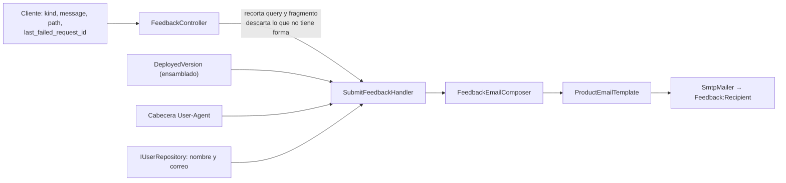

---
id: "MVP-711"
tipo: feature
titulo: "TDD: Canal de feedback del usuario"
estado: completado
tickets: []
epica: "MVP-007--ajustes-mvp-01"
responsable: "@andres"
revisores: []
ai_context:
  dominios: ["producto", "soporte", "privacidad"]
  modulo_path: "03-modulos/plataforma-de-aplicacion"
  componentes: ["feedback", "email", "shell"]
  etiquetas: ["mvp", "ajustes", "soporte"]
  nivel_riesgo: medio
creado_en: "2026-08-08"
actualizado_en: "2026-08-08"
---

# TDD: MVP-711 — Canal de feedback del usuario

> **Referencia al spec**: [spec.md](./spec.md)

## Resumen técnico

Un formulario y un correo. Lo que decide si la historia sirve de algo no es ninguna de las dos cosas,
sino **qué acompaña al mensaje**: sin contexto técnico, «me ha dado un error» obliga a una
conversación de ida y vuelta que casi nunca ocurre, y el reporte se queda en nada.

| Pieza | Decisión |
|---|---|
| Entrada | En la **navegación lateral**, no como panel al final de Ajustes |
| Formulario | **Pantalla propia** dentro del shell, no un diálogo |
| Contexto técnico | Lo compone **el servidor**, no el cliente |
| Correo | El **sexto** del inventario, por `ProductEmailTemplate` (`MVP-715`) |
| Límite anti-abuso | Por cuenta, en servidor, en memoria, y el cupo se consume **al entregar** |
| Persistencia | **Ninguna**: no hay tabla de reportes. El correo es el registro |

## Componentes afectados

| Componente | Tipo de cambio | Descripción |
|---|---|---|
| `Controllers/FeedbackController.cs` | nuevo | La puerta: valida, acota lo que el cliente aporta y traduce los fallos del canal |
| `Application/Feedback/SubmitFeedbackHandler.cs` | nuevo | Resuelve quién reporta y entrega |
| `Application/Feedback/FeedbackRateLimiter.cs` | nuevo | CA-6: tres por hora y cuenta, ventana deslizante |
| `Infrastructure/Feedback/FeedbackEmail.cs` | nuevo | Catálogo `feedback_kind` y lo que lleva el correo, con lo que **no** lleva escrito al lado |
| `Infrastructure/Feedback/FeedbackEmailComposer.cs` | nuevo | El contenido, sobre la plantilla común |
| `Infrastructure/Feedback/{IFeedbackEmailSender,SmtpFeedbackEmailSender}.cs` | nuevo | Salida, con el mismo trato que los otros emisores |
| `Infrastructure/Feedback/FeedbackOptions.cs` | nuevo | `Feedback:Recipient`, secreto de despliegue |
| `Common/DeployedVersion.cs` | nuevo | Qué versión sirve esta instancia |
| `Common/Http/RequestIdMiddleware.cs` | modificado | La validación del identificador pasa a ser pública: la comparte el canal |
| `Common/Errors/ErrorCodes.cs` · `Program.cs` · `appsettings.json` | modificado | Códigos nuevos, registro, aviso de arranque y sección de configuración |
| `Program.cs` (CORS) | modificado | Expone `X-Request-Id`, o el cliente no puede leerlo |
| `frontend/.../components/feedback/FeedbackView.tsx` | nuevo | La pantalla |
| `frontend/.../lib/report-context.ts` | nuevo | Dónde estaba y qué petición falló |
| `frontend/.../services/{feedback.service,http-client}.ts` | nuevo · modificado | El servicio, y la captura del `X-Request-Id` de cada fallo |
| `frontend/.../components/layout/{AppSidebar,AppLayout}.tsx` · `App.tsx` | modificado | Entrada, título, ancho de contenido, ruta y rastro de navegación |
| `Tests/Emails/ProductEmail{Catalog,InventoryTests}.cs` | modificado | El sexto correo entra en el inventario ejecutable |
| `.github/workflows/deploy.yml` | modificado | Graba el tag como versión del ensamblado |
| `docs/06-integraciones` · `07-seguridad` · `02-arquitectura` · `05-infraestructura` · `03-modulos` | modificado | Inventario, tratamiento, contrato, configuración y ficha de módulo |

## Diseño detallado

### El contexto lo arma el servidor

De los cuatro datos del contexto técnico, **el cliente solo aporta dos**, y son los únicos que no
puede saber nadie más: en qué pantalla estaba y qué petición le falló. La versión sale del ensamblado
y el navegador de la cabecera de la propia petición.

No es desconfianza hacia el cliente: es que este cuerpo termina en una bandeja de correo, y todo lo
que llega allí tiene que estar acotado. Por eso el servidor **recorta la query y el fragmento** de la
ruta y **descarta** un `X-Request-Id` que no tenga la forma que emite `RequestIdMiddleware`. Lo
primero es la garantía real de que no viajan datos del Workspace —los filtros del panel llevan
identificadores de terreno en la URL desde `MVP-403`—, y lo segundo evita mandar a quien lee el
reporte a buscar en la traza algo que no existe.

### La versión desplegada, de una sola fuente

No existía. La publicación se dispara con un **tag** (`deploy.yml`) y hasta ahora ese dato no entraba
en ninguna parte del artefacto. Se graba al compilar con `-p:InformationalVersion` y lo lee
`DeployedVersion`.

Se resuelve **en servidor y no en el cliente** porque la API sirve también el estático: un único
artefacto, una única versión. Preguntárselo al navegador habría añadido un dato que quien reporta
puede falsear sin querer —una pestaña abierta desde antes del último despliegue diría la versión
vieja— y habría obligado a incrustar la versión también en el bundle. Sin el parámetro —una
compilación local— queda el `1.0.0` del SDK, que es información honesta: dice «esto no viene de una
publicación».

### El `X-Request-Id` se captura en el cliente HTTP, no en cada pantalla

La cabecera existe desde `MVP-105` (`P-006`) y el cliente la tiraba. Se anota en `http-client.ts`, que
es el único punto por el que pasa toda la operativa, por un motivo de comportamiento humano: **quien
reporta un fallo casi nunca lo hace desde la pantalla que lo provocó**, así que capturarlo en la vista
del error habría cubierto justo el caso que no ocurre.

Dos detalles con consecuencia:

- **Se retiene solo el identificador**, no la URL ni el cuerpo ni el mensaje. Con eso basta para
  encontrar la traza; lo demás serían datos de la explotación camino de un buzón.
- **Un valor ausente no borra el anterior.** Si una respuesta posterior no trae cabecera, conservar el
  último identificador conocido es mejor que quedarse sin ninguno.

Hizo falta además **exponer la cabecera en CORS**. `AllowAnyHeader` es de petición; las de respuesta se
exponen una a una o el navegador no deja leerlas. En producción no habría hecho falta —un solo
origen—, pero en desarrollo (5173 contra 5127) el dato habría sido siempre `null`, que es la peor
forma de descubrir un fallo: funcionando en el sitio donde no se mira.

### Dónde estaba: un rastro en el shell

Consecuencia directa de que el canal sea una pantalla propia: si se enviara `location.pathname`, todo
reporte diría `/app/feedback`, que es lo único que no interesa saber. `AppLayout` anota cada ruta
visitada —**menos la del propio canal**— y el formulario lee la última.

Vive **en memoria**, no en `sessionStorage`, y es deliberado: guardarlo en el navegador añadiría
entradas al inventario que `RN-042` obliga a mantener, y a cambio solo cubriría el caso de fallar,
**recargar** y reportar después. La aplicación es un SPA, así que ir de la pantalla del fallo al canal
no recarga nada. Se acepta perderlo tras un `F5`.

### Pantalla propia, y en la navegación

Dos decisiones que parecen una.

**No es un diálogo.** Contar un fallo lleva un par de párrafos y a veces hay que releerlos; un modal
empuja a despachar. Y hay una razón de oportunidad que pesa igual: `MVP-704` está unificando todos los
modales del producto en un componente común con trampa de foco, y estrenar uno propio a la vez sería
un modal más que migrar.

**No es un panel de Ajustes**, aunque `AjustesView` ya tenga paneles y fuera lo más barato. Esa
pantalla termina en la zona de baja de cuenta, que está deliberadamente al final por ser lo
irreversible (`MVP-505`): el canal habría quedado **por debajo de lo más peligroso de la aplicación**.
Y CA-1 pide una entrada *visible*, que es lo contrario de estar al fondo de una pantalla de
configuración. En la navegación lateral se ve desde cualquier sitio, que es donde hace falta cuando
algo acaba de fallar.

### El correo entra por la puerta que `MVP-715` dejó abierta

`MVP-715` unificó la composición de los cinco correos existentes y escribió, en su propio inventario,
que este sería el sexto y tendría que entrar por ahí. Se cumple literalmente: `FeedbackEmailComposer`
aporta **solo texto**, la plantilla produce el marcado, y el correo se da de alta en
`ProductEmailCatalog`, que es lo que le da las garantías comprobadas del resto —pie legal, motivo del
envío, versión en texto plano y cero recursos remotos— sin escribir un solo test para ellas.

Importa especialmente aquí porque es **el único correo del producto cuyo cuerpo lo escribe una
persona**, que es exactamente el caso en el que olvidarse de escapar duele. No hay nada que recordar:
el emisor no tiene acceso al marcado.

Dos detalles propios:

- **Sin llamada a la acción**, como las alertas: la respuesta a un reporte es leerlo y contestar.
- **Un extracto del mensaje en el asunto**, con los espacios colapsados antes de recortar. Es
  legibilidad para triar la bandeja, y también la defensa que corresponde: un salto de línea dentro de
  una cabecera es la forma clásica de inyectar otras. MimeKit ya codifica el valor, pero una cabecera
  no debería salir de un campo de texto libre sin normalizar.

### El correo de quien reporta va dentro, y se dice antes

Sin él, el canal no puede contestar «¿en qué pantalla exactamente?» y deja de ser un canal en cuanto
haga falta una aclaración. Es dato personal, así que la decisión no se resuelve poniéndolo y ya: la
pantalla enumera **antes de enviar** qué acompaña al mensaje —nombre y correo de la cuenta, versión,
navegador, pantalla y referencia del último error— y dice expresamente que **no** va nada de la
explotación. La transparencia del art. 13 en el momento, no en un documento aparte.

### El límite, en servidor y con el cupo al final

Tres por hora y cuenta, ventana deslizante. El número sale de lo que hace una persona de verdad:
contar un problema, acordarse de un detalle y mandarlo aparte. Un cuarto en la misma hora es
repetición.

Está **en servidor** porque deshabilitar el botón ordena la pantalla pero no es un límite: el endpoint
está autenticado y cualquiera con sesión puede llamarlo en bucle. Y está **en memoria** porque la API
corre en una sola instancia, que es la misma premisa por la que las migraciones se aplican al arrancar
y por la que el estado de las alertas vive en un singleton. Si algún día escala, el límite pasaría a
ser «tres por réplica»; queda escrito en el propio código.

El cupo se consume **al entregar**, no al intentar. Si el proveedor de correo está caído, el reporte no
ha llegado a ninguna parte y gastarle el cupo a quien lo intentó sería castigarle por un fallo
nuestro. El riesgo teórico de agotar el canal a base de envíos fallidos no existe: justamente lo que
no está pasando es que salga correo.

### Lo que se responde cuando no se puede enviar

| Situación | Respuesta | Por qué así |
|---|---|---|
| Cupo agotado | `429 RATE_LIMIT_FEEDBACK` + `Retry-After` | No hay regla de negocio incumplida, solo hay que esperar, y se dice cuánto |
| Sin buzón o sin cuenta de envío | `503 FEEDBACK_CHANNEL_UNAVAILABLE` | El canal no existe hoy; además se traza como error, porque es un fallo de configuración del despliegue |
| El proveedor no acepta el envío | `503 FEEDBACK_DELIVERY_FAILED` | Reintentar tiene sentido, y el mensaje lo dice |

Lo que **no** se hace en ninguno de los tres es confirmar. Decir «enviado» sin haber enviado es peor
que el fallo: la persona se queda esperando una respuesta que nadie va a dar.

## Alternativas descartadas

| Alternativa | Por qué no |
|---|---|
| Herramienta de tickets externa, con o sin widget | Decisión del PO (2026-08-06): sería un encargado del tratamiento nuevo y, si carga scripts, activaría `RN-042` y obligaría al banner de cookies que `MVP-505` evitó |
| Un `mailto:` en el pie | Depende de que haya cliente de correo configurado, no lleva contexto técnico y no se puede limitar |
| Modal desde cualquier pantalla | Empuja a despachar lo que necesita dos párrafos, y `MVP-704` está migrando todos los modales a la vez |
| Panel al final de `AjustesView` | Quedaría por debajo de la baja de cuenta, que está deliberadamente al final por irreversible |
| Guardar el reporte en una tabla | El spec deja fuera estados y seguimiento: sería un almacén de texto libre, con su retención y sus derechos, que nadie consulta |
| Adjuntar el Workspace o la temporada «porque ayuda» | Un canal de soporte no es una vía lateral para sacar datos operativos a un buzón. Hay un test que lo impide |
| Que el cliente mande la versión y el navegador | Dos datos que el servidor ya tiene, y uno de ellos falseable sin querer por una pestaña vieja |
| `sessionStorage` para el contexto del reporte | Añade filas al inventario de `RN-042` a cambio de cubrir solo el caso «fallar, recargar y reportar» |
| Límite por IP | Detrás de un CGNAT castiga a vecinos; la sesión ya identifica a quien envía |
| Cupo consumido al intentar | Con el correo caído, agotaría el canal de quien no ha conseguido enviar nada |
| Acuse de recibo por correo al usuario | La confirmación se da en pantalla, donde está la persona; un correo automático sería un séptimo envío para repetir lo dicho |

## Riesgos e impacto

- **Sin `Feedback__Recipient` el canal está visible y no funciona.** Es el estado en cualquier máquina
  de trabajo, porque la dirección no puede ir al repositorio (público). El arranque lo advierte, igual
  que con la cuenta de envío y con `Ops__AlertEmail`, y el intento responde `503` explicándolo.
- **Llega texto libre a un buzón.** Acotado a 2000 caracteres, escapado por la plantilla y limitado a
  tres por hora y cuenta, pero es contenido escrito por personas y puede contener lo que decidan
  escribir, incluidos datos de terceros. Queda declarado en `privacidad-datos.md`.
- **El límite es por instancia.** Con una sola, es el límite real; con varias réplicas pasaría a ser
  «tres por réplica y hora».
- **La versión solo es fiable en lo publicado por el pipeline.** Un despliegue hecho a mano dirá
  `1.0.0`, que es lo correcto: no viene de una publicación.
- **`X-Request-Id` pasa a exponerse por CORS.** Es un identificador de correlación aleatorio, sin
  información dentro, y ya viajaba en la respuesta; lo que cambia es que el navegador deja leerlo.

## Plan de testing

| Nivel | Qué cubre |
|---|---|
| Límite (`FeedbackRateLimiterTests`) | El cupo se agota, se recupera al salir el más antiguo de la ventana y es por cuenta, no global |
| Puerta (`FeedbackControllerTests`) | Validaciones; que el navegador salga de la cabecera; que la query y el fragmento se recorten; que un `X-Request-Id` con mala forma se descarte; `429` con `Retry-After`; canal sin configurar; y que un fallo de envío no confirme ni gaste cupo |
| Correo (`FeedbackEmailComposerTests`) | Contexto técnico completo en HTML y texto; «ninguna registrada» en lugar del hueco; asunto sin saltos de línea; escapado; y **nada de la explotación** |
| Inventario (`ProductEmailInventoryTests`) | Las garantías transversales, ahora sobre seis correos, por entrar en `ProductEmailCatalog` |
| Contexto del cliente (`report-context.test.ts`) | Se recuerda la pantalla anterior, se ignora la del canal y el último fallo no se pierde con una respuesta sin cabecera |
| Cliente HTTP (`http-client.test.ts`) | Solo las respuestas de error dejan correlación |
| Pantalla (`FeedbackView.test.tsx`) | Lo que sale lleva pantalla y correlación; confirmación en pantalla; mensaje de la API al agotar el cupo; y que se diga qué se envía antes de enviarlo |

## Verificación realizada

| Comprobación | Resultado |
|---|---|
| `dotnet test src/backend/Terrenario.sln` | 937 pruebas en verde (27 nuevas en `Tests/Feedback/`) |
| `npm run build` · `npm test` · `npm run lint` | Build correcto, 184 pruebas en verde, sin avisos nuevos (sigue el `exhaustive-deps` de `OAuthCallback.tsx`) |
| Previews en `artifacts/correos/` | Seis correos: el nuevo se genera desde el mismo código que compone el que se envía |
| Ausencia de recursos remotos | `sin-recursos-externos.test.ts` y la comprobación transversal del inventario, ambas en verde sin tocar la CSP |

**Lo que no se ha verificado**:

- **La recepción del correo en una bandeja.** No se ha enviado ninguno: hacerlo exige levantar el
  receptor SMTP local (`scripts/smtp-sink.py` + `ProductEmailDeliveryTests`, de `MVP-715`) y no era el
  encargo. El correo queda dado de alta en el catálogo, así que la comprobación es
  `TERRENARIO_SMTP_SINK_PORT=1025 dotnet test --filter FullyQualifiedName~ProductEmailDelivery`.
- **El recorrido en la aplicación en marcha.** No se han levantado los servidores (puertos ocupados),
  así que la entrada en la barra lateral, el título de la cabecera y el envío real están cubiertos por
  pruebas pero no vistos en pantalla.
- **`Feedback__Recipient` en el despliegue.** Es configuración de producción y hay que darla de alta
  en el App Service; hasta entonces el canal responde que no está disponible.

## Checklist de implementación

- [x] Entrada visible en la navegación lateral, no al fondo de Ajustes
- [x] Formulario como pantalla propia dentro del shell, sin ningún modal nuevo (`MVP-704` no se toca)
- [x] Contexto técnico compuesto en servidor: versión, ruta, `X-Request-Id` del último fallo y navegador
- [x] Nada de la explotación en el reporte, con la query recortada en servidor y una prueba que lo fija
- [x] El correo entra por `ProductEmailTemplate`, en `ProductEmailCatalog` y en el inventario de la KB
- [x] Destinatario fuera del repositorio (`Feedback:Recipient`), con aviso al arrancar si falta
- [x] Confirmación en pantalla, y mensaje distinto por cada forma de fallar
- [x] Límite de tres reportes por hora y cuenta, en servidor
- [x] Sin recursos ni scripts de terceros: `RN-042` sin activar y CSP intacta
- [x] Tratamiento descrito en `privacidad-datos.md` con base y plazo coherentes con `RN-041`
- [x] `P-088` marcado como resuelto en el registro de `MVP-999`
- [x] 937 pruebas de backend y 184 de cliente en verde
