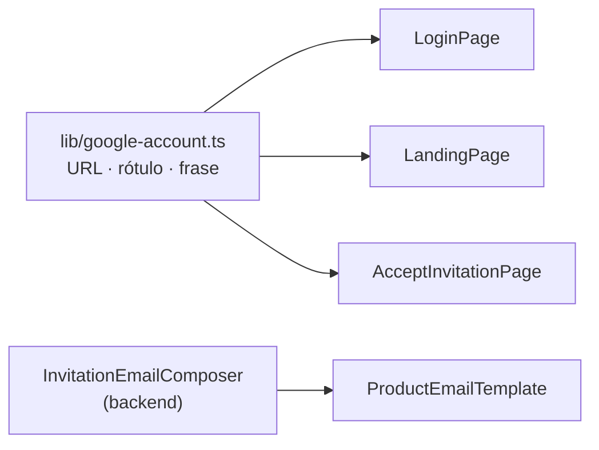

---
id: "MVP-712"
tipo: feature
titulo: "TDD: Acceso con cualquier direccion de correo"
estado: completado
tickets: []
epica: "MVP-007--ajustes-mvp-01"
responsable: "@andres"
revisores: []
ai_context:
  dominios: ["identidad", "ux", "contenido"]
  modulo_path: "03-modulos/identidad-y-workspaces"
  componentes: ["login", "landing", "invitaciones", "correos"]
  etiquetas: ["mvp", "ajustes", "acceso"]
  nivel_riesgo: bajo
creado_en: "2026-08-08"
actualizado_en: "2026-08-08"
---

# TDD: MVP-712 — Acceso con cualquier dirección de correo

> **Referencia al spec**: [spec.md](./spec.md)

## Resumen técnico

**Esta historia no toca el modelo de identidad.** `RN-036` fija Google OIDC como único proveedor y
sigue intacta; lo que se corrige es que el producto describía esa decisión de una forma que excluye a
gente que **sí puede entrar**. Una Cuenta de Google se da de alta con la dirección que ya se tiene
—Hotmail, Outlook, la de una cooperativa— sin crear ningún buzón nuevo. El límite es el **proveedor**,
no el dominio del correo, y ninguna de las cuatro superficies lo decía.

El diff es texto, un módulo de constantes y sus pruebas.

| Superficie | Qué faltaba | Dónde se dice ahora |
|---|---|---|
| Login | «accede directamente con tu cuenta de Google» se lee como «necesitas un Gmail» | Aviso y enlace al alta, bajo el botón |
| Landing (pública) | No decía **con qué** se entra, y es donde se decide si probar el producto | Bajo el CTA del hero, antes de pedir nada |
| Aptitud de invitación | Explicaba el problema y no la salida: callejón sin salida | Mensaje de `email_mismatch` ampliado + enlace |
| Correo de invitación | Primer contacto, y no hay segunda pantalla donde desmentirlo | Nota bajo la llamada a la acción |

## Componentes afectados

| Componente | Tipo de cambio | Descripción |
|---|---|---|
| `frontend/.../lib/google-account.ts` | nuevo | URL del alta, rótulo del enlace y la frase compartida |
| `frontend/.../auth/LoginPage.tsx` | modificado | Aviso y enlace bajo el botón de Google |
| `frontend/.../marketing/LandingPage.tsx` | modificado | El mismo aviso bajo el CTA del hero |
| `frontend/.../lib/invitation-ui.ts` | modificado | `email_mismatch` ampliado y `shouldOfferGoogleSignup` |
| `frontend/.../invitations/AcceptInvitationPage.tsx` | modificado | Enlace al alta dentro del aviso de aptitud |
| `frontend/.../marketing/LandingPage.test.tsx` | nuevo | La landing no tenía cobertura ninguna |
| `frontend/.../auth/LoginPage.test.tsx` · `lib/invitation-ui.test.ts` | modificado | Cobertura del texto nuevo |
| `Infrastructure/Invitations/InvitationEmailComposer.cs` | modificado | Nota nueva, a través de `ProductEmailTemplate` |
| `Terrenario.Api.Tests/Invitations/InvitationEmailComposerTests.cs` | modificado | Dos pruebas del contenido nuevo |
| `artifacts/correos/invitacion-a-workspace.{html,txt}` | modificado | Vista previa regenerada por los tests |
| `docs/01-producto/reglas-de-negocio.md` · `03-modulos/identidad-y-workspaces/README.md` · `06-integraciones/correos-del-producto.md` | modificado | La aclaración, en la KB |

## Diseño detallado

### El texto vive en un sitio, no en cuatro

Las tres pantallas del cliente comparten la frase y el enlace. No es ahorro de líneas: **tienen que
decir lo mismo**. Si cada una lo redactase por su cuenta, la que se quedara corta volvería a dejar
fuera exactamente a quien esta historia intenta recuperar, y nadie se enteraría —el abandono por creer
que no puedes entrar no genera error, ni ticket, ni traza—.

El correo **no** comparte la constante y es deliberado: es backend, y duplicar la cadena a través de un
recurso compartido entre el cliente y la API sería infraestructura nueva para tres frases. Lo que sí
comparte es la redacción, y las pruebas de los dos lados fijan las mismas palabras.

### Nombrar los dominios, y no prometer de más

Dos decisiones de tono, las dos con consecuencia:

- **«Cualquier dirección» no funciona**: es abstracto y quien tiene un Hotmail no se da por aludido.
  El texto nombra Hotmail, Outlook y «el de tu cooperativa», que es el caso real del usuario objetivo.
- **No se dice «cualquier correo vale»**: dar de alta la dirección como Cuenta de Google es un paso
  real. Prometer lo contrario cambiaría un abandono silencioso por una promesa incumplida en mitad del
  alta, que es peor. La frase dice qué hay que hacer y que es gratis y no crea un buzón nuevo, que es
  la objeción que de verdad frena.

### El aviso de `email_mismatch` no se ramifica

El spec pedía explicar la salida «cuando el motivo probable es que la dirección no sea una Cuenta de
Google». Ese caso **no se puede distinguir**, y conviene que quede escrito por qué:

| Causa de `email_mismatch` | Qué necesita la persona |
|---|---|
| Tiene Cuenta de Google en la dirección invitada, pero entró con otra | Cambiar de cuenta |
| La dirección invitada no es Cuenta de Google, y entró con la única que tenía | Dar de alta esa dirección |

Separarlas exigiría saber si existe una Cuenta de Google para el correo invitado. Y ahí hay dos
paredes: `PreviewInvitationHandler` **no expone** el correo destinatario a propósito —quien tiene el
enlace no siempre es la persona invitada—, así que el cliente no lo conoce; y preguntárselo a Google
sería, además de una integración nueva, filtrar a un tercero una dirección que el producto se ha
comprometido a no revelar ni a quien tiene el enlace.

Así que el mensaje nombra **las dos salidas** y el enlace acompaña siempre a este motivo. Sobra para
quien solo se equivocó de cuenta —le basta la primera frase— y es la única vía para quien, si no, se
queda encerrado. Los demás motivos no lo llevan (`shouldOfferGoogleSignup`): en una invitación
caducada, anulada o ya usada, darse de alta en Google no arregla nada y solo distraería.

### Enlace, nunca recurso

La landing es **pública y está desplegada**, y su CSP es `default-src 'self'` (`RN-042`, cerrada en
`MVP-505` y verificada en `MVP-710`). El alta de Google entra como `<a href>`: lo sigue la persona, no
lo pide el navegador. La guarda `sin-recursos-externos.test.ts` ya distingue las dos cosas —prohíbe
`src=` y `<link href=…>` a terceros y admite enlaces, como el de la AEPD en la Política— así que no
hay que relajar nada.

Los enlaces abren pestaña nueva y llevan `rel="noreferrer"`: lo primero, para no perder la pantalla de
la que se sale —especialmente la invitación—; lo segundo, para no contarle a Google desde qué página
se llega, que es coherente con lo que la Política de Privacidad afirma sobre transferencias.

En el correo, la dirección del alta va en **texto plano**. `ProductEmailTemplate` admite una sola
llamada a la acción, y es aceptar la invitación: un segundo botón compitiendo con el primero dejaría
el correo sin acción principal. Un `<a href>` a Google tampoco descarga nada, pero la nota es
secundaria y no merece el peso visual de un enlace destacado en el único correo que llega a quien
todavía no tiene cuenta.

### El correo se toca donde toca

`MVP-715` acabó con la composición ad-hoc: cada correo aporta **solo texto** y la plantilla es la única
que sabe de HTML y de escapado. La nota nueva entra como un `Notes[0]` más en
`InvitationEmailComposer`; no se añade marcado en ningún sitio. La vista previa
(`artifacts/correos/invitacion-a-workspace.{html,txt}`) la regeneran los propios tests, así que el
inventario publicado no se queda atrás.

De paso se corrige el párrafo que originaba la lectura errónea: «Entra con tu cuenta de Google desde
el enlace de abajo» pasa a «Se entra con una Cuenta de Google, desde el enlace de abajo». «Tu cuenta
de Google» da por hecho que existe; «una Cuenta de Google» la nombra como lo que es, un requisito que
puede cumplirse.

## Alternativas descartadas

| Alternativa | Por qué no |
|---|---|
| Añadir Microsoft como segundo proveedor | Rompe `RN-036`, obliga a decidir vinculación de cuentas y a rehacer la aptitud de invitaciones. Es la evolución, no esta historia |
| Enlace mágico por correo | Mismo motivo, y añade un canal de acceso que habría que endurecer |
| Ramificar `email_mismatch` según si la dirección tiene Cuenta de Google | Exigiría revelar o consultar el correo destinatario, que el preview oculta a propósito |
| Comprobar en el alta si el correo invitado existe en Google | Integración nueva y filtración de la dirección a un tercero, para ahorrar una frase |
| Repetir el aviso también en el CTA final de la landing | Ruido: quien llega abajo ya lo ha leído arriba, y el hero es donde se decide |
| Decir simplemente «vale cualquier correo» | Falso: hay que dar de alta la dirección en Google. Cambiaría el abandono por una promesa incumplida |
| Enlazar el artículo de ayuda de Google en vez del alta | Un paso más antes del formulario, y el propio formulario ya ofrece usar una dirección existente |

## Riesgos e impacto

- **La URL del alta es de un tercero y puede cambiar.** `https://accounts.google.com/signup` es la
  entrada estable y documentada del alta; si Google la moviera, el enlace se rompería sin que ninguna
  prueba lo detecte —comprobarlo exigiría una llamada de red en el CI, que se descarta—. Vive en una
  constante única, así que corregirlo es una línea.
- **No se ha verificado en navegador contra la Google real** (ver más abajo): el flujo de alta con una
  dirección existente es de Google y no se puede ejercitar desde aquí.
- Riesgo de producto: ninguno reversible. Si el texto sobra, sobra; si falta, alguien no entra.

## Plan de testing

| Nivel | Qué cubre |
|---|---|
| Unitario frontend (`LoginPage.test.tsx`) | El texto, que no promete de más, y que el alta es enlace en pestaña nueva con `noreferrer` |
| Unitario frontend (`LandingPage.test.tsx`, nuevo) | Que la landing dice con qué se entra **antes de pedir nada** y lo mismo que el login |
| Unitario frontend (`invitation-ui.test.ts`) | El mensaje ampliado y que el alta solo se ofrece en `email_mismatch` |
| Unitario backend (`InvitationEmailComposerTests`) | La nota en las **dos** versiones del correo, y que no entra como segunda llamada a la acción |
| Guarda existente (`sin-recursos-externos.test.ts`) | Que el enlace no se ha colado como recurso de un tercero |

## Verificación realizada

| Comprobación | Resultado |
|---|---|
| `dotnet test src/backend/Terrenario.sln` | 907 pruebas, 0 fallos |
| `npm test` | 23 ficheros, 185 pruebas, 0 fallos |
| `npm run build` | Correcto |
| `npm run lint` | Sin errores; los avisos son los preexistentes (`exhaustive-deps` en `OAuthCallback.tsx` y `only-export-components` en los contextos) |
| Vista previa del correo | `artifacts/correos/invitacion-a-workspace.txt` regenerado: la nota aparece bajo el enlace de aceptación, en texto y en HTML |

**Lo que no se ha podido verificar aquí**: nada se ha probado en navegador ni se ha enviado ningún
correo —los puertos de desarrollo estaban ocupados por el PO—, así que quedan pendientes de su
comprobación el aspecto del aviso en las tres pantallas y el del correo en un cliente real. Tampoco se
ha seguido el enlace hasta el alta de Google.

## Checklist de implementación

- [x] Aviso y enlace al alta en el login, bajo el botón de Google
- [x] Lo mismo en la landing pública, antes de pedir nada, como enlace y no como recurso
- [x] `email_mismatch` explica la salida y ofrece el alta; los demás motivos no
- [x] El correo de invitación lo menciona, compuesto con `ProductEmailTemplate` y sin marcado ad-hoc
- [x] `RN-036` intacta: ni un fichero del flujo de autenticación tocado
- [x] Aclaración «Cuenta de Google ≠ Gmail» en `RN-036`, en el módulo y en el inventario de correos
- [x] `P-089` marcado como resuelto en el registro de `MVP-999`
- [x] 907 pruebas de backend y 185 de frontend en verde
