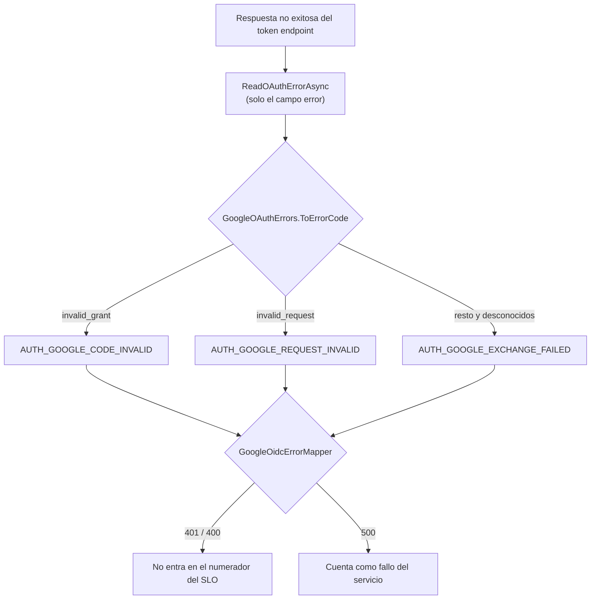

---
id: "MVP-713"
tipo: feature
titulo: "TDD: Errores de OAuth y ruido en las alertas"
estado: completado
tickets: []
epica: "MVP-007--ajustes-mvp-01"
responsable: "@andres"
revisores: []
ai_context:
  dominios: ["autenticacion", "observabilidad"]
  modulo_path: "03-modulos/"
  componentes: ["google-oidc", "slo", "alertas"]
  etiquetas: ["mvp", "ajustes", "bug"]
  nivel_riesgo: medio
creado_en: "2026-08-08"
actualizado_en: "2026-08-08"
---

# TDD: MVP-713 — Errores de OAuth y ruido en las alertas

> **Referencia al spec**: [spec.md](./spec.md)

## Resumen técnico

Un error de cliente deja de contarse como fallo del servidor. El cambio de conducta cabe en una tabla:

| Respuesta de Google | Antes | Desde MVP-713 |
|---|---|---|
| `invalid_grant` (código usado o caducado) | 500 `AUTH_GOOGLE_EXCHANGE_FAILED` | **401** `AUTH_GOOGLE_CODE_INVALID` |
| `invalid_request` | 500 `AUTH_GOOGLE_EXCHANGE_FAILED` | **400** `AUTH_GOOGLE_REQUEST_INVALID` |
| `invalid_client`, `unauthorized_client`, caída, cuerpo ilegible | 500 `AUTH_GOOGLE_EXCHANGE_FAILED` | igual |

Lo que no cabe en la tabla es por qué importa: el numerador del SLO de tasa de error son las
respuestas **5xx**, así que clasificar mal un error no es un detalle de contrato, es mover la medida.
Recargar la pantalla de vuelta de Google —que es lo que provoca `invalid_grant`— contaba como caída
del servicio, y un solo caso sobre 70 peticiones dio 1,43 % y disparó `HighErrorRate`, que es crítica,
con correo real (`MVP-699`, `R-04`).

**La instrumentación del SLO no se toca.** `RequestMetricsMiddleware` ya separaba 4xx de 5xx
correctamente y `AlertEvaluator` ya leía solo el segundo: el defecto nunca estuvo en la medida, sino en
la respuesta que se medía. Lo que sí se añade allí es cobertura, porque hasta ahora nada ataba las dos
piezas.

## Componentes afectados

| Componente | Tipo de cambio | Descripción |
|---|---|---|
| `Infrastructure/Auth/GoogleOAuthErrors.cs` | nuevo | El vocabulario cerrado de RFC 6749 §5.2 y su traducción a códigos de la API |
| `Common/Errors/GoogleOidcErrorMapper.cs` | nuevo | Código de error → HTTP y → cuerpo, en el borde de transporte |
| `Common/Errors/ErrorCodes.cs` · `ApiError.cs` | modificado | Dos códigos nuevos con su mensaje al usuario |
| `Infrastructure/Auth/GoogleOidcService.cs` | modificado | Clasifica el `error` de Google y ajusta el nivel de log |
| `Controllers/AuthController.cs` | modificado | Una captura sobre la tabla, en vez de una cláusula por código |
| `frontend/.../auth/OAuthCallback.tsx` | modificado | Mensaje que dice qué ha pasado y qué hacer |
| `Tests/Auth/GoogleOAuthErrorMappingTests.cs` | nuevo | CA-5, CA-3 y CA-4 |
| `Tests/Integration/GoogleOAuthErrorContractTests.cs` | nuevo | CA-1 y CA-2 sobre la aplicación real |
| `frontend/.../auth/OAuthCallback.test.tsx` | nuevo | Lo que ve el usuario, que no tenía cobertura |
| `docs/02-arquitectura/contratos-api.md` · `05-infraestructura/observabilidad.md` | modificado | La tabla de clasificación y qué cuenta como fallo del servicio |
| `docs/09-desarrollos/.../MVP-999/spec.md` | modificado | `P-079` resuelto |

## Diseño detallado

### Dónde se decide de quién es el error

Son **dos** tablas y no una porque hablan idiomas distintos: la primera traduce el vocabulario de
Google, que solo conoce `GoogleOidcService`; la segunda traduce a HTTP, que el servicio de identidad no
debe conocer. Es la misma separación que ya aplicaba `InvitationErrorMapper`.

La lectura del `error` **no cambia**: se sigue extrayendo únicamente ese campo del cuerpo y descartando
todo lo demás, tal y como decidió `MVP-502` (CA-2) para no registrar en claro una carga ajena que viaja
con el `code` y el `client_secret`. Lo que cambia es que ese valor, además de diagnosticar, ahora
clasifica.

### El defecto va hacia el 500, a propósito

Lo cómodo habría sido clasificar por descarte: «todo lo que no sea claramente nuestro, es del cliente».
Se hace al revés. Un `error` desconocido, ausente o ilegible —una caída de Google, un cambio en su
respuesta, un proxy que devuelve HTML— se sigue contando como fallo propio.

El motivo es que los dos errores no cuestan lo mismo. Una alerta de más se investiga y se descarta; una
alerta que no salta deja una avería corriendo sin que nadie la mire. `P-079` describe el daño de la
primera —una alerta crítica que salta sin motivo se acaba ignorando **también cuando el motivo es
real**—, pero la cura no puede ser peor: si el arreglo silenciara lo desconocido, habríamos cambiado
una alerta ruidosa por una ciega.

Es la misma dirección que tomó `R-03` en `MVP-699`, que sacó del SLO el tráfico que no era de nadie
pero **siguió contándolo aparte** en `api.internal.*` en vez de descartarlo.

### Por qué una tabla y no dos `catch … when`

El controlador tenía una cláusula de captura por código y **ninguna captura general**. Con dos códigos
funcionaba; con cuatro, añadir uno y olvidar su cláusula dejaba la excepción sin capturar, que acaba en
500 por la vía del framework —sin cuerpo de error del contrato y contado como fallo del servidor— sin
que nadie hubiera decidido eso.

La tabla convierte ese olvido en una decisión explícita: lo no clasificado responde 500 porque el
`switch` lo dice, no porque se haya escapado.

### El nivel de log también se clasifica

Recargar la pantalla de vuelta escribía un `Warning` en el servicio y un `LogError` con traza completa
en el controlador. Los dos bajan: `Information` en el servicio y ningún `LogError` cuando el error es de
quien llama.

Es la otra mitad del «ruido» del título. Las alertas son el canal automático; el log es el canal por el
que se mira cuando una alerta salta. Llenarlo de sucesos normales tiene el mismo efecto que una alerta
que salta sin motivo: se deja de leer.

### El embudo de login sigue viendo el fallo

`ExchangeGoogleCodeHandler` emite `login_google_error` con el código, y eso **no cambia**: un intento de
acceso que no llega a entrar es un fallo del embudo aunque no sea un fallo del servicio. Son dos
preguntas distintas —«¿ha podido entrar la gente?» y «¿está roto el servicio?»— y solo la segunda
gobierna `HighErrorRate`.

Como efecto secundario útil, el desglose `login.error.{codigo}` ahora distingue
`auth_google_code_invalid` de `auth_google_exchange_failed`, que antes se mezclaban bajo el segundo.

### La pantalla

`AUTH_GOOGLE_CODE_INVALID` es, con diferencia, el caso más frecuente de la pantalla de callback, y
«Error al completar el acceso» dejaba al usuario pensando que el producto estaba roto justo cuando
bastaba con volver a entrar. El mensaje pasa a decir qué ha pasado y qué hacer. El botón no cambia:
«Volver a intentarlo» ya llevaba a `/login`, que es exactamente la salida.

El mensaje genérico se **conserva** para `AUTH_GOOGLE_EXCHANGE_FAILED`, que desde ahora solo cubre lo
que de verdad es fallo nuestro: ahí el usuario no puede hacer nada distinto de reintentar, y decirle
otra cosa sería engañarle.

## Alternativas descartadas

| Alternativa | Por qué no |
|---|---|
| Sacar el callback del SLO, como se hizo con la sonda de salud en `R-03` | Es tráfico de usuario real: si el login deja de funcionar, el SLO tiene que enterarse |
| Subir el umbral de `HighErrorRate` | El spec lo deja fuera de alcance, y con razón: el problema es la clasificación, no el umbral |
| Clasificar por descarte (lo desconocido es del cliente) | Cambiaría una alerta ruidosa por una ciega |
| Responder 400 también a `invalid_grant` | La credencial presentada no sirve, que es lo que significa 401, y es donde ya estaba `AUTH_GOOGLE_TOKEN_INVALID` |
| Reutilizar `AUTH_GOOGLE_TOKEN_INVALID` para el código caducado | Comparten estado pero no causa ni mensaje; el cliente elige el texto por el código y no podría distinguirlos |
| Dejar el nivel de log como estaba | El canal que se lee cuando salta una alerta seguiría lleno de gente recargando una pantalla |

## Riesgos e impacto

- **La tasa de error observada va a bajar** y no es una mejora del servicio: es que deja de contarse
  algo que no era un fallo. Queda escrito en `observabilidad.md` para que la próxima revisión semanal
  no lo lea como una ganancia.
- Un cliente que tratara cualquier 4xx del callback como «sesión caducada» vería un comportamiento
  distinto. Solo hay un cliente y se ha revisado: `auth.service` extrae el código del cuerpo y no mira
  el estado.
- La clasificación depende de que Google siga usando el vocabulario de la RFC. Si dejara de hacerlo, el
  defecto conservador lo cubre: lo que no se reconoce vuelve a ser 500.

## Plan de testing

| Nivel | Qué cubre |
|---|---|
| Unitario (`GoogleOAuthErrorMappingTests`) | La tabla completa de RFC 6749 §5.2, lo no clasificado (nulo, vacío, desconocido, mayúsculas), que el cuerpo devuelve el mismo código, que los casos de cliente suman 4xx y no 5xx, y las dos caras del escenario de `MVP-699` sobre `AlertEvaluator` |
| Integración (`GoogleOAuthErrorContractTests`) | La aplicación real: 401/400/500 y el cuerpo que recibe el cliente |
| Unitario frontend (`OAuthCallback.test.tsx`) | El mensaje por código, sustituyendo `fetch` para que el recorrido incluya la extracción del código del cuerpo |

El doble de Google del arnés (`FakeGoogleOidcService`) gana `WithOAuthError`, que traduce con la tabla
**de producción**: si duplicara la traducción, el test seguiría pasando el día que la tabla real
cambiara.

## Verificación realizada

| Comprobación | Resultado |
|---|---|
| `dotnet test src/backend/Terrenario.sln` | 864 pruebas, 0 fallos |
| `npm test` (frontend) | 19 ficheros, 151 pruebas, 0 fallos |
| `npm run build` · `npm run lint` | Sin errores; el único aviso de `OAuthCallback.tsx` (`exhaustive-deps`) es anterior a esta historia |
| Escenario de `MVP-699` (69 + 1 código caducado) | `HighErrorRate` no se dispara |
| Mismo escenario con `invalid_client` | `HighErrorRate` sí se dispara |

**No verificado aquí**: el recorrido real contra Google —recargar la pantalla de vuelta en el navegador
con un código ya consumido— exige el consentimiento del proveedor y no se puede automatizar. Los tests
de integración cubren todo el recorrido excepto la respuesta del propio Google, que es lo que sustituye
el doble.

## Checklist de implementación

- [x] `invalid_grant` → 401 `AUTH_GOOGLE_CODE_INVALID`; `invalid_request` → 400
      `AUTH_GOOGLE_REQUEST_INVALID`
- [x] `invalid_client`, `unauthorized_client`, caída de Google y respuesta ilegible siguen en 500
- [x] Lo no clasificado responde 500 por defecto, no por descuido
- [x] Los casos de cliente cuentan en `api.requests.4xx` y no en `api.requests.5xx`, y siguen en el
      divisor
- [x] Reproducido el escenario de `MVP-699`: `HighErrorRate` ya no se dispara, y sigue disparándose con
      un fallo real
- [x] El nivel de log clasifica igual que la respuesta
- [x] La pantalla de callback explica que hay que volver a entrar
- [x] `contratos-api.md` y `observabilidad.md` actualizados; `P-079` marcado resuelto en `MVP-999`
- [x] 864 pruebas de backend y 151 de frontend en verde
