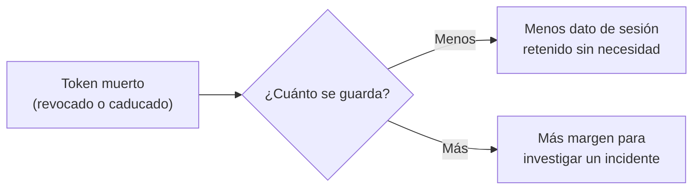

# TDD: MVP-714 — Higiene de datos: retención de sesiones y secretos en el repositorio

> **Referencia al spec**: [spec.md](./spec.md)

## Resumen técnico

Dos restos de higiene que no comparten código pero sí criterio: **lo que se guarda tiene que tener
plazo, y lo que no hace falta guardar no se guarda**.

| Punto | Cambio | Tamaño |
|---|---|---|
| `P-071` | Sexta categoría en `RN-041`: los tokens de refresco muertos se purgan a los **30 días** | Una constante, un corte y una línea de borrado |
| `P-076` | La dirección personal del titular sale de `initialData.ts` | Un valor y una nota de por qué el historial la conserva |

El grueso del trabajo no es el código —son quince líneas— sino **decidir el plazo** y **comprobar que
la rutina lo aplica de verdad**. Al hacer lo segundo apareció lo que el propio `P-071` daba por
sabido y era falso: no existe cascada que limpie esta tabla.

## Componentes afectados

| Componente | Tipo de cambio | Descripción |
|---|---|---|
| `Application/Account/AccountRetentionPolicy.cs` | modificado | `RefreshTokenRetentionDays` y `RefreshTokenCutoffFrom`, junto a los 24 meses |
| `Application/Retention/RetentionPurgeService.cs` | modificado | Paso 6 de la purga y `RefreshTokens` en el informe |
| `Infrastructure/Retention/RetentionOptions.cs` · `RetentionPurgeWorker.cs` | modificado | Los comentarios de cadencia razonaban sobre «el plazo son 24 meses», que ya no es el más corto |
| `Tests/Integration/RetentionPurgeTests.cs` | modificado | Tres casos con datos sembrados contra PostgreSQL real |
| `docs/01-producto/reglas-de-negocio.md` | modificado | `RN-041` con la categoría, el plazo y su motivo |
| `docs/07-seguridad/privacidad-datos.md` | modificado | Tabla de retención, motivo del plazo distinto y retirada de una nota caducada |
| `prototype/.../data/initialData.ts` | modificado | Dirección de ejemplo y nota sobre el historial |
| `docs/09-desarrollos/.../MVP-999/spec.md` | modificado | `P-071` y `P-076` cerrados |

## Diseño detallado

### El plazo: 30 días, y por qué

El spec dejaba abierto «días o semanas». La elección tiene dos fuerzas en contra:



**Por qué no los 24 meses del resto.** Lo que hay en `refresh_tokens` es un dato de sesión —hash del
token, cuenta y fechas—, no histórico operativo que nadie más pueda reconstruir. Y es la categoría
que **más filas genera de largo**: la rotación crea una fila por cada refresco, así que un usuario
activo deja miles al año. Aplicarle el plazo largo sería conservador de más justo donde más cuesta.

**Por qué 30 y no 7.** Es el mismo orden que la vida del propio token
(`Auth:RefreshToken:LifetimeSeconds`, 30 días), de modo que la regla se lee entera de un vistazo: **un
token muerto no dura más de lo que habría durado vivo**. Y deja cuatro ciclos de la revisión operativa
semanal que exige `observabilidad.md` para investigar una sesión sospechosa antes de que el rastro
desaparezca. Esa capacidad forense es lo único que justifica conservar la fila un solo día; con siete
días, una incidencia detectada en la revisión del lunes podría no tener ya nada que mirar.

El valor es **decisión de producto** y está pendiente de que el PO lo confirme.

**Desde cuándo cuenta**: desde la revocación o desde la caducidad, **lo primero que ocurra**. Un token
puede estar revocado y todavía sin caducar (rotación: es el caso masivo) o caducado y sin revocar
(el usuario dejó de volver). Muere en cuanto se cumple cualquiera de las dos, y desde ahí corre el
plazo. De ahí el `OR` del predicado:

```csharp
.Where(rt =>
    (rt.RevokedAt != null && rt.RevokedAt < tokenCutoff) ||
    rt.ExpiresAt < tokenCutoff)
```

Lo vivo no puede caer nunca: sin revocar, la única condición que le queda es `expires_at < cutoff`, y
un token vivo tiene `expires_at > now > cutoff`.

### La cascada que no existía

`P-071` decía que el hash «se limpia solo si se purga la cuenta entera, que arrastra la tabla por
cascada». **No es cierto.** `refresh_tokens` no declara ninguna FK hacia `users` —verificado en la
migración `InitialAuth`, en el snapshot del modelo y en el `modelBuilder`, que solo configura columnas
e índices—, así que `PurgeAccountsAsync` borra la fila del usuario y deja sus tokens ahí, sin cuenta a
la que volver ni plazo que los alcance. El problema no era «tienen plazo largo»: era **no tenían
ninguno**.

Se decidió **no añadir la FK**. Sería el arreglo estructural, pero exige migración sobre una tabla
caliente para conseguir a los 24 meses lo que el plazo nuevo ya consigue a los 30 días: al cerrar una
cuenta, `CloseAccountHandler` revoca todos sus tokens, así que un mes después no queda ninguno vivo ni
muerto. La FK resolvería un caso que, con esta línea, ya no se da.

La suposición equivocada queda escrita en los tres sitios donde alguien la buscaría —el comentario del
servicio, `RN-041` y `privacidad-datos.md`— porque el próximo que lea `P-071` la creerá igual que la
creímos nosotros.

### Dónde vive el plazo

En `AccountRetentionPolicy`, junto a los 24 meses, y **no configurable**. Es la misma decisión que ya
estaba tomada y escrita en `RetentionOptions`: lo que se configura es la cadencia, que es operación;
el plazo es negocio y vive en código para que sea verificable. Una clase nueva para una segunda
constante invitaría a que la tercera categoría naciera con su plazo escondido en otro sitio.

Con dos plazos, la pasada calcula **dos cortes**. La línea nueva va la sexta, al final, con la nota de
que el orden le da igual precisamente porque no hay FK: las cinco primeras van de hijo a padre porque
las FK `Restrict` lo obligan, y esta no participa de esa cadena.

### El correo del prototipo

Sustitución por `juan.perez@ejemplo.test`: coherente con el `userName: 'Juan Pérez'` que ya estaba al
lado, y sobre un TLD **reservado** (RFC 2606), que no es registrable ni entregable —una dirección de
ejemplo sobre un dominio real sería mover el problema a otra persona—.

La nota que queda en el fichero dice tres cosas: que estos datos son de maqueta y ninguno puede ser
real, que **el historial de git conserva la dirección original**, y que eso se acepta a sabiendas. El
PO descartó reescribir el historial: invalidaría clones, tags y referencias existentes —incluidos los
tags de release desde los que se despliega— y no recuperaría lo ya copiado por los rastreadores. La
mitigación real no es borrar el pasado, es que no vuelva a entrar.

### El barrido (CA-5)

Búsqueda por patrón de correo sobre `src/`, `prototype/`, `docs/` e `infra/`, evaluada **de nuevo** y
sin heredar la clasificación de revisiones anteriores. 31 direcciones distintas; todas de ejemplo
(`@ejemplo.com`, `@ejemplo.test`, `@example.com`, `@example.test`), de servicio (`no-reply@terrenario.com`)
o marcadores (`tu-cuenta@gmail.com`), salvo dos:

| Dirección | Dónde | Decisión |
|---|---|---|
| `andresgilabertsanchez@gmail.com` | `prototype/.../initialData.ts` | **Sustituida**. Es `P-076` |
| `hola@andresgilabert.dev` | `legal-entity.ts` y tres documentos | **Se conserva** |

La segunda es real, pero no es una filtración: es el contacto del responsable del tratamiento donde se
ejercen los derechos de los arts. 15-22, que la LSSI (art. 10) y el RGPD (art. 13) **obligan a
publicar**. Ya es pública en la Política de Privacidad del sitio, está versionada con ese motivo
escrito en `legal-entity.ts`, y es sobreescribible por `VITE_LEGAL_PRIVACY_EMAIL` para un despliegue
concreto. Retirarla del repositorio no la haría menos pública y sí dejaría el documento legal sin el
dato que la norma exige.

## Alternativas descartadas

| Alternativa | Por qué no |
|---|---|
| 24 meses, como el resto | Conservador de más para un dato de sesión, y en la categoría que más filas genera |
| 7 días | Una incidencia detectada en la revisión semanal podría no tener ya rastro que mirar |
| Plazo configurable por entorno | Es plazo de negocio, no cadencia: repetiría el error que `RetentionOptions` ya evita a propósito |
| Añadir la FK `refresh_tokens → users` | Migración sobre tabla caliente para conseguir a los 24 meses lo que el plazo nuevo consigue a los 30 días |
| Borrar los tokens dentro de `PurgeAccountsAsync` | Ataría la limpieza al cierre de cuenta y dejaría sin plazo los tokens de las cuentas **vivas**, que son la inmensa mayoría |
| Reescribir el historial de git (`P-076`) | Descartado por el PO: invalida clones, tags y referencias de release, y no recupera lo ya copiado |
| Retirar también `hola@andresgilabert.dev` | Es publicación obligatoria por LSSI y RGPD; quitarla incumple sin ganar privacidad |

## Riesgos e impacto

- **La primera pasada en producción borrará de golpe todo el histórico de `refresh_tokens`** que lleve
  más de 30 días muerto, que es prácticamente toda la tabla desde `MVP-101`. Es el objetivo, y va en
  una transacción con cerrojo, pero conviene saber que el informe de esa ejecución dará un número
  grande y no es un incidente.
- Se pierde capacidad forense sobre sesiones de más de 30 días. Es el precio elegido y está escrito.
- Ninguna sesión viva se ve afectada: el predicado no puede alcanzarlas. Cubierto por test.
- El cambio del prototipo no toca la aplicación real: `prototype/` no se compila ni se despliega.

## Plan de testing

| Nivel | Qué cubre |
|---|---|
| Integración contra PostgreSQL real | Caducado y revocado se purgan; muerto hace una semana y sesión viva se quedan — **en la misma pasada**, para que un predicado que borre de más no pase con el token vivo delante |
| Integración, frontera | El día 30 exacto: una hora antes se purga, una hora después no |
| Integración, huérfanos | Purgar la cuenta y el token en la misma pasada, fijando que sin FK no hay cascada que lo haga por nosotros |
| Mutación | Dos mutaciones deliberadas sobre el servicio para comprobar que los tests **fallan** cuando el plazo desaparece |

Las fechas se siembran a mano en vez de crear los tokens por `RefreshTokenStore`: sembrar por el store
obligaría a esperar 30 días para tener uno caducado.

## Verificación realizada

| Comprobación | Resultado |
|---|---|
| `dotnet test src/backend/Terrenario.sln` | **844 pruebas, 0 fallos** |
| `RetentionPurgeTests` (10 casos, 3 nuevos) | En verde contra PostgreSQL real |
| Mutación 1: `tokenCutoff = now` (el plazo desaparece) | 2 fallos, los dos esperados |
| Mutación 2: predicado siempre cierto (purga todo) | 2 fallos, los dos esperados |
| Barrido de direcciones sobre `src/`, `prototype/`, `docs/`, `infra/` | Una sola personal filtrada, ya sustituida |
| FK `refresh_tokens → users` | No existe: comprobado en `InitialAuth`, en el snapshot del modelo y en `TerrenarioDbContext` |

**No verificado**: la rutina no se ha ejecutado contra la base de datos de producción, así que el
volumen real de la primera purga es una estimación. Tampoco se ha comprobado en un entorno en marcha
que el `BackgroundService` dispare la línea nueva: lo que se prueba es el servicio que ejecuta, no el
temporizador que lo llama, igual que en `MVP-504`. El frontend no se ha tocado.

## Checklist de implementación

- [x] Sexta categoría en `RN-041` con plazo, motivo y momento desde el que cuenta
- [x] `RetentionPurgeService` la aplica, con corte propio y sin poder alcanzar una sesión viva
- [x] El informe de la rutina la cuenta aparte, para que la purga siga siendo auditable
- [x] Tabla de retención de `privacidad-datos.md` actualizada, con el motivo del plazo distinto
- [x] Retirada la nota caducada que decía que la rutina seguía esperando programación (`MVP-504` la entregó)
- [x] Corregida en la KB y en el código la suposición de `P-071` sobre la cascada inexistente
- [x] Dirección personal sustituida en `initialData.ts`, con nota de que el historial la conserva
- [x] Barrido de direcciones personales en la copia de trabajo, reevaluado desde cero
- [x] `P-071` y `P-076` cerrados en el registro de `MVP-999`
- [x] 844 tests de backend en verde
