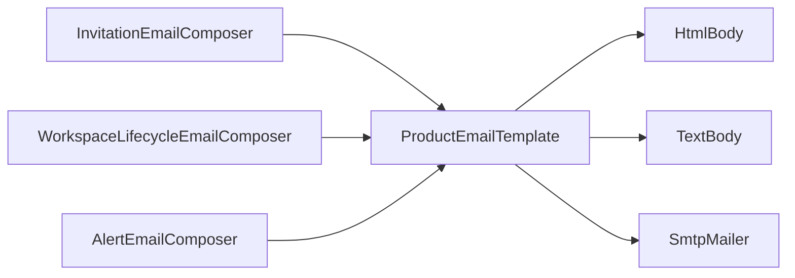

---
id: "MVP-715"
tipo: feature
titulo: "TDD: Correos del producto: inventario y maquetacion unificada"
estado: completado
tickets: []
epica: "MVP-007--ajustes-mvp-01"
responsable: "@andres"
revisores: []
ai_context:
  dominios: ["comunicaciones", "ux", "legal"]
  modulo_path: "03-modulos/"
  componentes: ["email", "plantillas", "smtp"]
  etiquetas: ["mvp", "ajustes", "email"]
  nivel_riesgo: medio
creado_en: "2026-08-08"
actualizado_en: "2026-08-08"
---

# TDD: MVP-715 — Correos del producto: inventario y maquetación unificada

> **Referencia al spec**: [spec.md](./spec.md)

## Resumen técnico

El spec decía «al menos cuatro» correos. **Son cinco**, y no son los cuatro que enumeraba.

| Lo que decía el spec | Lo que hay |
|---|---|
| Invitación por email | Sí |
| Aviso de baja de Workspace con enlace de reactivación | Sí |
| Aviso de solicitud a quien dio de baja | Sí |
| «Notificaciones de la baja de cuenta» | **No existen**: `CloseAccountHandler` no envía ningún correo |
| — | **Alerta de operación disparada** (`MVP-603`) |
| — | **Alerta de operación resuelta** (`MVP-603`) |

Lo que el spec llamaba «notificaciones de la baja de cuenta» es el **aviso de baja de Workspace visto
desde el camino de la baja de cuenta**: cerrar la cuenta obliga antes a resolver los Workspaces de
propiedad única (RN-038), y cerrar uno sí manda correo. Y los dos que faltaban eran justo los que
peor estaban: los avisos de alerta eran un `TextPart` suelto, el único correo del producto sin
maquetación ninguna.

El cambio de fondo es dónde vive la composición. `MVP-206` ya había extraído el transporte
(`SmtpMailer`, ADR-0010); lo que seguía siendo ad-hoc era el mensaje. Ahora hay una única forma de
componerlo y el pie legal es **estructural**, no algo que cada emisor tenga que acordarse de poner.

## Componentes afectados

| Componente | Tipo de cambio | Descripción |
|---|---|---|
| `Infrastructure/Email/ProductEmailTemplate.cs` | nuevo | La plantilla: cabecera, cuerpo, llamada a la acción, pie legal, y las dos versiones (HTML y texto) |
| `Infrastructure/Email/LegalEntityOptions.cs` | nuevo | Identidad del responsable, leída del recurso incrustado y sobreescribible por `Legal:*` |
| `frontend/src/config/legal-entity.json` | nuevo | El dato, con un solo origen para el cliente y la API |
| `frontend/src/config/legal-entity.ts` | modificado | Deja de escribir los valores y los importa del JSON |
| `Terrenario.Api.csproj` · `tsconfig.app.json` | modificado | Incrustar el JSON en el ensamblado; permitir importarlo en TypeScript |
| `Infrastructure/Invitations/InvitationEmailComposer.cs` | modificado | Aporta contenido; ya no arma marcado |
| `Infrastructure/Email/WorkspaceLifecycleEmailComposer.cs` | modificado | Ídem, los dos correos del ciclo de vida |
| `Infrastructure/Telemetry/Alerts/AlertEmailComposer.cs` | nuevo | Los dos avisos de alerta, que antes se componían dentro del notificador |
| `Infrastructure/Telemetry/Alerts/AlertNotifier.cs` | modificado | Se queda con la decisión de cuándo se traza y cuándo se envía |
| `Tests/Emails/` | nuevo | Catálogo ejecutable, comprobaciones transversales y volcado de previews |
| `docs/06-integraciones/correos-del-producto.md` | nuevo | El inventario en prosa |

## Diseño detallado

### El contenido no sabe de HTML

Cada correo entrega un `ProductEmailContent` de **texto plano**: titular, párrafos, una llamada a la
acción como mucho, notas, motivo del envío y forma de dejar de recibirlo. La plantilla es la única
que produce marcado.

Eso arregla de paso un riesgo que estaba repartido: antes, **cada emisor escapaba su propio HTML**.
Funcionaba —los dos composers llamaban a `HtmlEncode` donde tocaba— pero era una obligación que había
que recordar en cada correo nuevo. Ahora escapar es imposible de olvidar porque el emisor no tiene
acceso al marcado.

El escapado no usa `WebUtility.HtmlEncode`: convierte además cada acento en entidad numérica
(`Andr&#233;s`), y el correo viaja en UTF-8, así que eso no aporta nada y deja el HTML ilegible justo
en la parte que más se revisa a ojo, el pie legal. Se escapan los cinco caracteres que cambian el
significado del marcado, comillas incluidas.

### La identidad del responsable tiene un solo origen

`MVP-504` ya había hecho este trabajo una vez para las páginas legales: sacó el NIF del JSX y lo dejó
en `config/legal-entity.ts`. El pie de los correos necesita el mismo dato, así que la pregunta era
dónde ponerlo sin escribirlo dos veces.

La respuesta es un **fichero JSON que consumen los dos**: TypeScript lo importa, y la API lo incrusta
como recurso al compilar. Es exactamente lo que ya se hace con la CSP, que `SpaContentSecurityPolicy`
lee del build del cliente en vez de reescribirla en C#.

El fichero vive en `src/frontend/terrenario-web/src/config/` y **no en la raíz del repositorio**, que
sería el sitio «neutral» esperable, por un motivo comprobado: el `server.fs.allow` de Vite se calcula
desde el directorio del `package-lock.json`, que es el del cliente, así que un fichero por encima de
esa carpeta quedaría bloqueado en el servidor de desarrollo. Entre un dato compartido que vive donde
está su consumidor principal y un dato compartido que rompe `npm run dev`, se elige el primero.

Sobre el fichero se pone una guarda que el tipado de TypeScript no puede dar: una cadena vacía en el
JSON compila igual de bien que un NIF, así que la API valida al leerlo y **falla al primer uso** si
algún campo obligatorio del pie viene en blanco.

La URL de la Política de Privacidad no entra en ese fichero: no es identidad, es una ruta pública que
cambia con el dominio del despliegue. Vive en `appsettings.json` (`Legal:PrivacyPolicyUrl`) con el
resto de URLs públicas.

### Por qué las alertas también entran

Los dos avisos de alerta van a `Ops:AlertEmail`, no a un usuario, y eran el candidato natural a
quedarse fuera. Entran por dos razones:

- El inventario no distingue destinatarios. Un correo del producto es un correo del producto, y
  dejar uno fuera de la plantilla reabre exactamente el problema que la historia cierra.
- Aquí el «motivo del envío» y el «cómo dejar de recibirlo» **no son burocracia, son documentación
  operativa**: quien hereda una bandeja de alertas necesita saber de dónde salen y dónde se apagan.

Lo que no tienen es llamada a la acción: la respuesta a una alerta es el runbook, no un enlace.

### El «cómo dejar de recibirlo» no es igual en los cinco

Es el punto donde era fácil poner una frase de relleno idéntica y quedarse tranquilo. No lo es:

| Correo | Qué se puede ofrecer de verdad |
|---|---|
| Invitación | Es el único que llega a quien **no tiene cuenta**: no puede decir «sal del Workspace». Dice que no hay lista, que no se insiste, y que la dirección se retira escribiendo a la de derechos |
| Baja de Workspace · solicitud de reactivación | Nada: son avisos imprescindibles del servicio. Se dice tal cual, en vez de simular una baja que no existe |
| Alertas | Retirar la dirección de `Ops:AlertEmail` |

### Sin recursos remotos, y comprobado

CA-6 no se cumple «teniendo cuidado». La prueba transversal recorre el HTML de los cinco y afirma que
**el único atributo que puede llevar una URL es `href`**: si aparece un `src`, un `background` o un
`poster`, es algo que el cliente descargará, y falla. Descarta además ``, `<link>`, `<script>`,
`@import`, `@font-face`, `background-image` y `url(`.

El motivo no es estético. Un recurso remoto delata al servidor que lo aloja el instante exacto de la
apertura —seguimiento que nadie ha pedido— y deja el correo cojo en cualquier cliente que bloquee
remotos por defecto, que son casi todos. Y este es el único canal del producto hacia alguien que
**todavía no tiene cuenta**.

### Cómo se revisa lo que no puede automatizarse

CA-5 pide ver cada correo en un cliente real, y eso lo hace una persona. Lo que hace la suite es que
esa persona no tenga que provocar una baja de Workspace de verdad para ver cómo queda el aviso:
`ProductEmailPreviewTests` vuelca el HTML y el texto de los cinco a `artifacts/correos/` en cada
ejecución, desde el mismo código que compone los correos que salen. La carpeta está en `.gitignore`:
es salida reproducible, no contenido.

## Alternativas descartadas

| Alternativa | Por qué no |
|---|---|
| Copiar la identidad legal a `appsettings.json` | Un NIF escrito dos veces diverge, y el sitio donde se nota es la bandeja de alguien |
| El JSON compartido en la raíz del repositorio | El `server.fs.allow` de Vite lo bloquearía en desarrollo. Comprobado antes de decidir |
| Un test que compare el C# con el `.ts` y avise si divergen | Sigue habiendo dos copias; solo se añade quien las vigila |
| Dejar las alertas fuera por ser internas | Reabre el problema que cierra la historia, y son las que peor estaban |
| Una plantilla con tablas anidadas al estilo _newsletter_ | Complejidad de un correo de marketing para cinco avisos transaccionales de tres párrafos |
| Cabecera con el logotipo | Sería el recurso remoto que CA-6 prohíbe, o un adjunto embebido que muchos clientes marcan como sospechoso |
| Cabecera `List-Unsubscribe` | Es para correo suscrito; en transaccional, algunos clientes ofrecerían una baja que el producto no puede honrar |
| Migrar solo los correos a personas y dejar los de alerta | Serían el sexto correo del inventario sin plantilla, que es como empezó todo |

## Riesgos e impacto

- **El aspecto de los cinco correos cambia** en el próximo envío. Es el objetivo, y ninguno cambia lo
  que dice ni a dónde enlaza.
- Las alertas de operación pasan de texto plano a multiparte. Cualquier filtro de bandeja que se
  hubiera montado sobre el cuerpo exacto del mensaje dejaría de casar; el asunto no cambia.
- El pie alarga los correos. Es el precio de que ninguno salga sin identificar al responsable, y va
  en cuerpo pequeño y al final.
- La API depende ahora, **en tiempo de compilación**, de un fichero que vive en el árbol del cliente.
  Es una dependencia de datos, no de código, y romperla falla el build en vez de pasar inadvertida.

## Plan de testing

| Nivel | Qué cubre |
|---|---|
| Catálogo ejecutable (`ProductEmailCatalog`) | Los cinco correos compuestos con datos de ejemplo; un correo nuevo que no entre aquí se queda sin las garantías del resto |
| Transversal (`ProductEmailInventoryTests`) | Por cada correo: responsable, NIF, domicilio, derechos y política en las **dos** versiones; motivo del envío; texto plano no vacío y sin marcado; cero recursos remotos; remitente y destinatario |
| Plantilla | Escapado de lo que escriben las personas, en HTML y no en texto; sobreescritura de un campo legal sin borrar el resto; identidad versionada completa |
| Por correo | Lo específico de cada uno: enlace íntegro, omisión de quien invita sin nombre, salida explicada en la invitación, «aviso imprescindible» en los del ciclo de vida |
| Previews (`ProductEmailPreviewTests`) | Genera los ficheros que sustentan la revisión manual de CA-5 |

## Verificación realizada

| Comprobación | Resultado |
|---|---|
| `dotnet test src/backend/Terrenario.sln` | 899 pruebas en verde |
| `npm run build` · `npm test` · `npm run lint` (cliente) | Build correcto, 161 pruebas en verde, sin avisos nuevos |
| Identidad legal en el pie de los cinco, HTML y texto | Titular, NIF, domicilio, política y dirección de derechos, en los diez cuerpos |
| Ausencia de recursos remotos en los cinco | Ningún atributo con URL salvo `href` |
| Previews en `artifacts/correos/` | Diez ficheros (`.html` y `.txt`) más un `LEEME.txt` |

**Lo que no se ha verificado**: CA-5 en un cliente de correo real. No se ha enviado ningún correo —no
hay cuenta SMTP provisionada y hacerlo no era el encargo—, así que queda pendiente de la revisión
manual sobre los ficheros generados.

## Checklist de implementación

- [x] Inventario completo en la KB, con disparador y destinatario, y con el recuento real (cinco)
- [x] Plantilla común con cabecera, cuerpo, llamada a la acción y pie legal
- [x] Identidad del responsable con un solo origen, compartido con las páginas legales publicadas
- [x] Los cinco correos migrados a la plantilla
- [x] Versión en texto plano de cada uno, generada del mismo contenido que el HTML
- [x] Ningún recurso remoto, comprobado por prueba y no por revisión
- [x] `P-001` y `P-030` marcados como resueltos en el registro de `MVP-999`; `P-039` sigue descartado
- [x] 899 pruebas de backend y 161 de cliente en verde
