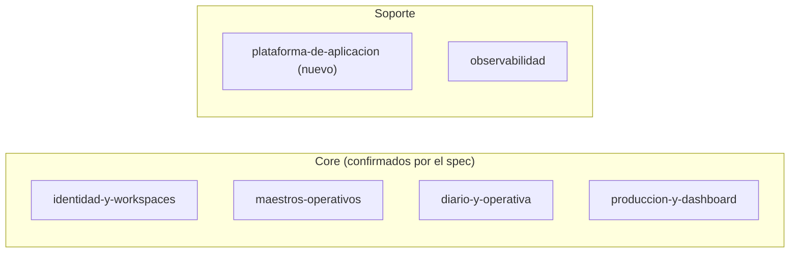

# TDD: MVP-716 — Consolidación del catálogo de módulos

> **Referencia al spec**: [spec.md](./spec.md)

## Resumen técnico

Documentación pura: **cero cambios en `src/`**. Lo que se decide aquí no es qué construir, sino
**cómo se corta** el sistema entregado en dominios documentables y **cuánto** se escribe de cada uno.

Dos decisiones sostienen el resto:

| Decisión | Qué implica |
|---|---|
| El reparto sale del **código entregado**, no de la hipótesis del spec | Seis módulos, no cinco: aparece uno de soporte que el spec no había previsto |
| Cada módulo es **una ficha** (`README.md`) que enlaza los `tech-design.md` | No se instancian los siete documentos de la plantilla de módulo |

## Componentes afectados

| Componente | Tipo de cambio | Descripción |
|---|---|---|
| `docs/03-modulos/{seis módulos}/README.md` | nuevo | Una ficha por módulo real |
| `docs/03-modulos/_vision-general.md` | modificado | Mapa, catálogo, trazabilidad con épicas y relaciones |
| `docs/03-modulos/modulo-ejemplo/` | eliminado | Ocho ficheros de plantilla, marcados para retirar desde la v1.0.0 de la KB |
| `docs/00-meta/README.md` | modificado | Tabla de módulos: el único **enlace roto** que dejaba la retirada |
| `AGENTS.md` · `.github/copilot-instructions.md` | modificado | Instrucciones que mandaban ignorar un directorio que ya no existe |
| `docs/00-meta/changelog.md` | modificado | Alta del catálogo y retirada del ejemplo |
| `MVP-999/spec.md` | modificado | `P-020` a `resuelto` |

## Diseño detallado

### Cómo se verificó el reparto

El spec proponía cinco módulos. Se recorrieron `src/backend/Terrenario.Api` —controllers, `Domain/`,
`Application/`, `Infrastructure/`— y `src/frontend/terrenario-web/src`, y se comprobó que cada
carpeta y cada endpoint cayera en alguno. Los cinco se confirman:

Lo que **no** cayó en ninguno fue un residuo grande y con historias propias: `Common/Errors`,
`Common/Http` —`RequestId`, `SecurityHeaders`, `IfMatchHeader`—, `Infrastructure/Data`,
`lib/http-client.ts`, `contexts/ApiContext`, `routes/`, y `components/` con `layout`, `home`,
`errors`, `common`, `marketing` y `legal`. Es el chasis: `MVP-105`, `MVP-202`, `MVP-406`, `MVP-502`,
`MVP-505` y `MVP-703` trabajaron ahí.

Se añade como **`plataforma-de-aplicacion`**, módulo de soporte. Repartirlo entre los cuatro core
era la alternativa obvia y se descartó: el contrato de error o el shell no son de nadie en
particular, y trocearlos habría repetido el problema que esta historia cierra —código entregado sin
sitio donde estar descrito—.

### Por qué una ficha y no la plantilla completa

`docs/00-meta/plantillas/modulo-readme.md` prevé siete documentos por módulo. Instanciarlos serían
42 ficheros, y el spec lo prohíbe de forma explícita: «enlazando a los `tech-design.md` existentes en
vez de duplicarlos». Además, tres de esos siete no tienen contenido que dar:

| Documento de la plantilla | Por qué no se instancia |
|---|---|
| `eventos.md` | No hay bus de eventos: es un monolito modular online-first (`ADR-0002`) |
| `modelo-datos.md` | El esquema es único y está en `02-arquitectura/modelo-de-datos.md` |
| `modelo-dominio.md` · `arquitectura.md` | Es justo lo que los `tech-design.md` ya explican, con su contexto y sus alternativas |

Así que la sección «Documentación del módulo» de la plantilla se reformula como **«Documentación de
referencia»**: una tabla de enlaces a las historias que construyeron el módulo y a los documentos
centrales que le aplican. El resto de secciones de la plantilla se mantienen tal cual.

A cambio, cada ficha añade una tabla de **superficie entregada** (API, backend, frontend, tablas) que
la plantilla no tiene. Es lo que permite verificar que el reparto cubre el código y no se apoya en
una taxonomía inventada.

### El barrido de referencias

`modulo-ejemplo` aparecía en siete sitios. Solo uno era un **enlace** —`docs/00-meta/README.md`—; el
resto eran instrucciones o registro histórico, y cada tipo se trata distinto:

| Sitio | Tratamiento |
|---|---|
| `docs/00-meta/README.md` | Enlace roto: sustituido por la tabla de los seis módulos |
| `AGENTS.md` · `.github/copilot-instructions.md` | Instrucciones vivas: reformuladas para apuntar a la ficha y, desde ella, a los `tech-design.md` |
| `docs/00-meta/changelog.md` | Registro histórico: **no se reescribe**; se añade la entrada de la retirada |

`docs/00-meta/convenciones.md` no lo mencionaba, así que no hubo que tocarlo.

De paso, `copilot-instructions.md` mandaba leer `modelo-dominio.md` y `eventos.md` de cada módulo:
ficheros que nunca han existido y que, por la decisión anterior, no van a existir. Se redirige a
`modelo-de-datos.md` y `reglas-de-negocio.md`, que es donde vive de verdad esa información.

### Deriva con la plantilla

`docs/00-meta/README.md`, `AGENTS.md` y `.github/copilot-instructions.md` son **núcleo sincronizable**
(`template_core_policy: synced`). Editarlos crea deriva con el repositorio de plantilla.

Se acepta a propósito: los tres describían un estado del proyecto que ha dejado de ser cierto, y uno
de ellos enlazaba a un directorio borrado. Un enlace roto en el punto de entrada de la KB pesa más
que la deriva. Queda anotado para la próxima revisión de `upgrade-template.md`.

## Alternativas descartadas

| Alternativa | Por qué no |
|---|---|
| Los cinco módulos del spec, sin `plataforma-de-aplicacion` | Dejaba fuera el código más tocado del MVP y repetía el problema que la historia cierra |
| Un módulo por maestro (Terrenos, Temporadas, Trabajadores, Tareas) | Cuatro fichas casi idénticas; contradice el precedente de `MVP-202` que el propio spec invoca |
| Separar cosecha del dashboard | Los widgets están definidos contra el modelo de cosecha (`RN-009`): habría que mantener la regla dos veces |
| Instanciar los siete documentos de la plantilla por módulo | 42 ficheros, y duplicaría los `tech-design.md` que el spec manda enlazar |
| Conservar `modulo-ejemplo` como referencia de estructura | La plantilla ya vive en `docs/00-meta/plantillas/`; el ejemplo solo añadía un dominio ficticio al contexto de los agentes |
| Reescribir las entradas del changelog que citan `modulo-ejemplo` | Un changelog registra lo que pasó; que algo se deshaga después es una entrada nueva, no una corrección |

## Riesgos e impacto

- **Riesgo de deriva**: seis fichas más que mantener. Se mitiga con la regla de no duplicar —lo que
  cambia con frecuencia (diseño, contrato, esquema) vive fuera de la ficha y se enlaza—, así que un
  cambio técnico normal no obliga a tocarlas.
- **`plataforma-de-aplicacion` puede degenerar en cajón de sastre**. Su ficha declara explícitamente
  que no contiene reglas de negocio; es el criterio con el que rechazar lo que no le toca.
- Sin impacto funcional ni de despliegue: no se toca `src/`.

## Plan de testing

No aplica en el sentido habitual: no hay código. La verificación es la del pipeline de la KB.

## Verificación realizada

| Comprobación | Resultado |
|---|---|
| Cobertura del reparto sobre `src/` | Los 20 controllers, las 12 carpetas de `Domain/`, las 16 de `Application/` y las 21 de `components/` caen en exactamente un módulo (CA-1) |
| `docs/03-modulos/` | Seis fichas, ninguna con contenido copiado de un `tech-design.md` (CA-1) |
| `_vision-general.md` | Mapa Mermaid, catálogo de seis filas, trazabilidad con épicas y tabla de relaciones (CA-2) |
| `grep -rn "modulo-ejemplo" docs/ *.md .github/` | Cero enlaces; solo el registro histórico del changelog y el texto del propio `MVP-716`/`P-020` (CA-3) |
| `validar_pipeline_kb.py --solo-cambios --base-ref origin/develop --check-indices-clean` | `PIPELINE EXIT: 0` (CA-4) |
| Validador completo (sin `--solo-cambios`) | 0 errores |

## Checklist de implementación

- [x] Seis fichas de módulo en `docs/03-modulos/`, cada una enlazando sus `tech-design.md`
- [x] Reparto contrastado contra `src/`, con un sexto módulo de soporte que el spec no preveía
- [x] Catálogo, mapa, trazabilidad con épicas y relaciones en `_vision-general.md`
- [x] `modulo-ejemplo` retirado y sus referencias vivas reformuladas
- [x] Deriva con el núcleo de plantilla declarada y justificada
- [x] `P-020` marcado como resuelto en el registro de `MVP-999`
