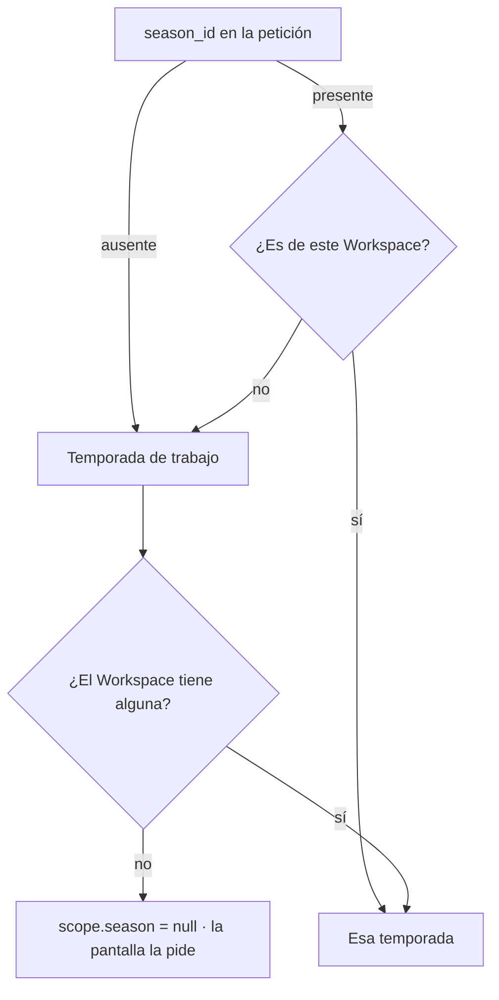
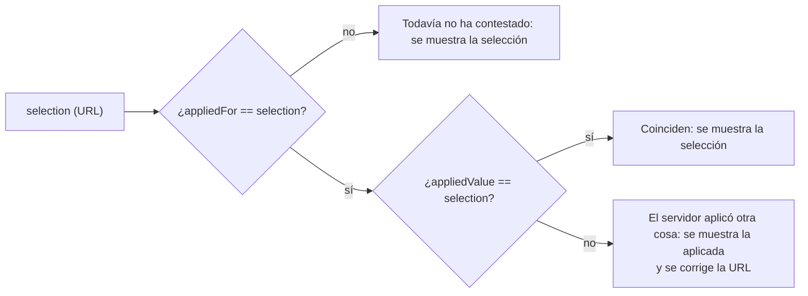

# TDD: MVP-801 — Coherencia del ámbito de temporada

> **Referencia al spec**: [spec.md](./spec.md)

## Resumen técnico

El mismo escenario visto por los dos lados, y por eso el arreglo tiene dos mitades que no se sustituyen
la una a la otra:

| Punto | Lado | Cambio |
|---|---|---|
| `P-107` | Servidor | `DashboardScopeResolver` cae al defecto de RN-008 ante una temporada o unos terrenos que no son del Workspace, igual que ya hacía `SeasonScopeResolver` |
| `P-108` | Cliente | El control de temporada deja de dar por buena la selección de la URL: manda el ámbito que devuelve el servidor, y la dirección se corrige |
| — | Cliente | Al cambiar de Workspace se limpian de la URL los parámetros que nombran entidades suyas |

Lo que hacía el defecto difícil de ver leyendo código es que **cada mitad parecía correcta por
separado**. El servidor «descartaba en silencio» los identificadores ajenos, que es lo que su propio
comentario decía hacer; el cliente «respetaba la elección del usuario», que es lo que `MVP-701` había
decidido. Solo al juntarlos aparece el resultado: una pantalla que pide crear lo que ya existe, y otra
que rotula «Todas las temporadas» mientras enseña una.

## Componentes afectados

| Componente | Tipo de cambio | Descripción |
|---|---|---|
| `Application/Dashboard/DashboardScope.cs` | modificado | Caída al defecto de temporada y de terrenos |
| `Controllers/DashboardController.cs` | modificado | `scope.season: null` pasa a tener un único significado; se documenta |
| `frontend/.../lib/season-scope.ts` | modificado | Reconciliación selección ↔ ámbito aplicado, y corrección de la selección |
| `frontend/.../lib/diary-url-state.ts` | modificado | `setFilter` admite `{ replace }` para las correcciones |
| `frontend/.../components/diary/DiarioView.tsx` | modificado | Conecta `onCorrect` a la URL |
| `frontend/.../components/dashboard/VisionGeneralView.tsx` | modificado | Adopta `useSeasonScope`; reconcilia también `plot_ids` |
| `frontend/.../routes/RequireWorkspace.tsx` | modificado | Limpia el ámbito de la URL al cambiar de Workspace |
| `docs/01-producto/reglas-de-negocio.md` (RN-008) | modificado | Las dos precisiones de la regla |

## Diseño detallado

### Servidor — la caída al defecto

`plot_ids` sigue la misma forma: se interseca con los terrenos del Workspace y, **si la intersección
queda vacía**, el ámbito cae en todos los activos. La diferencia con lo anterior es solo esa: antes la
intersección vacía se aceptaba como ámbito legítimo, y un resumen de cero terrenos siempre suma cero.

Un terreno inactivo pedido explícitamente sigue contando (MVP-202, CA-3): la intersección se hace
contra todos los del Workspace, no contra los activos.

Lo que **no** cambia: `season_id=all` sigue siendo un `400` en el dashboard (`RU-38` acota el análisis a
una campaña). Hay un test que lo fija, porque «tolerar lo desconocido» podría leerse como tolerarlo
todo.

### Cliente — quién manda cuando los dos hablan

El bucle que `MVP-701` evitó separando *lo que se pide* de *lo que se muestra* sigue en pie; lo que se
añade es un tercer dato: **para qué selección se registró la respuesta**.

Sin `appliedFor` no se puede distinguir «el servidor no me ha hecho caso» de «todavía no ha contestado
a lo último que le he pedido», y la segunda situación no debe mover el control: elegir una campaña
válida haría parpadear el `<select>` en la anterior hasta que llegara la respuesta.

La corrección **borra** el parámetro en vez de reescribirlo con la campaña aplicada. Las dos dejan la
pantalla diciendo la verdad, pero solo esta respeta la higiene de `RN-007` —los valores por defecto no
se escriben—: fijar la campaña resuelta congelaría en el enlace la de trabajo del día en que se
corrigió, que es justo lo que `MVP-705` evitó.

Y la corrección **sustituye** la entrada de historial (`onCorrect`, `{ replace: true }`). Con entrada
propia, «atrás» devolvería a la dirección con el ámbito ajeno para volver a corregirla: un bucle del
que el usuario no puede salir con el botón de atrás.

### La Visión General adopta la misma pieza

Hasta aquí el dashboard posicionaba su filtro con `seasonParam ?? scope.season.id`, que es exactamente
la expresión que da por buena la selección de la URL. Pasa a usar `useSeasonScope` en modo controlado,
como el diario. Es la lección de `P-082` aplicada otra vez: un defecto resuelto en dos sitios acaba
divergiendo, y aquí ya había divergido.

Para los terrenos no hay pieza compartida —solo el dashboard los filtra— y la reconciliación vive en la
propia vista: se conservan los que el servidor dice haber aplicado y se borran los demás. Si no honró
ninguno, el parámetro desaparece y el filtro vuelve a rotular «Todos los terrenos», que es lo que se
está viendo. Antes decía «3 terrenos» con las tres casillas sin marcar.

### Limpieza al cambiar de Workspace

Va en `RequireWorkspace` y no en `switchWorkspace` por el mismo motivo por el que allí vive la
invalidación de `MVP-701`: es el punto por el que pasa todo el área operativa, y una vista nueva hereda
el comportamiento sin tener que acordarse del problema.

Se limpian **solo** los parámetros que nombran entidades del Workspace: `season_id`, `plot_id` y
`plot_ids`. El tipo, la búsqueda y la página no están atados a ninguna ficha, y borrarlos sería tirar
trabajo del usuario sin motivo.

La primera resolución del Workspace —de «no hay» a «este»— no cuenta como cambio: limpiaría la URL de
quien acaba de abrir un enlace compartido, que es justo el caso que `RN-007` existe para servir.

## Alternativas descartadas

| Alternativa | Por qué se descartó |
|---|---|
| Resolver el defecto en `VisionGeneralView` | `RN-008` lo prohíbe expresamente: «si el cliente resolviera el defecto, la regla viviría en dos sitios y volvería a divergir». Es lo que produjo `P-082` |
| Quedarse solo con la limpieza de la URL al cambiar de Workspace | Un enlace compartido o un marcador reproducen el escenario sin pasar por el selector |
| Responder `400` a un `season_id` desconocido | Convierte un filtro obsoleto en una pantalla de error. Es una lectura, y quien llega con la URL de ayer debe ver lo que sí existe |
| Corregir la URL escribiendo la campaña aplicada | Congela en el enlace la campaña de trabajo del día en que se corrigió, contra la higiene de `RN-007` |
| Limpiar **toda** la query al cambiar de Workspace | El tipo, la búsqueda y la página no pertenecen a ningún Workspace. Ver el hallazgo abierto más abajo |

## Riesgos e impacto

| Riesgo | Probabilidad | Mitigación |
|---|---|---|
| La reconciliación entra en bucle con la petición que la dispara | media | `appliedFor` ata la respuesta a la selección que la produjo; corregir lleva al defecto, que ya no se pide |
| Un ámbito legítimamente vacío (0 terrenos) deja de poder pedirse | baja | Nunca fue pedible: la UI ofrece «todos» o una selección concreta, y `plot_ids` vacío ya significaba «todos» |
| La limpieza de URL borra los filtros de quien abre un enlace | baja | Solo se limpia ante un **cambio** de Workspace, nunca en la primera resolución. Cubierto por test |

## Plan de testing

- [x] Tests unitarios (backend): caída al defecto de temporada y de terrenos en `DashboardScopeResolver`
- [x] Tests unitarios (cliente): reconciliación en `useSeasonScope`, incluidos los casos que **no** deben
  corregirse (la campaña sí aplicada, «todas» explícita, y la respuesta anterior a la selección)
- [x] Tests de integración: los dos endpoints con el **mismo** identificador ajeno devuelven el mismo
  `scope.season` (CA-1), los terrenos ajenos caen en todos los activos (CA-2) y `season_id=all` sigue
  siendo `400`
- [x] Tests de componente: la Visión General posiciona el filtro en la campaña aplicada y corrige la
  dirección; conserva los terrenos que sí son del Workspace

## Hallazgos fuera de alcance

- **El mismo patrón en los filtros que no son de ámbito.** `worker_id` y `plot_id` del diario tienen la
  forma exacta de `P-108`: con un identificador de otro Workspace el `<select>` cae en su primera
  opción y rotula «Todos los responsables» mientras el servidor filtra por una ficha que no existe. La
  limpieza al cambiar de Workspace tapa el camino frecuente para `plot_id`, no para `worker_id`, y
  ninguno de los dos queda cubierto ante un enlace compartido. Se propone como punto nuevo para
  `MVP-999`.

## Checklist de implementación

- [x] Diseño técnico revisado
- [x] Migraciones de base de datos preparadas — no aplica, no hay cambio de esquema
- [x] Tests escritos y pasando
- [x] Documentación de API actualizada — el contrato no cambia; cambia qué ámbito se resuelve
- [x] Módulo afectado actualizado en `docs/03-modulos/` — vía `RN-008`, que es donde vive la regla
- [x] Sin `TODO` sin resolver en este documento
