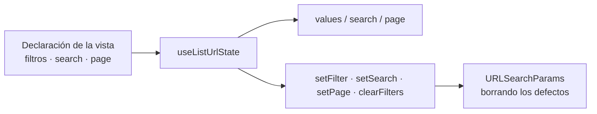

# TDD: MVP-802 — Filtros de cosechas y compras en la URL

> **Referencia al spec**: [spec.md](./spec.md)

## Resumen técnico

El cambio visible es pequeño —dos vistas leen sus filtros de la URL en vez de del estado local— y el
que importa no se ve: **la mecánica pasa a estar en un solo sitio**.

`MVP-705` la escribió para el diario dentro de `diary-url-state.ts`, con los nombres de sus parámetros
incrustados. Copiarla a Cosechas y a Compras habría dejado tres implementaciones de las mismas dos
invariantes de higiene, que es literalmente lo que `P-072` y `P-082` enseñaron a no hacer. Lo que se
hace es extraer el motor a `lib/list-url-state.ts` y dejar que cada vista **declare** sus parámetros;
`useDiaryUrlState` se queda como un envoltorio tipado sobre él, con la misma API pública, así que el
diario no cambia de comportamiento.

| Vista | Parámetros declarados | Página | Búsqueda |
|---|---|---|---|
| Diario | `type`, `plot_id`, `season_id`, `worker_id` | sí | `search` |
| Cosechas | `plot_id`, `season_id`, `destination` | no | no |
| Compras | `season_id` | no | `product` |

## Componentes afectados

| Componente | Tipo de cambio | Descripción |
|---|---|---|
| `frontend/.../lib/list-url-state.ts` | nuevo | Motor común: lectura, escritura, higiene y contador de filtros |
| `frontend/.../lib/diary-url-state.ts` | modificado | Pasa a ser un envoltorio tipado del motor, con la misma API |
| `frontend/.../components/harvests/CosechasView.tsx` | modificado | Sus tres filtros salen del estado local a la URL |
| `frontend/.../components/purchases/ComprasView.tsx` | modificado | Campaña y material a la URL, con **rebote** de la búsqueda |
| `frontend/.../components/harvests/CosechasView.test.tsx` | nuevo | La vista no tenía cobertura propia |
| `frontend/.../lib/list-url-state.test.ts` | nuevo | Las dos invariantes de higiene |
| `docs/01-producto/reglas-de-negocio.md` (RN-007) | modificado | La regla rige en las cuatro vistas operativas |

## Diseño detallado

### El motor y la declaración

Cada filtro se declara con **el nombre de su parámetro** y **el valor que significa «sin filtro»**. Esa
segunda mitad es la que hace posible la primera invariante sin casos particulares por vista: escribir
un filtro que vale su defecto **borra** el parámetro en vez de fijarlo.

El defecto no es el mismo para todos, y por eso se declara y no se asume: los filtros de lista valen
`todos`, pero **la temporada vale cadena vacía**, porque desde `MVP-701` su defecto lo resuelve el
servidor (`RN-008`) y `all` es una elección explícita con valor propio. Con un único «vacío» para todo,
o `all` acabaría escribiéndose en la URL o la campaña por defecto quedaría congelada en el enlace.

`page` y `search` son opcionales en la declaración: Cosechas no pagina y no busca, y `setPage` sobre una
vista que no declaró página no escribe nada en vez de inventarse un parámetro.

### El rebote de la búsqueda de Compras

Es lo único de esta historia que cambia el comportamiento de red, y lo hace a mejor. Hasta aquí
`productFilter` era estado local y `reload` dependía de él directamente: **cada pulsación disparaba una
petición de compras, otra de consumos y un repintado del libro**. Escribir «abono» eran diez
peticiones.

Se adopta el patrón que el diario tiene desde `MVP-506`/`MVP-705`: lo que se teclea vive en el
componente, y a los 350 ms de silencio se escribe en la URL **sustituyendo** la entrada de historial.
Un segundo efecto sigue a la URL cuando cambia por fuera —«atrás», «adelante», un enlace pegado— sin
pisar lo que se está escribiendo.

Sin el rebote, llevar la búsqueda a la URL habría dejado una entrada de historial por carácter, que es
exactamente la condición de higiene que `RN-007` prohíbe.

### La dependencia con `MVP-801`, comprobada y no recomendada

Llevar el filtro a la URL es **el mecanismo que expone `P-108`**: en cuanto la selección viene de la
dirección, un identificador de otro Workspace deja de estar entre las opciones y el `<select>` cae en
la primera. Por eso las dos vistas usan `useSeasonScope` en **modo controlado** con `onCorrect`
conectado, y por eso `CA-5` lo comprueba con un test en cada una en vez de confiarlo a la
secuenciación.

El doble de cliente HTTP de esos tests **aplica `RN-008` como el servidor** —honra `all` y una campaña
conocida, y cae al defecto con cualquier otra—. Con un doble que devolviera siempre el mismo ámbito, la
prueba de `CA-5` pasaría por casualidad y la de «elegir todas las temporadas» fallaría por mentira del
doble, no del código.

## Alternativas descartadas

| Alternativa | Por qué se descartó |
|---|---|
| Copiar `useDiaryUrlState` a cada vista | Tres implementaciones de la misma higiene. Es `P-082` otra vez, y el spec lo excluye expresamente |
| Acotar `RN-007` a dashboard y diario | El enunciado de la regla es general, y el usuario no tiene forma de saber que dos pantallas recuerdan y dos no |
| Un solo valor «vacío» para todos los filtros | La temporada no vale `todos`: su defecto lo pone el servidor y `all` es una elección con valor propio |
| Escribir la búsqueda de Compras sin rebote | Una entrada de historial por carácter, contra la segunda invariante de `RN-007`, y la petición por pulsación que ya había |
| Llevar también a la URL el estado de los maestros | No son vistas operativas y `RN-007` no las nombra |

## Riesgos e impacto

| Riesgo | Probabilidad | Mitigación |
|---|---|---|
| El envoltorio del diario cambia su comportamiento al refactorizar | media | Los 33 tests del diario y de su estado de URL pasan sin tocarlos |
| El rebote nuevo de Compras retrasa el filtrado de forma perceptible | baja | 350 ms, el mismo que el diario, ya validado en uso |
| La declaración cambia de identidad en cada render y reentra en los efectos | media | Se memoiza por contenido, no por identidad, y las dependencias de `reload` siguen siendo identificadores estables |

## Plan de testing

- [x] Tests unitarios: las dos invariantes de higiene en `list-url-state.test.ts`, incluida la
  comprobación de que la búsqueda navega con `REPLACE` y el filtro con `PUSH`
- [x] Tests de componente (Cosechas, nuevos): el filtro se escribe en la dirección, se pide al servidor
  lo que trae la dirección, los defectos no se escriben, y un `season_id` ajeno cae al defecto y se
  corrige
- [x] Tests de componente (Compras): los mismos, más que **las dos listas** —libro y consumos— reciben
  los mismos filtros, y que la búsqueda se escribe una sola vez al dejar de teclear
- [x] Regresión: los 33 tests del diario siguen en verde sin modificarlos

## Checklist de implementación

- [x] Diseño técnico revisado
- [x] Migraciones de base de datos preparadas — no aplica, no hay cambio de esquema ni de API
- [x] Tests escritos y pasando
- [x] Documentación de API actualizada — no aplica: los parámetros de consulta no cambian
- [x] Módulo afectado actualizado en `docs/03-modulos/` — vía `RN-007`, que es donde vive la regla
- [x] Sin `TODO` sin resolver en este documento
