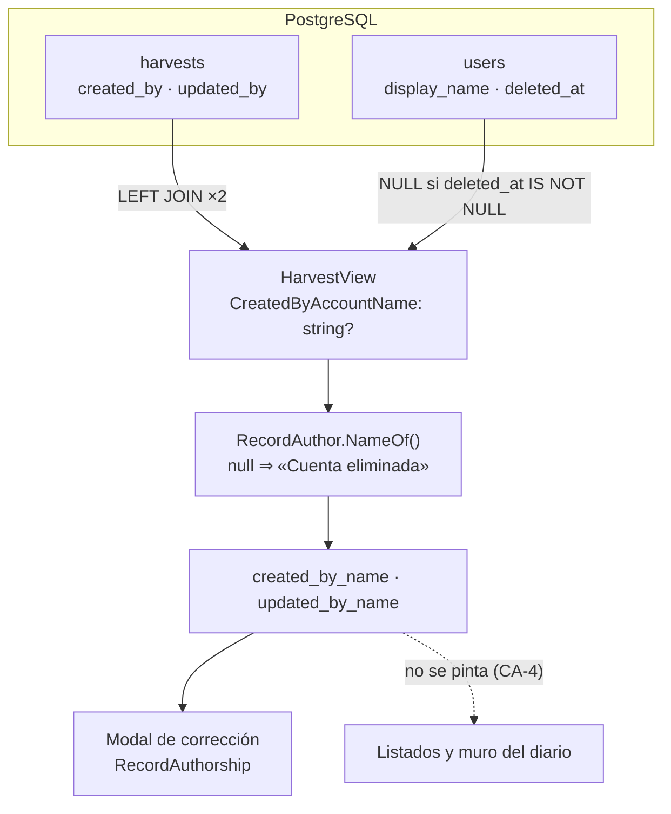

# TDD: MVP-804 — Autoría visible de los registros operativos

> **Referencia al spec**: [spec.md](./spec.md)

## Resumen técnico

La parte cara ya estaba hecha: las cuatro tablas operativas guardan `created_by`, `created_at`,
`updated_by` y `updated_at` desde que se crearon. **No hay migración.** Lo que faltaba era leer el dato
y pintarlo.

Se lee **en la proyección de lectura que cada tipo ya comparte** entre su listado y su lectura por id
(`ActivityView`, `HarvestView`, `PurchaseView`, `ConsumptionView`), con dos `LEFT JOIN` a `users`. Así
no hace falta ningún endpoint nuevo ni ninguna petición extra, y llega igual a las dos vistas que abren
un modal con la fila que ya tienen (Cosechas, Compras) y a la que lo abre pidiendo el registro por id
(el diario).

| Pieza | Qué hace |
|---|---|
| `IAuthoredRecord` + `RecordAuthor` | La regla de **cómo se nombra a un autor**, en un solo sitio para los cuatro tipos |
| Proyecciones de los cuatro repositorios | `LEFT JOIN users` ×2, con el filtro de cuenta dada de baja **dentro del SQL** |
| `created_by_name` / `updated_by_name` | Los dos campos nuevos del contrato, en los cuatro recursos |
| `RecordAuthorship.tsx` | La línea de apoyo al pie del modal, y la decisión de cuándo callarse |
| `RU-21` | Pasa a `entregado` en la matriz de trazabilidad de `MVP-809` |

## Diagrama de arquitectura / flujo



## Componentes afectados

| Componente | Tipo de cambio | Descripción |
|---|---|---|
| `Domain/Operations/RecordAuthorship.cs` | nuevo | `IAuthoredRecord` y `RecordAuthor`: la regla del rótulo, en un sitio |
| `Domain/Activities/IActivityRepository.cs` | modificado | `ActivityView` implementa `IAuthoredRecord` |
| `Domain/Harvests/IHarvestRepository.cs` | modificado | `HarvestView`, ídem |
| `Domain/Purchases/IPurchaseRepository.cs` | modificado | `PurchaseView`, ídem |
| `Domain/Consumptions/IConsumptionRepository.cs` | modificado | `ConsumptionView`, ídem |
| `Infrastructure/.../ActivityRepository.cs` | modificado | Dos `LEFT JOIN` a `users` en la proyección |
| `Infrastructure/.../HarvestRepository.cs` | modificado | Ídem |
| `Infrastructure/.../PurchaseRepository.cs` | modificado | Ídem |
| `Infrastructure/.../ConsumptionRepository.cs` | modificado | Ídem |
| `Controllers/ActivitiesController.cs` | modificado | `created_by_name` / `updated_by_name` en la respuesta |
| `Controllers/HarvestsController.cs` | modificado | Ídem |
| `Controllers/PurchasesController.cs` | modificado | Ídem |
| `Controllers/ConsumptionsController.cs` | modificado | Ídem |
| `frontend/.../common/RecordAuthorship.tsx` | nuevo | La línea de apoyo, compartida por los cuatro modales |
| `frontend/.../types/*.types.ts` | modificado | Los dos campos en `Activity`, `Harvest`, `Purchase` y `Consumption` |
| `frontend/.../diary/ActivityFormModal.tsx` | modificado | Autoría al pie |
| `frontend/.../harvests/HarvestFormModal.tsx` | modificado | Ídem |
| `frontend/.../purchases/PurchaseFormModal.tsx` | modificado | Ídem |
| `frontend/.../purchases/ConsumptionFormModal.tsx` | modificado | Ídem |
| `docs/01-producto/definicion-requisitos-usuario.md` | modificado | `RU-21` entregado, en el requisito y en la matriz |
| `docs/02-arquitectura/contratos-api.md` | modificado | Los dos campos y las tres precisiones del contrato |

## Diseño detallado

### Modelo de datos

**Ninguno.** Es lo que hace que esta historia sea barata y merece decirse explícitamente: las cuatro
tablas ya tienen las columnas, escritas desde el primer alta de cada tipo.

```sql
-- activities, harvests, purchases, purchase_consumptions (ya existentes)
created_by uuid NOT NULL,
created_at timestamptz NOT NULL,
updated_by uuid NOT NULL,
updated_at timestamptz NOT NULL
-- Sin FK hacia users. Ver «El JOIN es LEFT a propósito».
```

### API / Contratos

Los cuatro recursos operativos ganan dos campos con la misma forma:

```yaml
created_by_name: string   # quien lo apuntó; nunca nulo ni vacío
updated_by_name: string   # quien hizo la última corrección
# `created_at` y `updated_at` ya estaban: son la otra mitad de RU-21.
```

No hay endpoint nuevo. Las compras y los consumos **no** tienen lectura por id, y no ha hecho falta
inventarla: su modal se abre con la fila del listado, que sale de la misma proyección.

El **diario** (`GET /api/v1/diary`) es la única lectura operativa que no los lleva, por `CA-4`.

### Lógica de negocio

#### Dónde se lee: en la proyección compartida, no en un endpoint propio

Cada tipo tiene una única proyección (`ProjectViews`) que alimenta a la vez su listado y su lectura
por id. Añadir ahí la autoría tiene tres consecuencias que la hacen la opción correcta:

1. **No hay petición extra ni endpoint nuevo.** El modal ya tiene el dato en el momento en que se
   abre, venga de la fila del listado o de `GET /{id}`.
2. **No se abre un segundo camino de lectura sobre lo mismo.** Es la lección que `MVP-708` dejó
   escrita al traer la fecha de la compra por el mismo sitio en vez de por una consulta paralela: dos
   caminos sobre el mismo dato acaban divergiendo.
3. **`CA-4` sigue cumpliéndose**, porque habla de la **interfaz**: la autoría no puede ser una columna
   ni cambiar la densidad de las listas. Que el dato viaje en la fila no lo pinta en la tabla; lo pinta
   quien decide pintarlo, y esa decisión está en un solo componente.

El coste es dos `LEFT JOIN` más por consulta de listado, sobre la clave primaria de `users`. A la
escala del producto —decenas de filas por Workspace— no es una cifra que discutir.

#### El `JOIN` es `LEFT` a propósito

Las tablas operativas **no tienen `FK` hacia `users`**. Comprobado en `TerrenarioDbContext` y en las
migraciones: `created_by` es una columna `uuid NOT NULL` y nada más. Y la purga de `RN-041`
(`RetentionPurgeService.PurgeAccountsAsync`) mira `workspaces`, `workspace_invitations` y
`workspace_reactivation_requests`, pero **no** las cuatro operativas, porque no hay `FK` que la
retenga.

Consecuencia: una cuenta purgada al vencer el plazo deja `created_by` apuntando a una fila que ya no
existe. Con `INNER JOIN`, esa cosecha **desaparecería del listado y del dashboard**. Perder un dato de
apoyo es aceptable; perder la partida, no. Hay test de integración que lo fija dejando la referencia
colgando a mano.

#### `CA-3`: la baja de cuenta, con el filtro dentro del SQL

`User.Anonymize` ya escribe `"Cuenta eliminada"` en `display_name`, así que un `JOIN` a secas
devolvería el rótulo correcto. **Aun así la proyección no lo lee**: devuelve `NULL` en cuanto
`users.deleted_at IS NOT NULL`, sin mirar qué guarda la columna, y el rótulo lo pone
`RecordAuthor.NameOf` en la capa de lectura.

Es deliberadamente redundante, y ese es el punto. Una funcionalidad de **lectura** nueva sobre un dato
que ya estaba escrito es justo por donde se escapa un dato personal que otra historia dio por borrado:
con esto, el camino de lectura no depende de que la escritura de la baja hiciera su trabajo. La misma
rama cubre el caso de la cuenta purgada, donde no hay fila que leer.

El test que lo comprueba **no mira los dos campos de autoría**: da de alta la cuenta, la deja corregir
una cosecha, ejecuta la baja por el endpoint real y comprueba que **el cuerpo entero** de la respuesta
no contiene ni el nombre ni el correo. Mirar solo los dos campos dejaría pasar una fuga por cualquier
otro.

#### Qué se expone y qué no

Solo el **nombre**. Ni el correo, ni el identificador de la cuenta. Ninguno de los dos hace falta para
responder a «quién apuntó esto», y esta historia no añade ningún dato personal nuevo al producto: el
nombre ya está en pantalla en el maestro de responsables y en la lista de miembros. Lo único que
cambia es que ahora también se lee desde el registro.

#### Cuándo se calla la línea de última edición

La decide el **cliente**, comparando los dos instantes. Es una regla de presentación —«no repitas el
mismo nombre dos veces»— y no un dato del registro, así que el servidor manda siempre los dos nombres
y la pantalla decide.

Se compara el **instante**, no el nombre: corregir tu propio registro sigue siendo una corrección, y
esconderla dejaría creyendo que la cifra está tal y como se apuntó. En un registro sin corregir los dos
instantes salen del mismo reloj (`Harvest.Create` y equivalentes usan una única variable `now`), así
que son idénticos y la línea no aparece.

#### Dónde se ve

En el **modal de corrección**, al pie, después de los botones, en gris y con la tipografía más pequeña
del formulario. El producto no tiene pantalla de detalle: el detalle de un registro *es* su modal. Y
ponerlo después de la fila de acciones es lo que impide que se lea como un campo más de captura.

En actividades hay un riesgo de lectura que conviene nombrar: **`created_by_name` no es
`worker_name`**. El responsable es quien hizo el trabajo en el campo y puede no tener cuenta; la
autoría es quien lo registró en la aplicación. Casi nunca coinciden. Por eso el texto es «Registrado
por», no «Por».

### Manejo de errores

No hay ninguno nuevo. La autoría es un campo más de una respuesta que ya existía: no puede fallar por
separado, no se pide aparte y no tiene estado de carga. Un registro cuya cuenta ya no existe se lee
«Cuenta eliminada», que es una respuesta, no un error.

## Alternativas descartadas

| Alternativa | Por qué se descartó |
|---|---|
| Un endpoint de autoría por tipo (`GET /harvests/{id}/authorship`) | Cuatro rutas nuevas y una petición extra por modal abierto, para un dato que la consulta que ya se hace puede traer en el mismo `SELECT` |
| Dar lectura por id a compras y consumos y pedir el registro al abrir el modal | Dos endpoints nuevos y una petición más solo para leer lo que la fila del listado ya tenía. La lectura por id de actividades y cosechas existe porque el diario la necesita, no porque el modal la exija |
| Una proyección aparte para el detalle, sin autoría en la del listado | Dos caminos de lectura sobre el mismo registro acaban divergiendo (lección de `MVP-708`), y el ahorro son dos `JOIN` sobre clave primaria |
| Autoría en el listado del diario / como columna de las listas | `CA-4` lo prohíbe expresamente. Además `MVP-803` acaba de dejar Cosechas y Compras legibles en móvil: una columna más las devolvería al arrastre lateral |
| Histórico completo de cambios | `RU-21` lo excluye por escrito («No se mantiene histórico completo de cambios por simplicidad»). Exponerlo todo convertiría una ayuda en un registro de vigilancia entre compañeros |
| Devolver también el `id` y el correo de la cuenta | No hacen falta para responder a la pregunta y amplían la superficie de datos personales sin contrapartida. Ante la duda, la opción protectora |
| Fiarse de que `display_name` ya vale «Cuenta eliminada» tras la baja | Funcionaría hoy. Pero deja el camino de lectura dependiendo de que la escritura de `MVP-505` hiciera su trabajo, y `CA-3` existe justamente porque una lectura nueva es por donde se escapa lo que se creía borrado |
| `INNER JOIN` a `users` | Una cuenta purgada por `RN-041` haría desaparecer el registro del listado: no hay `FK` que impida la referencia colgando |
| Decidir en servidor si se muestra la línea de última edición | Es una regla de presentación, no del registro. El servidor devolvería un campo que solo significa algo para una pantalla concreta |
| Mostrar también la hora | `fechaDelInstante` formatea a día y unificar formatos no era el encargo (`P-101`). La pregunta que `RU-21` responde es **quién**; el día basta para situarla |

## Riesgos e impacto

| Riesgo | Probabilidad | Mitigación |
|---|---|---|
| El `JOIN` a `users` no se traduce a SQL y el listado responde `500` | media | Es exactamente `P-014`. Siete tests de integración contra Postgres real; los unitarios no lo verían porque los repos van mockeados |
| Una cuenta dada de baja filtra el nombre o el correo que tuvo | media | El filtro va **en el SQL**, no en el rótulo. Test que comprueba el cuerpo entero de la respuesta, no los dos campos |
| Una cuenta purgada hace desaparecer registros del listado | baja | `LEFT JOIN` + test con la referencia colgando a mano |
| Alguien añade la autoría al muro del diario «ya que estamos» | media | Test de integración que falla si aparece `created_by_name` en `GET /diary`, y test de cliente que falla si el listado de Cosechas la pinta |
| La línea de apoyo se lee como un campo del formulario | baja | Va después de los botones, en gris y a 11 px; test de que en el alta no aparece |

## Plan de testing

- [x] **Tests de integración contra Postgres real (7)**: los cuatro tipos dicen quién los apuntó; la
  autoría llega también por la lectura por id; quien apunta y quien corrige son campos distintos cuando
  edita otro miembro; una cuenta dada de baja se lee «Cuenta eliminada» **y el cuerpo entero no la
  nombra**; lo mismo en el listado; el muro del diario no lleva autoría; y un registro cuya cuenta ya no
  existe se sigue devolviendo
- [x] **Tests de cliente (9)**: la línea dice quién lo apuntó; se **omite** la de última edición cuando
  nadie tocó el registro; se muestra cuando la editó otra persona; se muestra también cuando la editó
  quien lo apuntó (la omisión mira el instante, no el nombre); «Cuenta eliminada» se pinta tal cual; en
  el modal de cosecha aparece al corregir y **no** en el alta; y el listado de Cosechas no la pinta
- [x] **Comprobado que falla sin el cambio**: quitando los dos `LEFT JOIN` de `HarvestRepository`,
  **4 de los 7** tests de integración pasan a rojo con «Expected … "Andrés Gilabert" … but "Cuenta
  eliminada"». Con el cambio, 1.051 tests de backend y 355 de cliente en verde
- [x] Tests e2e de navegador: no aplica (`P-064`, cobertura E2E descartada)

## Checklist de implementación

- [x] Diseño técnico revisado
- [x] Migraciones de base de datos preparadas — **no aplica**: las cuatro columnas existen desde el
  alta de cada tabla
- [x] Tests escritos y pasando
- [x] Documentación de API actualizada — los dos campos y las tres precisiones, en `contratos-api.md`
- [x] Módulo afectado actualizado en `docs/03-modulos/` — vía `RU-21`, que es donde vive el requisito;
  la historia no cambia ninguna regla de negocio
- [x] Sin `TODO` sin resolver en este documento
