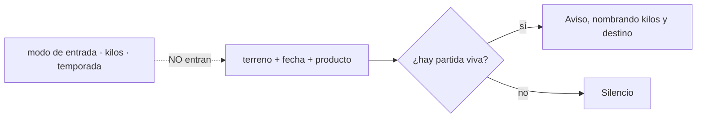

# TDD: MVP-805 — Aviso de cosecha duplicada

> **Referencia al spec**: [spec.md](./spec.md)

## Resumen técnico

`RU-24` estaba marcado «Estado: MVP» y nunca se construyó: no había lógica de duplicados en producción.
Lo que se añade es el **tercer aviso de la misma familia** que ya tienen `RN-023` (fecha fuera del
rango de la campaña) y `RN-043` (consumo anterior a su compra): avisa mientras se rellena y no impide
guardar.

La decisión que no se ve en el diff es **dónde vive la comparación**: en el servidor, con nombre propio
en el contrato (`GET /api/v1/harvests/duplicates`), y no en el formulario.

| Pieza | Qué hace |
|---|---|
| `HarvestFilter.Product` | El filtro que faltaba para poder preguntar por terreno + fecha + producto |
| `FindHarvestDuplicatesHandler` | **Qué cuenta como duplicado**: la regla, en un único sitio |
| `GET /harvests/duplicates` | La lectura de apoyo, con lo justo para **nombrar** la partida existente |
| `HarvestFormModal` | El aviso, rebotado, no bloqueante y conviviendo con el de `RN-023` |
| `RN-044` | La regla, con las tres precisiones de la comparación |

## Componentes afectados

| Componente | Tipo de cambio | Descripción |
|---|---|---|
| `Domain/Harvests/IHarvestRepository.cs` | modificado | `HarvestFilter` admite `Product` |
| `Infrastructure/.../HarvestRepository.cs` | modificado | Comparación exacta sobre el catálogo cerrado |
| `Application/Harvests/HarvestHandlers.cs` | modificado | `FindHarvestDuplicatesHandler` |
| `Controllers/HarvestsController.cs` | modificado | `GET /harvests/duplicates` |
| `frontend/.../services/harvest.service.ts` | modificado | `findDuplicates` |
| `frontend/.../types/harvest.types.ts` | modificado | Tipos de la consulta y de la respuesta |
| `frontend/.../harvests/HarvestFormModal.tsx` | modificado | El aviso y su rebote |
| `docs/01-producto/reglas-de-negocio.md` | modificado | **`RN-044`**, nueva |
| `docs/01-producto/definicion-requisitos-usuario.md` | modificado | `RU-24` con su destino y la decisión de «misma unidad» |
| `docs/02-arquitectura/contratos-api.md` | modificado | El endpoint y por qué tiene ruta propia |

## Diseño detallado

### Por qué la comparación no puede vivir en el cliente

La tentación es obvia: la pantalla ya tiene una lista de cosechas cargada, así que bastaría con buscar
ahí. **No basta, y además engañaría.**

- El listado de Cosechas está **filtrado** (desde `MVP-802`, por lo que traiga la URL), y el diario trae
  **una página**. Un aviso que dependa de eso aparece o no según lo que el usuario tuviera filtrado, que
  es peor que no avisar: enseña silencio donde no ha habido comprobación.
- El modal lo abren **dos** vistas —Cosechas y el diario—. Con la comparación en el formulario, la
  regla viviría en la pantalla que la usa y cambiarla obligaría a acordarse de las dos.

Es el mismo criterio de `RN-008`: la regla en un sitio. Por eso el endpoint tiene ruta propia en vez de
ser unos parámetros más de `GET /harvests`: así **qué cuenta como duplicado** tiene un nombre en el
contrato.

### Qué entra en la comparación y qué no

- **El modo de entrada, fuera.** `RU-24` decía «misma unidad» cuando la cosecha aún podía informar el
  rendimiento de varias formas; hoy `RN-013` fija la canónica. Incluirlo dejaría sin avisar el
  duplicado más probable: quien apunta dos veces lo mismo suele hacerlo de dos maneras, una con litros
  y otra con rendimiento.
- **Los kilos, fuera.** Se llevarían por delante el caso de teclear mal la cantidad al repetir, que es
  cuando el aviso más sirve.
- **La temporada, fuera.** La partida la identifican terreno, fecha y producto. Dos apuntes del mismo
  día en el mismo terreno son el duplicado que se busca aunque estén en campañas distintas —de hecho,
  eso es un síntoma más de que uno de los dos sobra—. Hay test de integración que lo fija.

El borrado lógico se resuelve solo: el puerto excluye las eliminadas en **todas** sus lecturas
(`RN-037`), así que `CA-4` se cumple por construcción. Aun así hay test, porque «se cumple por
construcción» es exactamente lo que deja de ser cierto cuando alguien añade otra consulta.

### El aviso

Rebotado a 350 ms, igual que la búsqueda del diario: depende de tres campos y sin espera saldría una
petición por pulsación en la fecha.

Un fallo se trata como **«no se sabe»**, no como error de pantalla: no poder comprobar si hay duplicado
no puede impedir registrar una cosecha. Hay test de eso.

Los dos avisos del formulario se apilan en el mismo sitio y, cuando coinciden, **se ven los dos**: una
fecha rara y una partida repetida son cosas distintas, y esconder una porque salga la otra dejaría al
usuario decidiendo con la mitad de la información (`CA-5`).

## Alternativas descartadas

| Alternativa | Por qué se descartó |
|---|---|
| Buscar el duplicado en la lista que la pantalla ya tiene | Está filtrada y paginada: el aviso aparecería o no según lo que el usuario tuviera puesto |
| Añadir `product` y `date` a `GET /harvests` y componer en el cliente | La regla de qué es un duplicado quedaría repartida en los dos formularios que abren el modal |
| Bloquear el alta | `RU-24` dice expresamente «se permite guardar igual (sin bloqueo)», y dos partidas del mismo terreno y día son un caso real |
| Comparar también kilos o modo de entrada | Dejaría sin avisar justo los dos casos en que el aviso sirve. Decisión del PO, 2026-08-10 |
| Avisar al intentar guardar y no al rellenar | `RN-023` y `RN-043` avisan mientras se escribe; un aviso al guardar llega cuando ya se ha decidido |

## Riesgos e impacto

| Riesgo | Probabilidad | Mitigación |
|---|---|---|
| Una petición por pulsación al teclear la fecha | media | Rebote de 350 ms, el mismo que el diario |
| El aviso desplaza el formulario mientras se escribe | baja | Va en el mismo bloque que el de `RN-023`, encima de los campos de captura |
| Un fallo de red deja el formulario inutilizable | baja | Se trata como «no se sabe»; test que lo comprueba |
| El filtro de producto no se traduce a SQL | baja | Test de repositorio contra Postgres real: la lección de `P-014` |

## Plan de testing

- [x] Tests de repositorio contra Postgres real: el filtro por producto **acota**, no se ignora
- [x] Tests de integración (7): el aviso nombra kilos y destino; no salta al cambiar terreno o fecha;
  **sí** salta con otra campaña; se excluye la propia al corregir; una partida eliminada no cuenta;
  faltar un campo es `400`; y no se ven partidas de otro Workspace
- [x] Tests de componente (6): el aviso nombra la partida, no impide guardar, desaparece al cambiar de
  terreno, manda `exclude_id` al corregir, convive con el de `RN-023`, y un fallo no rompe el formulario
- [x] Verificación contra la API real con la partida del 20 de octubre en «Matorral», que es el
  escenario con el que se detectó `P-110`

## Checklist de implementación

- [x] Diseño técnico revisado
- [x] Migraciones de base de datos preparadas — no aplica, no hay cambio de esquema
- [x] Tests escritos y pasando
- [x] Documentación de API actualizada — endpoint nuevo en `contratos-api.md`
- [x] Módulo afectado actualizado en `docs/03-modulos/` — vía `RN-044`, que es donde vive la regla
- [x] Sin `TODO` sin resolver en este documento
