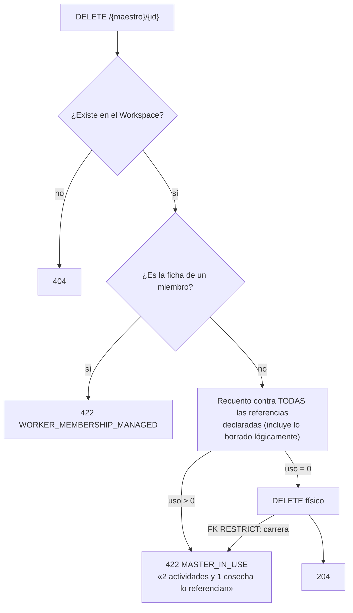

# TDD: MVP-806 — Depuración de maestros: borrado y fusión

> **Referencia al spec**: [spec.md](./spec.md)

## Resumen técnico

Dos operaciones nuevas sobre los cuatro maestros de `MVP-002`, con **una sola implementación** para
los cuatro:

| Operación | Endpoint | Qué la hace no trivial |
|---|---|---|
| Borrado físico de la ficha nunca usada | `DELETE /api/v1/{maestro}/{id}` | Comprobar el «sin uso» contra **todas** las referencias, no contra la que se está mirando |
| Fusión de dos fichas | `POST /api/v1/{maestro}/{id}/merge` | Reapuntar claves ajenas en una transacción y con el control de concurrencia de `ADR-0005` |

El spec avisa de dónde está el riesgo: «la comprobación del sin uso es la parte delicada, no el
borrado». Todo el diseño gira alrededor de eso. Quién puede referenciar a cada maestro se declara
**una vez** en `MasterReferenceMap`, el recuento se genera recorriendo esa declaración, y un test
compara la declaración contra las claves ajenas que EF conoce del modelo. La consecuencia práctica es
que una entidad operativa nueva con un `plot_id` pone el gate en rojo antes de que nadie pueda borrar
un terreno que sí se usaba.

## Diagrama de arquitectura / flujo

```mermaid
flowchart TD
    A["POST /{maestro}/{superviviente}/merge"] --> B{"¿Las dos fichas existen<br/>y son distintas?"}
    B -->|no| C["404 (ruta) · 400 (cuerpo) · 422 (consigo misma)"]
    B -->|sí| D{"¿La absorbida es<br/>la ficha de un miembro?"}
    D -->|sí| E["422 MERGE_MEMBER_SURVIVES"]
    D -->|no| F["BEGIN"]
    F --> G["Reapuntar por el agregado:<br/>sube la versión de cada registro"]
    G -->|"DbUpdateConcurrency"| H["409 · ROLLBACK, nada se aplica"]
    G --> I["Volver a contar el uso de la absorbida"]
    I -->|"> 0"| H
    I -->|"= 0"| J["DELETE de la absorbida · COMMIT"]
```





## Componentes afectados

| Componente | Tipo de cambio | Descripción |
|---|---|---|
| `Domain/Masters/MasterKind.cs` | nuevo | Los cuatro maestros y sus etiquetas para los mensajes |
| `Domain/Masters/MasterUsage.cs` | nuevo | Recuento con desglose por tipo y su redacción |
| `Domain/Masters/IMasterRepository.cs` | nuevo | Puerto único: buscar, contar, borrar y fusionar |
| `Domain/Masters/MasterOperationException.cs` | nuevo | Regla de negocio que impide depurar (422) |
| `Domain/{Activities,Harvests,Purchases,Consumptions}/*.cs` | modificado | Métodos `Reassign*` que reapuntan y suben la versión |
| `Infrastructure/Data/Repositories/MasterReferenceMap.cs` | nuevo | **Declaración única** de quién referencia a cada maestro |
| `Infrastructure/Data/Repositories/MasterRepository.cs` | nuevo | Recuento genérico, borrado y fusión transaccional |
| `Application/Masters/DeleteMasterHandler.cs` | nuevo | Reglas del borrado |
| `Application/Masters/MergeMastersHandler.cs` | nuevo | Reglas de la fusión, incluida la de `RN-036` |
| `Application/Masters/MasterUsageService.cs` | nuevo | Recuento por Workspace para el listado |
| `Common/Errors/MasterDepurationExceptionFilter.cs` | nuevo | Traducción al contrato, una vez para los cuatro |
| `Controllers/{Plots,Seasons,Workers,Tasks}Controller.cs` | modificado | `DELETE`, `merge` y `usage_count` en el listado |
| `frontend/.../lib/use-master-depuration.ts` | nuevo | Estado de las dos acciones, compartido |
| `frontend/.../components/common/MergeMasterDialog.tsx` | nuevo | Diálogo de fusión |
| `frontend/.../components/common/MasterDepurationLayer.tsx` | nuevo | Aviso + confirmación + fusión, una vez |
| `frontend/.../components/{plots,seasons,workers,tasks}/*View.tsx` | modificado | Botones y cableado |
| `docs/01-producto/reglas-de-negocio.md` (RN-037) | modificado | El criterio de los maestros |
| `docs/02-arquitectura/contratos-api.md` (§0.f) | modificado | Contrato común de las dos operaciones |

## Diseño detallado

### Modelo de datos

**No hay migración.** Es lo primero que se comprobó, porque una historia que borra filas invita a
pensar que hace falta esquema nuevo, y aquí no: las claves ajenas ya están declaradas como
`RESTRICT` desde `MVP-301` —«los maestros no se borran, así que `Restrict` es la semántica correcta:
si algún día se borrara un terreno con histórico, la operativa no debe quedar huérfana»— y ese «algún
día» es esta historia. La red que se puso pensando en un futuro hipotético es exactamente la que hace
falta ahora.

La única referencia con otro comportamiento es `workspace_members.active_season_id`, que ya nacía
`ON DELETE SET NULL` en `MVP-209` por ser una preferencia y no histórico.

### La declaración única de referencias

`MasterReferenceMap` describe cada forma de referenciar a un maestro con cinco datos: cómo se llama
en singular y en plural (para el mensaje), qué entidad y qué propiedad es (para la comprobación de
cobertura), si es **operativa** y una función que devuelve los identificadores de maestro
referenciados por las filas del Workspace.

Devolver los **identificadores** y no las filas es lo que permite que la misma declaración sirva para
las dos consultas que hacen falta, sin escribirlas dos veces:

- El recuento de una ficha: `ReferencedIds(db, ws).Count(id => id == masterId)`.
- El recuento de todo el maestro, para el listado: `ReferencedIds(db, ws).GroupBy(id)`.

Las nueve referencias que hay hoy:

| Maestro | Referencias operativas | No operativas |
|---|---|---|
| Terreno | `Activity.PlotId`, `Harvest.PlotId`, `PurchaseConsumption.PlotId` | — |
| Temporada | `Activity.SeasonId`, `Harvest.SeasonId`, `Purchase.SeasonId`, `PurchaseConsumption.SeasonId` | `WorkspaceMember.ActiveSeasonId` |
| Trabajador | `Activity.WorkerId` | — |
| Tarea | `Activity.TaskId` | — |

Dos decisiones que están en el mapa y no en un comentario suelto:

- **No se filtran los eliminados lógicamente.** Una actividad con `deleted_at` conserva su `plot_id`,
  y la FK `RESTRICT` no distingue: filtrar por «vivos» daría un «sin uso» que la base de datos
  desmentiría con un `23503`. Contarla no es prudencia, es la verdad.
- **`IsOperational` separa histórico de preferencia.** La temporada de trabajo de un miembro se
  declara —para que la comprobación de cobertura la vea— pero no bloquea el borrado. Es una
  preferencia con `SET NULL` que se resuelve sola cayendo al defecto de `WorkingSeasonPolicy`, que es
  exactamente lo que hace un Workspace recién creado.

### La comprobación de cobertura

`MasterReferenceCoverageTests` construye el modelo de EF —sin base de datos: basta con
`UseNpgsql` y una cadena que nunca se abre— y, para cada maestro, compara las claves ajenas que
apuntan a él con las declaradas en el mapa.

Es la única pieza de esta historia cuyo valor está **entero en el futuro**. Los demás tests
comprueban que lo declarado se cuenta bien; este comprueba que no falte nada por declarar, que es el
fallo que el spec anticipa y que ningún test de comportamiento puede ver, porque el escenario que lo
destaparía es el que nadie escribió.

Un segundo test fija que la **única** referencia marcada como no operativa es
`WorkspaceMember.ActiveSeasonId`: sacar una referencia del recuento que bloquea el borrado no puede
ser una decisión que se tome de pasada.

### La fusión y el control de concurrencia

Reapuntar con un `UPDATE` masivo (`ExecuteUpdateAsync`) sería una línea por maestro y estaría mal: se
salta el token de concurrencia, así que pisaría en silencio la corrección de alguien que tuviera el
registro abierto. Por eso los registros operativos se cargan, se mutan con métodos del agregado
(`Activity.ReassignPlot`, `Harvest.ReassignSeason`…) que suben `version`, y se guardan. EF emite
entonces `UPDATE … WHERE id = @id AND version = @vieja`; si alguien se adelantó, no se actualiza
ninguna fila, EF lanza `DbUpdateConcurrencyException` y la transacción se deshace entera. Es
preferible repetir la fusión a completarla a medias.

La preferencia de temporada de trabajo sí va por `ExecuteUpdateAsync`: no tiene versión ni es
histórico. Se reapunta igualmente —no hacerlo devolvería al usuario al defecto sin que lo pidiera—
pero no suma en `reassigned_count`, que cuenta registros operativos.

Antes de borrar la ficha absorbida, y **dentro de la misma transacción**, se vuelve a contar su uso.
Es la comprobación explícita del `CA-5`: si un tipo de referencia se hubiera quedado sin reapuntar, el
error lo dice con nombre y cifra en vez de aparecer como un `23503` de PostgreSQL.

### Por qué el borrado va por `ExecuteDeleteAsync`

La primera implementación hacía `Remove` + `SaveChanges`. El test de la carrera lo tumbó, y lo que
enseñó merece quedar escrito: con un dependiente cargado en el rastreador, EF detecta que su clave
ajena obligatoria se quedaría apuntando a nada y lanza «the association has been severed» **antes de
hablar con la base de datos**. Un fallo de infraestructura donde lo correcto era la respuesta de
negocio que la propia FK sabe dar. Y, peor, una decisión tomada sobre lo que este contexto casualmente
había cargado, no sobre lo que hay.

Yendo directo al SQL, quien decide es la base de datos, que ve todas las referencias. El
`23503` se traduce al mismo `422 BUSINESS_RULE_MASTER_IN_USE`, igual que el índice único de `MVP-207`
se traduce al `409` de nombre duplicado.

### API / Contratos

Documentado en `docs/02-arquitectura/contratos-api.md` §0.f, común a los cuatro maestros:

```yaml
DELETE /api/v1/{plots|seasons|workers|tasks}/{id}      -> 204 | 404 | 422
POST   /api/v1/{plots|seasons|workers|tasks}/{id}/merge
  body: { absorbed_id: uuid }
  200: { survivor_id, survivor_name, absorbed_id, absorbed_name, reassigned_count }
  400 FOREIGN_KEY_WORKSPACE_MISMATCH | 404 | 409 CONFLICT_VERSION_MISMATCH | 422
GET    /api/v1/{maestro}   -> cada fila añade `usage_count: number | null`
```

`usage_count` viaja **solo poblado en el listado**. En el alta y la edición vale `null`, que significa
«no consultado». Devolver `0` habría sido más cómodo y habría sido mentira en el `PATCH` de una ficha
con histórico, y una interfaz que se lo creyera ofrecería un borrado imposible.

No hay `If-Match`: los maestros no tienen versión. Lo que se protege con `ADR-0005` son los registros
operativos que se reapuntan, no las fichas.

### Manejo de errores

Un filtro global (`MasterDepurationExceptionFilter`) traduce las tres excepciones de la historia, en
vez de repetir cuatro bloques `try/catch` idénticos en los cuatro controladores. El filtro **no toca**
`context.Result` si la excepción no es suya: sobrescribirla con `null` convertiría en `500` lo que
otro filtro ya había resuelto.

| Excepción | Respuesta |
|---|---|
| `MasterOperationException` | `422` con su código de regla |
| `MasterLinkException` | `400 FOREIGN_KEY_WORKSPACE_MISMATCH` |
| `ConcurrencyConflictException` | `409 CONFLICT_VERSION_MISMATCH` |

Los controladores de las entidades operativas siguen atrapando `ConcurrencyConflictException` ellos
mismos: su respuesta lleva además `current_version`, y la fusión no edita un registro concreto del
que dar la versión.

Los mensajes concuerdan en género (`MasterKinds.Article` / `ObjectPronoun`): con cuatro maestros de
dos géneros, una plantilla única del tipo «el … lo referencian» sale mal la mitad de las veces, y es
un texto que lee el usuario.

### Cliente

La superficie es la misma en las cuatro pantallas, así que hay una sola implementación:
`useMasterDepuration` lleva el estado (qué ficha se confirma, si hay operación en curso, el error y el
aviso) y `MasterDepurationLayer` pinta el aviso, la confirmación de borrado y el diálogo de fusión.
Cada vista solo decide dónde van los botones —eso sí depende de su maqueta— y las palabras.

Tres decisiones del cliente:

- **«Eliminar» solo con `usage_count === 0`.** `null` es «no lo sé», y ante la duda no se ofrece:
  enseñar un botón que el servidor va a rechazar es peor que no enseñarlo. La guarda que manda sigue
  siendo la del servidor.
- **El mensaje del `422` se muestra tal cual.** Trae la cifra y el desglose, que es lo que el `CA-2`
  pide y lo que el cliente no puede inventarse.
- **En responsables, el diálogo fija el sentido.** Si una de las dos fichas es la de un miembro,
  sobrevive esa y se explica por qué, sin ofrecer invertirlo. Si lo son las dos —dos cuentas
  homónimas—, se bloquea. Así el usuario no llega nunca a pedir lo que el servidor rechazaría.

## Alternativas descartadas

| Alternativa | Por qué se descartó |
|---|---|
| Cuatro implementaciones, una por maestro | Es el fallo que el spec anticipa. La lista de referencias en cuatro sitios garantiza que la próxima entidad operativa se añada en tres |
| Contar el uso solo contra la entidad «principal» de cada maestro | Literalmente el defecto descrito: un terreno con consumos y sin actividades pasaría por «nunca usado» y el borrado chocaría con la FK |
| Filtrar los registros eliminados lógicamente en el recuento | Su clave ajena sigue apuntando a la ficha: daría un «sin uso» que la base de datos desmiente con un `500` |
| Borrado **lógico** de la ficha de maestro, como en los operativos | La política de conservación de un maestro ya existe y es la inactivación. Un tercer estado no aporta ningún dato y sí una lista más que mantener |
| Reapuntar con `ExecuteUpdateAsync` | Una línea por maestro, y se salta el token de concurrencia: pisaría en silencio la edición de otra persona. Es lo que el spec llama «la fusión no es un borrado con pasos previos» |
| Endpoint de previsualización de la fusión | El `usage_count` del listado ya es la cifra que la confirmación necesita, y es la misma que usa el servidor para decidir |
| `usage_count: 0` también en el alta y la edición | Falso en el `PATCH` de una ficha con histórico. `null` dice la verdad: no se ha consultado |
| Intercambiar en silencio superviviente y absorbido en el caso miembro/cuadrilla | Cumpliría el `CA-4` y sería una API que hace algo distinto de lo que se le pide. Se rechaza con un código propio y es la interfaz la que fija el sentido |
| Permitir fusionar dos fichas de miembro | Son dos personas con dos cuentas: la fusión borraría la ficha de una de ellas en un Workspace al que sigue teniendo acceso |
| Bloquear el borrado de una temporada fijada como de trabajo | No es histórico. Su FK es `SET NULL` y el defecto se resuelve solo; bloquearlo sería inventar una restricción que el modelo no tiene |
| Impedir borrar la última temporada del Workspace | Deja el Workspace en el mismo estado que uno recién creado, que el onboarding ya sabe resolver. Una restricción de más para un caso que no rompe nada |

## Riesgos e impacto

| Riesgo | Probabilidad | Mitigación |
|---|---|---|
| Una entidad operativa futura referencia un maestro y nadie actualiza el recuento | media | `MasterReferenceCoverageTests` compara el mapa contra las claves ajenas del modelo de EF y falla |
| El listado va desfasado y se ofrece borrar algo que ya se usó | media | La comprobación que manda es la del servidor, y por debajo la FK `RESTRICT`. Las dos acaban en el mismo `422`, nunca en un `500` |
| Una fusión se aplica a medias | baja | Transacción única, y recuento del absorbido antes de borrarlo. Cubierto por test |
| Un borrado se lleva por delante operativa | muy baja | Tres capas: recuento contra todas las referencias, FK `RESTRICT` y comprobación posterior en la fusión. `CA-5` verificado consultando las claves ajenas después |
| El usuario fusiona en el sentido equivocado y no hay vuelta atrás | media | El diálogo nombra cuál desaparece y cuántos registros se mueven, y avisa de que no se puede deshacer. Deshacer una fusión está fuera de alcance por decisión del spec |

## Plan de testing

- [x] **Tests unitarios (backend)**: reglas del borrado y de la fusión con el repositorio mockeado
  (`DeleteMasterHandlerTests`, `MergeMastersHandlerTests`), incluida la concordancia de género de los
  mensajes y las dos caras de la regla de `RN-036`.
- [x] **Comprobación de cobertura**: el mapa de referencias contra el modelo de EF, para los cuatro
  maestros (`MasterReferenceCoverageTests`).
- [x] **Tests de integración contra PostgreSQL real** (`MasterRepositoryPostgresTests`): **una prueba
  por cada uno de los nueve tipos de referencia** (`CA-2`), el recuento incluyendo lo eliminado
  lógicamente, el recuento agrupado del listado, la fusión de los cuatro maestros contando antes y
  después (`CA-3`/`CA-5`), el salto de versión de lo reapuntado y el `409` cuando alguien edita
  entretanto.
- [x] **Tests de integración contra la API** (`MasterDepurationIntegrationTests`): las cuatro
  superficies, los nueve casos de uso con su código y su cifra, la desaparición de la ficha del
  listado, el caso miembro/cuadrilla en los dos sentidos (`CA-4`) con el índice único parcial de
  `MVP-208` comprobado en base de datos, y el aislamiento multi-tenant.
- [x] **Tests de cliente (Vitest)**: el diálogo de fusión (`MergeMasterDialog.test.tsx`), la decisión
  de ofrecer o no el borrado según `usage_count` y el error del servidor mostrado tal cual
  (`TareasView.test.tsx`), y el caso del miembro (`TrabajadoresView.test.tsx`).
- [ ] Tests e2e de navegador: no aplica, sigue descartado por `P-064`.

**Comprobado en rojo.** Retirando del mapa la referencia `PurchaseConsumption.PlotId` —la que el spec
señala como fácil de olvidar— fallan tres pruebas de tres niveles distintos:
`MasterReferenceCoverageTests(kind: Plot)`, `ElUsoDeUnTerreno_Deberia_ContarLosConsumos` y
`BorrarUnTerrenoConConsumos_Deberia_Responder422`.

## Hallazgos fuera de alcance

- **El `PATCH` de terrenos exige el objeto completo desde el cliente.** `TerrenosView.toggleActive`
  reenvía los siete campos del terreno para cambiar solo `is_active`, cuando el endpoint admite campos
  parciales. No es un defecto visible —los valores que reenvía son los que ya tenía— pero es una
  escritura ciega: si otra persona editó el terreno entretanto, la inactivación revierte su cambio. Se
  propone como punto nuevo para `MVP-999`.
- **El listado de maestros hace ahora una consulta por tipo de referencia.** Son tres en el peor caso
  (terrenos) y a la escala del producto no se nota, pero es trabajo que crece con el número de
  entidades operativas, no con el de fichas. Si algún día molesta, la salida es una vista materializada
  o un `UNION ALL`, no volver a preguntarlo ficha a ficha. Sin acción propuesta hoy.

## Checklist de implementación

- [x] Diseño técnico revisado
- [x] Migraciones de base de datos preparadas — no aplica: las claves ajenas ya eran `RESTRICT` desde
  `MVP-301` y `SET NULL` donde tocaba desde `MVP-209`
- [x] Tests escritos y pasando
- [x] Documentación de API actualizada — `contratos-api.md` §0.f y las cuatro secciones de maestro
- [x] Módulo afectado actualizado en `docs/03-modulos/` — vía `RN-037`, que es donde vive la regla
- [x] Sin `TODO` sin resolver en este documento
