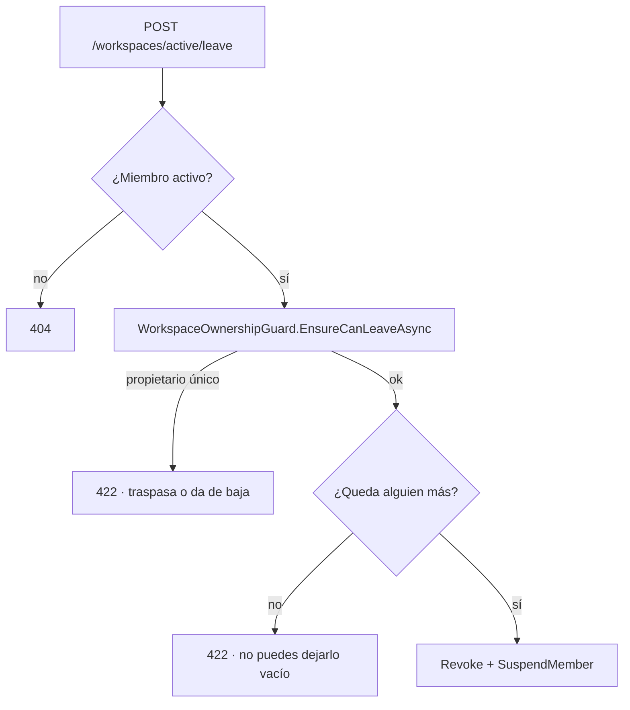

# TDD: MVP-807 — Ciclo de vida de la membresía

> **Referencia al spec**: [spec.md](./spec.md)

## Resumen técnico

Dos puntos que comparten superficie —«Miembros y accesos»— y la misma decisión de producto: **que lo
que la interfaz ofrece coincida con lo que la regla permite**.

| Punto | Qué faltaba | Qué se hace |
|---|---|---|
| `P-048` | Un miembro no propietario no podía **abandonar** un Workspace | `POST /workspaces/active/leave`, con las dos guardas **llamadas**, no reimplementadas |
| `P-049` | `can_revoke` era más restrictivo que la guarda real | Pasa a describir exactamente el `CA-8` de `MVP-204` |

El código es poco. Lo que tiene sustancia son dos cosas: **de dónde sale cada guarda** y **un hallazgo
sobre la premisa de `P-049`** que cambia cómo hay que verificarlo.

## Componentes afectados

| Componente | Tipo de cambio | Descripción |
|---|---|---|
| `Application/Workspaces/WorkspaceOwnershipGuard.cs` | modificado | `EnsureCanLeaveAsync`: la misma regla, un solo Workspace |
| `Application/Workspaces/LeaveWorkspaceHandler.cs` | nuevo | El caso de uso, que solo orquesta guardas ajenas |
| `Controllers/WorkspacesController.cs` | modificado | `POST /workspaces/active/leave` |
| `Controllers/WorkspaceMembersController.cs` | modificado | `can_revoke` alineado con la guarda |
| `frontend/.../services/workspace-lifecycle.service.ts` | modificado | `leave()` |
| `frontend/.../components/members/MiembrosView.tsx` | modificado | La acción y su confirmación |
| `docs/01-producto/reglas-de-negocio.md` (RN-034) | modificado | Salida voluntaria y alineación |
| `docs/02-arquitectura/contratos-api.md` | modificado | El endpoint y qué significa `can_revoke` |

## Diseño detallado

### Abandonar es «revocarse a uno mismo», y por eso no inventa nada

El efecto es **exactamente el de revocar**: la membresía pasa a `revocado`, la fila de responsable se
inactiva (`MVP-208`) y el histórico no se toca. Reingresar exige invitación nueva, igual que para quien
fue revocado.

**Ninguna de las dos guardas se reimplementa**, que es la condición con la que se registró `P-024`:

- La de **no-orfandad** vive en `WorkspaceOwnershipGuard`, donde `MVP-206` la dejó y donde `MVP-505` la
  llamó al construir la baja de cuenta. Se le añade `EnsureCanLeaveAsync`, que reutiliza
  `ListObligationsAsync`: la definición de «propietario único» es **literalmente la misma consulta**.
  Abandonar y cerrar la cuenta son dos puertas al mismo problema —una persona que se va—, y si cada una
  decidiera por su cuenta acabarían discrepando, que es justo lo que le pasó a `can_revoke`.
- La de **no dejarlo vacío** es la misma comprobación del `CA-8` de `MVP-204`.

`CA-2` exige comprobar que **la llamada pasa por la guarda**, no que el resultado coincida. Hay un test
que afirma sobre `ListSoleOwnedAsync`: una comprobación equivalente escrita a mano daría hoy el mismo
veredicto y divergiría en cuanto la regla cambiara.

El endpoint responde `204` y no reemite la sesión: lo que hay que saber después es cuál es el contexto
nuevo, y eso lo resuelve `GET /workspaces/active`. El cliente resincroniza, igual que tras dar de baja
un Workspace.

### `can_revoke` describe la guarda, no una versión más prudente de ella

Antes: `activo && rol != propietario`.
Ahora: `activo && (rol != propietario || propietariosActivos > 1) && miembrosActivos > 1`.

La segunda condición es la otra mitad del `CA-8` que tampoco se decía: al último miembro activo no se
le puede retirar el acceso aunque no sea propietario.

Para poder decirlo, el listado cuenta los propietarios y los miembros activos que **ya tiene en
memoria**: no hay consulta nueva.

### El hallazgo que cambia cómo se verifica `P-049`

**Hoy ningún flujo del producto deja dos propietarios activos.** Se comprobaron los cuatro que
promueven a alguien:

| Flujo | Qué hace |
|---|---|
| `TransferWorkspaceOwnershipHandler` | Promueve al nuevo y **degrada** al anterior |
| `CloseWorkspaceHandler` (con copropietario) | Promueve al sucesor y **degrada y revoca** a quien sale |
| `ReopenWorkspaceHandler` | Reafirma la propiedad de quien lo levanta, que ya era propietario |
| `ResolveReactivationHandler` | Promueve al solicitante y **degrada** al anterior |

Es decir: la incoherencia de `P-049` era **latente**, no viva. En la práctica `can_revoke` y la guarda
coincidían, porque el caso en que difieren no se puede alcanzar.

Eso no quita la alineación —una regla publicada que no describe la guarda ya ha empezado a divergir, y
el día que exista un segundo propietario nadie volvería a mirarlo— pero **sí cambia cómo se comprueba**:
el `CA-6` pide un Workspace con dos propietarios activos, y ese estado hay que **sembrarlo en base de
datos** porque la API no lo produce. Es lo que hace el test, y se dice en su propio comentario para que
nadie lo lea como un atajo.

El hallazgo se registra como punto nuevo en `MVP-999`.

### El cliente no replica las guardas

La acción se ofrece siempre; quién puede irse lo decide el servidor y **su mensaje es el que se
enseña**. Adelantar la condición en la pantalla sería una segunda copia de la regla, que es exactamente
lo que produjo `P-049` en esta misma vista.

La salida va en su propio bloque al final de «Miembros y accesos», separada de la lista: es una acción
sobre uno mismo, y mezclarla con las que se ejercen sobre los demás la haría parecer una más. La
confirmación **nombra el Workspace** y dice que lo registrado no se borra.

## Alternativas descartadas

| Alternativa | Por qué se descartó |
|---|---|
| Reutilizar `RevokeMemberHandler` pasando el propio id | La guarda de propiedad que aplica al que se va no es la misma que protege al propietario único frente a terceros, y la interfaz oculta la revocación sobre uno mismo a propósito |
| Comprobar «soy propietario único» en el propio caso de uso | Es reimplementar `RN-038`. La condición de `P-024` es que se llame a la guarda |
| Endurecer la guarda para que no se pueda revocar a un copropietario | Obligaría a que un copropietario solo pudiera salir por su pie o traspasando, y se apartaría de lo que el `CA-8` de `MVP-204` dice. Decisión del PO: manda `RN-034` |
| Adelantar en el cliente quién puede abandonar | Segunda copia de la regla. Es el origen de `P-049` |
| Reemitir la sesión al abandonar | El contexto nuevo lo resuelve el servidor; devolver un token obligaría a decidir aquí a qué Workspace va la persona |
| Avisar al resto de miembros de que alguien se ha ido | Fuera de alcance por el `spec`: sería `MVP-808` si se decidiera |

## Riesgos e impacto

| Riesgo | Probabilidad | Mitigación |
|---|---|---|
| Alguien se va y deja el Workspace huérfano | baja | Dos guardas, las dos con test, y la de propiedad es la misma de la baja de cuenta |
| `can_revoke` pasa a ofrecer algo que la API rechaza | baja | Test de integración que compara **lo ofrecido con lo aceptado**, no cada uno por su lado |
| La sesión queda apuntando a un Workspace que ya no es suyo | media | El cliente resincroniza el contexto y navega; el servidor resuelve el activo que corresponda |
| El test de `CA-6` siembra un estado imposible y tapa un problema real | media | Se dice explícitamente en el test y en el `spec`, y el hallazgo se registra en `MVP-999` |

## Plan de testing

- [x] Tests unitarios (6): la membresía queda revocada, la fila de responsable se inactiva sin borrarse,
  el propietario único y el último miembro activo no pueden salir, **la llamada pasa por la guarda**, y
  quien no es miembro activo recibe `404`
- [x] Tests de integración contra Postgres real (8): el flujo completo con dos cuentas —invitar,
  aceptar, abandonar—, el Workspace desaparece de su selector, deja de ser responsable seleccionable
  conservando su ficha, vuelve como `revocado`, las dos negativas, y las dos mitades del `CA-6`
- [x] La prueba del `CA-6` comprobada **en rojo** sin la alineación de `can_revoke`
- [x] Tests de componente (4): la confirmación explícita que nombra el Workspace, el aviso de que lo
  registrado no se borra, la resincronización del contexto, y que el motivo del servidor se enseña tal
  cual cuando no se puede salir

## Hallazgo fuera de alcance

- **Ningún flujo produce dos propietarios activos** (ver arriba). Se propone como punto nuevo para
  `MVP-999`: o bien el producto quiere copropiedad y falta la vía para crearla, o bien no la quiere y
  entonces `RN-034` y las guardas deberían decirlo en vez de dejar el caso a medio camino.

## Checklist de implementación

- [x] Diseño técnico revisado
- [x] Migraciones de base de datos preparadas — no aplica: no hay cambio de esquema
- [x] Tests escritos y pasando
- [x] Documentación de API actualizada — el endpoint y la semántica de `can_revoke`
- [x] Módulo afectado actualizado en `docs/03-modulos/` — vía `RN-034`, que es donde vive la regla
- [x] Sin `TODO` sin resolver en este documento
