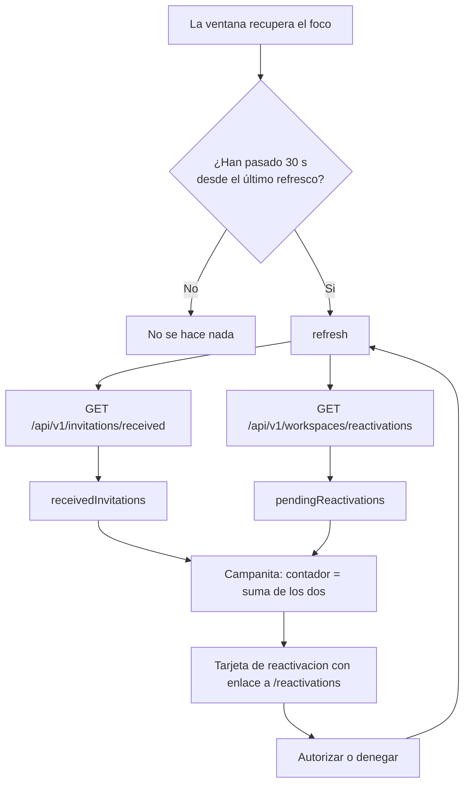

# TDD: MVP-808 — Avisos in-app que no dependan del correo

> **Referencia al spec**: [spec.md](./spec.md)

## Resumen técnico

Todo el cambio vive en el cliente y **no añade ni un endpoint**: la consulta que hace falta ya existe
desde `MVP-206` (`GET /api/v1/workspaces/reactivations`, documentada en
`docs/02-arquitectura/contratos-api.md`) y hasta ahora solo la consumía la pantalla `/reactivations`.
Lo que faltaba no era el dato, era que alguien lo mirara sin que se lo pidieran.

`NotificationsContext` pasa de tener **una** fuente a tener **dos**, y gana un disparador nuevo:

| Pieza | Antes | Ahora |
|---|---|---|
| Fuentes de la bandeja | Invitaciones recibidas | Invitaciones + solicitudes de reactivación pendientes |
| Cuándo se carga | Solo al montar la sesión | Al montar **y** al recuperar el foco de la ventana |
| Salvaguarda | — | Intervalo mínimo de 30 s entre refrescos |
| Contador de la campanita | `receivedInvitations.length` | Suma de los dos tipos |

El único cambio de backend es de **tests**: no había ninguna prueba contra PostgreSQL de la consulta
que alimenta el aviso, y esa consulta une con `db.Workspaces` un Workspace que por definición está
dado de baja.

## Diagrama de arquitectura / flujo



## Componentes afectados

| Componente | Tipo de cambio | Descripción |
|---|---|---|
| `src/contexts/NotificationsContext.tsx` | modificado | Segunda fuente (`pendingReactivations`), refresco por foco con intervalo mínimo, contador sumado |
| `src/components/notifications/PendingReactivationCard.tsx` | nuevo | Tarjeta del aviso, con enlace a `/reactivations` y sin acciones propias |
| `src/components/notifications/NotificationBell.tsx` | modificado | Pinta los dos tipos; rótulos de sección solo cuando conviven; `aria-label` en términos de «avisos» |
| `src/components/workspace/ReactivationInboxPage.tsx` | modificado | Tras autorizar o denegar, refresca también la bandeja (`CA-4`) |
| `src/contexts/NotificationsContext.test.tsx` | modificado | 11 casos nuevos, incluidos los de conteo de peticiones |
| `src/components/notifications/NotificationBell.test.tsx` | nuevo | 5 casos sobre lo que la campanita enseña y lo que no ofrece |
| `Terrenario.Api.Tests/Workspaces/WorkspaceLifecycleRepositoryPostgresTests.cs` | modificado | 3 casos contra PostgreSQL sobre `ListPendingAuthorizationsAsync` |
| `Terrenario.Api.Tests/Workspaces/ReactivationHandlersTests.cs` | modificado | Solo documentación: el test del correo pasa a ser explícitamente la guarda de `CA-5` |

## Diseño detallado

### Modelo de datos

Ninguno. No hay tabla nueva, ni columna, ni migración: el aviso se deriva del estado `solicitada` de
`workspace_reactivation_requests`, que ya existe desde `MVP-206`.

Que el aviso **no tenga estado propio** es una decisión, no una omisión. Un aviso con ciclo de vida
—leído, archivado, caducado— es justo lo que el `spec.md` deja fuera, y añadir la columna «por si
acaso» habría creado un segundo sitio donde una solicitud puede estar resuelta: el día que los dos no
coincidan, gana el equivocado.

### API / Contratos

Sin cambios. Se consume tal cual el endpoint que `MVP-206` ya documentó:

```yaml
GET /api/v1/workspaces/reactivations:
  auth: Bearer (sin ambito de Workspace: el Workspace de la solicitud esta dado de baja)
  200:
    data: [{ id, workspace: { id, name }, requested_by: { user_id, name, email },
             requested_at, expires_at }]
    meta: { total }
```

Que no exija ámbito de Workspace es lo que permite pedirlo desde el contexto de notificaciones sin
condicionarlo al Workspace activo.

### Lógica de negocio

**Las dos fuentes se piden a la vez y fallan por separado.** El `refresh` original envolvía la única
llamada en un `try/catch` que dejaba la bandeja vacía. Con dos fuentes, ese patrón haría que un fallo
leyendo invitaciones escondiera una solicitud de reactivación pendiente —exactamente el hueco que
esta historia viene a cerrar—, así que cada llamada lleva su propio `catch` a lista vacía y el
`Promise.all` no propaga nada. Dos tests fijan la simetría, uno por cada dirección.

**El intervalo mínimo se mide desde que el refresco *empieza*, no desde que termina**, y el reloj lo
lleva una `ref` que se marca al principio de `refresh`. Como consecuencia, la carga inicial ya cuenta:
volver a la ventana un segundo después de montar la sesión no dispara una segunda petición.

**Se escuchan dos eventos, `visibilitychange` y `focus`**, porque ninguno cubre solo el caso:
`visibilitychange` no salta al volver desde otra ventana de la misma pantalla, y `focus` no salta en
móvil al recuperar la pestaña. Volver a la pestaña suele emitir los dos, y ahí es donde el intervalo
mínimo evita que una sola vuelta cueste dos peticiones. El listener solo se registra con sesión
iniciada.

**El aviso no ofrece autorizar ni denegar desde la campanita.** Es la decisión irreversible de
`RN-040`: el Workspace vuelve y cambia de propietario. La campanita lleva a `/reactivations`, que es
donde se explica lo que implica. Lo que la historia quita es la dependencia del correo, no el paso de
leer antes de decidir.

**El tracking de «vistas» de `MVP-107` se reutiliza sin tocarlo y sin extenderlo.** Sigue habiendo un
único almacén (`terrenario:seen_invitations`) con su misma poda, y las solicitudes de reactivación no
entran en él porque no tienen modal que las ofrezca —el modal no bloqueante es de invitaciones—. No se
generalizó a «vistas de cualquier aviso»: sería una abstracción sin consumidor, que es la lección de
`P-007`. Un test lo fija: con una solicitud pendiente y ninguna invitación, `newInvitation` es `null`.

**Por qué aquí sí y en el dashboard no.** `RN-006` descartó el refresco al recuperar el foco «no
diferido, descartado». No es contradictorio: allí se trata de **recalcular cifras**, donde el usuario
decide cuándo mirar y un número que cambia solo desorienta; aquí, de **enterarse de algo que otra
persona ha mandado**, que por definición no depende de cuándo mires. La distinción se ha escrito en la
propia `RN-006` para que no haya que deducirla.

### Manejo de errores

| Situación | Comportamiento |
|---|---|
| Falla la lectura de invitaciones | Lista de invitaciones vacía; las reactivaciones se siguen mostrando |
| Falla la lectura de reactivaciones | Lista de reactivaciones vacía; las invitaciones se siguen mostrando |
| Sin token válido | No se pide nada y las dos listas se vacían: la bandeja es de la cuenta autenticada |
| 401 en la llamada de reactivaciones | Lo gobierna el cliente HTTP común (`ApiContext`), igual que cualquier otra pantalla |

La bandeja es informativa: ningún fallo suyo bloquea la operativa. Lo que sí se garantiza es que un
fallo de una fuente no silencie a la otra.

## Alternativas descartadas

| Alternativa | Por qué se descartó |
|---|---|
| **Polling con intervalo** | Es el coste permanente que el `spec.md` excluye: peticiones también cuando nadie mira. El disparador correcto es que la persona **vuelva**, no que pase el tiempo |
| **Websockets / SSE** | Infraestructura nueva (conexión persistente, reconexión, escalado) para dos tipos de aviso en un producto de explotaciones pequeñas. Fuera de alcance explícito |
| **Debounce en vez de intervalo mínimo** | Un debounce **retrasa**: espera a que dejes de cambiar de pestaña y entonces pide. Aquí el primer regreso es el que importa —es cuando la persona está mirando— y con debounce sería el único que **no** se atiende. El intervalo mínimo dispara en el flanco de entrada y silencia los siguientes; el debounce hace justo lo contrario |
| **Intervalo de 5 minutos** | Espacia tanto que reintroduce el problema: volver a la ventana y no ver la invitación que acaba de llegar es indistinguible de no tener refresco. 30 s es el orden de lo que se quiere resolver |
| **Columna de estado del aviso en base de datos** | Un segundo sitio donde una solicitud puede estar resuelta. La fuente de verdad es el estado de la solicitud, y así el aviso no puede desincronizarse |
| **Marcar también las reactivaciones como «vistas»** | Abstracción sin consumidor (`P-007`): nada las descartaría, porque no tienen modal |
| **Autorizar y denegar desde la campanita** | Decisión irreversible sin la pantalla que la explica. La campanita avisa; `/reactivations` decide |
| **Un endpoint nuevo que devolviera «todos los avisos»** | Generalizar el centro de notificaciones es `RU-31`, fase posterior. Con dos tipos, agregarlos en servidor sería inventar un contrato para un consumidor que todavía no sabe qué forma tendrá |
| **Avisar al solicitante del resultado** | Decisión del PO del 2026-08-10: abriría avisos con ciclo de vida propio (leído, caducado) que la campanita no tiene |

## Riesgos e impacto

| Riesgo | Probabilidad | Mitigación |
|---|---|---|
| Que alguien «simplifique» el correo de `RN-040` ahora que hay aviso in-app | media | El test del envío lleva escrito por qué no se puede quitar (`CA-5`), y `RN-040` lo dice como regla |
| Que el filtro de baja lógica se cuele en el `join` a `Workspaces` de la consulta del aviso y lo deje vacío para siempre | baja | Test contra PostgreSQL real con el Workspace **dado de baja**: es el único sitio donde se ve, porque los handlers van con repositorio mockeado (`P-014`) |
| Doblar el número de peticiones del arranque de sesión | alta (por diseño) | Son dos peticiones por refresco, en paralelo, y el intervalo mínimo acota el ritmo. A cambio, la única alternativa era no enterarse |
| Que quien dio de baja su **único** Workspace no vea el aviso | media | Limitación conocida, ver abajo |

**Limitación conocida y fuera de alcance.** La campanita vive en `AppTopbar`, dentro de `AppLayout`,
que exige Workspace activo. Quien dio de baja su único Workspace no tiene shell —cae en
`/onboarding`—, así que **para esa persona el aviso in-app no aparece** y el correo sigue siendo su
única vía, junto con el enlace a `/reactivations` que ya hay en Ajustes. Ese hueco existía antes de
esta historia y no lo abre ella; se registra como candidato a punto nuevo en `MVP-999` en vez de
resolverse aquí, porque su arreglo es una superficie fuera del shell y eso es otra decisión de diseño.

## Plan de testing

Según `docs/04-ingenieria/estrategia-testing.md`: lógica de decisión en el cliente con Vitest, y
consultas reales contra PostgreSQL con testcontainers.

- [x] Tests unitarios (cliente): `NotificationsContext.test.tsx` — 22 casos, 11 nuevos. Cubren las dos
  fuentes, su fallo independiente, el contador sumado, la ausencia de modal para el aviso nuevo, el
  refresco por foco y la **cuenta de peticiones** del `CA-2`.
- [x] Tests unitarios (vista): `NotificationBell.test.tsx` — 5 casos. Enlace a `/reactivations`,
  `aria-label` con el total, rótulos de sección solo cuando conviven los dos tipos y ausencia de
  botones de decisión en la campanita.
- [x] Tests de integración (PostgreSQL real): `WorkspaceLifecycleRepositoryPostgresTests` — 3 casos
  sobre `ListPendingAuthorizationsAsync`: la ve con el Workspace dado de baja, no la ve quien no
  decide, y deja de verla al autorizar **y** al denegar (`[Theory]` con las dos vías).
- [x] Tests e2e: no aplica. `P-064` mantiene descartada la cobertura E2E de navegador.

**Prueba que falla sin el cambio** (comprobado, no supuesto): con
`MIN_REFRESH_INTERVAL_MS = 0`, el caso `Deberia_NoLanzarUnaPeticionPorCadaCambioDePestana_...` falla
con `expected "vi.fn()" to be called 1 times, but got 41 times`. Con el intervalo puesto, 1.

## Checklist de implementación

- [x] Diseño técnico revisado y aprobado
- [x] Migraciones de base de datos preparadas — no hay: el cambio no toca el esquema
- [x] Tests escritos y pasando
- [x] Documentación de API actualizada — sin cambios: no se añade endpoint, se consume el de `MVP-206`
- [x] Módulo afectado actualizado en `docs/03-modulos/`
- [x] Sin `TODO` sin resolver en este documento
