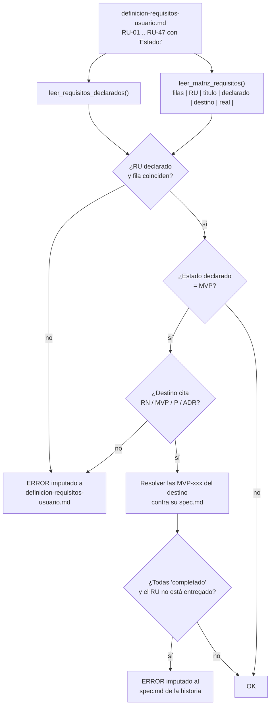

# TDD: MVP-809 — Trazabilidad de los requisitos de usuario

> **Referencia al spec**: [spec.md](./spec.md)

## Resumen técnico

Dos piezas que solo valen juntas:

| Pieza | Dónde | Qué hace |
|---|---|---|
| Matriz `RU -> destino` | `docs/01-producto/definicion-requisitos-usuario.md`, sección final | Declara, para los 47 requisitos, su estado declarado, su destino y su estado real |
| `validar_trazabilidad_requisitos_usuario()` | `docs/00-meta/scripts/validar_kb.py` | Hace la matriz obligatoria: la lee en cada ejecución del gate y falla si un requisito MVP se queda sin destino o si su destino ya cerró sin entregarlo |

La matriz sola es una tabla, y una tabla que nadie comprueba envejece exactamente igual que envejeció el
registro de puntos antes de `P-096`. La comprobación sola no tiene qué leer. El valor está en el par.

No hay cambios de producto: esta historia **declara, no implementa**. Los cuatro huecos que el repaso
encontró (`P-119` a `P-122`) se registran en `MVP-999` y no se arreglan aquí.

## Diagrama de arquitectura / flujo



## Componentes afectados

| Componente | Tipo de cambio | Descripción |
|---|---|---|
| `docs/00-meta/scripts/validar_kb.py` | modificado | Nueva sección «Trazabilidad de los requisitos de usuario»: `validar_trazabilidad_requisitos_usuario()` y sus auxiliares, invocada desde `main()` junto al resto de validaciones |
| `docs/01-producto/definicion-requisitos-usuario.md` | modificado | Matriz de trazabilidad de los 47 requisitos; `Estado:` explícito en `RU-01`..`RU-13`; corrección de `RU-32`/`RU-33`/`RU-34` (`P-111`) y de `RU-36` (`P-112`) |
| `docs/05-infraestructura/desarrollo-local.md` | modificado | Nota de entorno de la suite de backend (`P-069`) |
| `docs/09-desarrollos/epicas/MVP-999--.../spec.md` | modificado | Cierre de `P-112` y `P-114`, notas en `P-069` y `P-111`, alta de `P-119` a `P-122` |

## Diseño detallado

### Modelo de datos

No hay base de datos: el «modelo» es el formato de la matriz, y el contrato entre documento y script es
este.

```text
| Requisito | Qué pide | Estado declarado | Destino | Estado real |
|---|---|---|---|---|
| RU-06 | Filtrar el histórico... | MVP | `RN-033`, `MVP-305`, ...; hueco en `P-119` | entregado con hueco |
```

- **Estado declarado**: `MVP` · `Backlog post-MVP` · `Fase posterior` · `Descartado`. Tiene que coincidir
  con el `Estado:` escrito dentro del propio requisito.
- **Estado real**: `entregado` · `entregado con hueco` · `en <MVP-xxx>` · `backlog` · `descartado`.

Las celdas se indexan **desde el final** (`COL_RU_ESTADO_REAL = -2`, `COL_RU_DESTINO = -3`,
`COL_RU_DECLARADO = -4`), igual que en `validar_registro_de_puntos()` y por el mismo motivo: la columna
de destino es la larga y es la candidata a acabar llevando barras verticales escapadas. Contando desde
el principio, la primera que lo haga rompe el parseo de esa fila en silencio.

Los requisitos se declaran en el documento de dos formas históricas —`### RU-01 - Título` los trece
primeros y `- **RU-14: Título**` el resto— y el lector acepta las dos. Unificarlas habría sido reescribir
el documento, que el spec deja explícitamente fuera de alcance.

### API / Contratos

No hay contrato de API. El contrato es de línea de comandos y no cambia:

```bash
PYTHONUTF8=1 python docs/00-meta/scripts/validar_kb.py --validar
PYTHONUTF8=1 python docs/00-meta/scripts/validar_pipeline_kb.py --solo-cambios --base-ref origin/develop --check-indices-clean
```

La comprobación se cuelga de `--validar`, así que entra en el gate del CI sin tocar `ci.yml` ni el
pipeline.

### Lógica de negocio

#### Qué cuenta como «tener destino», y por qué ese criterio

Es la decisión de fondo de la historia, así que va argumentada.

**El criterio elegido**: un destino vale si la celda **cita al menos un identificador de algo que otra
parte del sistema ya vigila** — `RN-\d{3}`, `MVP-\d{3}`, `P-\d{3}` o `ADR-\d{4}`.

El motivo es que la pregunta interesante no es «¿hay algo escrito?», sino «¿hay alguien mirando?». Los
cuatro identificadores tienen esa propiedad y la prosa no:

- Una **historia** (`MVP-xxx`) tiene `spec.md` con `estado`, y el propio gate ya obliga a que ese estado
  sea coherente. Además es lo que dispara la segunda mitad de esta comprobación.
- Un **punto** del registro (`P-xxx`) está cubierto por la guarda de `P-096`, que impide que una fila se
  quede diciendo «pendiente» con su historia ya cerrada. Un `RU` con destino a un punto queda por tanto
  encadenado: `RU -> P-xxx -> historia`, con los dos eslabones vigilados. Esto es lo que permite que un
  requisito legítimamente indeciso —`RU-41`, por ejemplo— pase el gate sin mentir: no está resuelto,
  pero sí está **perseguido**.
- Una **regla** (`RN-xxx`) es la capa contra la que sí trazan las épicas, que era justamente el eslabón
  que existía; enlazarlo cierra la cadena `requisito -> regla -> contrato -> validación` que el roadmap
  declara como criterio de priorización.
- Un **ADR** es el sitio donde vive una decisión de arquitectura deliberada, como el online-first de
  `ADR-0002` para `RU-14`/`RU-15`/`RU-16`.

**Alternativas descartadas**, en la tabla de más abajo. La corta: «celda no vacía» se satisface con
«pendiente», que es exactamente el texto que dejó `RU-24` sin construir durante siete épicas; y exigir
siempre una historia obligaría a inventar historias para requisitos que la decisión correcta es no
construir.

#### Las cinco comprobaciones

1. **Correspondencia**: todo `RU-xx` definido tiene fila, y toda fila corresponde a un `RU-xx` definido.
2. **Coherencia de la declaración**: el `Estado:` del requisito y la columna «Estado declarado» dicen lo
   mismo, normalizados al mismo vocabulario de cuatro valores.
3. **Vocabulario del estado real**: la columna es uno de los cinco valores; `en …` tiene que nombrar la
   historia; `entregado con hueco` tiene que citar el `P-xxx` que persigue lo que falta —si no, sería
   una escapatoria silenciosa para no decir «entregado a medias»—.
4. **Destino obligatorio para MVP**: el corazón de `CA-2`. Un requisito con `Estado: MVP` cuyo destino no
   cita ningún identificador es un error.
5. **Destino ya cerrado**: para un requisito **declarado MVP**, si el destino nombra historias y
   **todas** están `completado`, el estado real tiene que ser `entregado` o `entregado con hueco`.

Sobre el «todas»: hay requisitos repartidos entre varias historias, y cerrar la primera no los entrega.
`RU-21` es el caso vivo —el dato se escribe desde `MVP-301`, ya cerrada, pero no se ve hasta `MVP-804`—.
Si bastara con que **una** estuviera cerrada, la comprobación exigiría marcar entregado algo que no lo
está, y el remedio sería peor: se aprendería a poner «entregado» para callarla. Con «todas», mientras
quede una historia abierta el requisito puede estar legítimamente en vuelo, y en cuanto la última cierra
el gate reclama la decisión.

Sobre el «declarado MVP»: este acotamiento **no estaba previsto y lo impuso un caso real**. Al rebasar
esta rama, `MVP-808` ya había mergeado en `develop` y la comprobación bloqueó porque `RU-31` seguía
figurando como `en MVP-808`. El hallazgo era correcto, pero la conclusión que reclamaba —«marca `RU-31`
como entregado»— habría sido falsa: `MVP-808` entregó el mínimo in-app, no la generalización por canal
y tipo de tarea que el requisito pide, y `RU-31` está declarado «Fase posterior». Un requisito que la KB
no reclama para el MVP puede recibir legítimamente una rebanada de una historia sin quedar entregado, así
que la comprobación 5 se limita a los MVP. Es además lo que el spec pide literalmente: las dos mitades
comparten sujeto, «un requisito marcado Estado: MVP».

#### A quién se le imputa cada error, y por qué decide si la regla sirve de algo

Es el mismo razonamiento que hace funcionar la guarda de `P-096`, y no es un detalle de estilo: en modo
`--solo-cambios` un hallazgo sobre un fichero que el PR no toca **se degrada a aviso**. La imputación es,
literalmente, lo que decide si la comprobación bloquea.

| Hallazgo | Se imputa a | Por qué ahí |
|---|---|---|
| Falta la fila, falta el `Estado:`, las dos declaraciones no coinciden, destino ausente, vocabulario inválido | `docs/01-producto/definicion-requisitos-usuario.md` | Quien da de alta o cambia un requisito toca ese fichero y ningún otro. El error cae siempre dentro del diff de su PR |
| Historia de destino ya `completado` con el requisito sin entregar | El `spec.md` de esa historia | El PR que cierra una historia toca su spec y casi nunca el documento de requisitos. Imputándolo al documento de requisitos, este caso jamás bloquearía y sería otra regla decorativa |

Esa asimetría se comprobó de verdad, no se dedujo: al provocar el segundo caso con `--solo-cambios`, el
error sale como `WARN: [legacy]` sobre `MVP-202/spec.md` —porque este PR no toca ese fichero— y como
`ERROR` en modo estricto. En el PR que cierre esa historia sí caerá dentro del diff y bloqueará, que es
cuando tiene que hacerlo.

#### La guarda no puede desaparecer en silencio

Si `leer_requisitos_declarados()` no encuentra **ninguna** declaración `RU-xx` —porque alguien reordena
el documento o cambia el formato de los encabezados—, la comprobación no pasa de largo: da error pidiendo
revisar el formato. Una guarda que se apaga sola al reestructurar el documento que vigila es peor que no
tenerla, porque además genera confianza.

### Manejo de errores

- Si el documento de requisitos no existe, la función retorna sin ruido, igual que
  `validar_registro_de_puntos()` con el registro: el validador tiene que seguir sirviendo en un
  repositorio de plantilla que aún no tenga ese documento.
- Una fila con menos de cinco columnas da error de formato y **no** se sigue evaluando, para no emitir
  cuatro errores derivados del mismo desajuste.
- Un `MVP-xxx` del destino que no existe en `09-desarrollos` da error de referencia rota (caza erratas),
  y esa historia no cuenta para la comprobación 5.
- Todos los mensajes empiezan por `<ruta>.md: …`, que es el formato que `extraer_path_desde_mensaje()`
  necesita para poder decidir si degradar a aviso en `--solo-cambios`. Un mensaje con otro formato
  bloquearía siempre, incluso sobre ficheros ajenos al PR.

## Alternativas descartadas

| Alternativa | Por qué se descartó |
|---|---|
| «Tener destino» = celda no vacía | Se satisface escribiendo «pendiente» o «se verá», que es exactamente lo que pasó con `RU-24`: la ausencia de destino no era un hueco tipográfico sino una decisión que nadie tomó. Un criterio que acepta prosa no distingue las dos cosas |
| «Tener destino» = tiene que nombrar una historia | Obliga a inventar historias para requisitos cuya decisión correcta es **no** construirlos (`RU-11`, `RU-12`, `RU-32`..`RU-34`), y convierte el backlog en un cementerio de tickets vacíos. Aceptar `P-xxx` deja registrar «esto está decidido y perseguido» sin fabricar trabajo |
| Un fichero aparte (`trazabilidad-requisitos.yaml`) leído por el script | Más fácil de parsear y peor de mantener: el estado del requisito acabaría viviendo lejos del requisito, que es el origen del problema que la historia arregla. La matriz tiene que estar donde la lee quien escribe el requisito |
| Derivar la trazabilidad automáticamente con `grep` de `RU-xx` por la KB | Es la medición que produjo `P-114`, no una solución: contar citas dice quién nombra a quién, no si el requisito está entregado. Y premiaría citar el identificador en cualquier sitio |
| Comprobar también la cadena `RN-xxx -> contrato -> test` | Fuera de alcance por decisión del spec. La cadena tiene más eslabones, pero el que faltaba entero era el primero; añadir dos a la vez habría hecho imposible saber cuál de los dos sostiene qué |
| Imputar todos los errores al documento de requisitos | Cómodo y estéril: el caso «historia cerrada sin entregar» nunca bloquearía en `--solo-cambios`, que es el modo del CI. Es el error que `P-096` ya había cometido y corregido |
| Que el estado real fuera binario (entregado / no entregado) | Obliga a mentir en los cinco requisitos entregados con un hueco real. `entregado con hueco` + `P-xxx` obligatorio dice la verdad y deja el hueco vigilado |

## Riesgos e impacto

| Riesgo | Probabilidad | Mitigación |
|---|---|---|
| La matriz se convierte en un trámite y se rellena con `entregado` para callar al gate | media | El estado real no es libre: `entregado con hueco` exige citar un punto del registro, y ese punto está a su vez vigilado por la guarda de `P-096`. Mentir cuesta más que decirlo |
| Un cambio de formato del documento deja la comprobación sin leer nada | baja | Si no encuentra ninguna declaración `RU-xx`, la función da error en vez de pasar de largo |
| Falsos positivos al cerrar una historia que solo entrega parte de un requisito | media | La comprobación 5 solo salta cuando **todas** las historias del destino están cerradas; mientras quede una abierta el requisito puede estar en vuelo |
| Divergencia de comportamiento entre Windows y el CI sobre Linux | baja | El script solo lee texto con `utf-8-sig` y usa `pathlib`; verificado con `PYTHONUTF8=1` en Windows. No añade llamadas al sistema ni dependencias nuevas |
| Los cuatro puntos nuevos se quedan en `pendiente` para siempre | media | Van al registro de `MVP-999`, con destino propuesto, y `MVP-899` los triará al cerrar la épica; el `CA-6` de la épica exige que ninguna fila se quede diciendo `triado` con el trabajo hecho |

## Plan de testing

La comprobación no tiene arnés de pruebas propio: `validar_kb.py` no lo tiene para ninguna de sus
validaciones, y montarlo solo para esta habría sido incoherente con el resto del script. Se verifica del
mismo modo que se verificó la guarda de `P-096`: **provocando cada fallo sobre la KB real** y
comprobando después que el estado real pasa en verde.

- [x] Tests unitarios: no aplica (el script no tiene suite; ver nota anterior)
- [x] Tests de integración: no aplica
- [x] Verificación por provocación: requisito de prueba `RU-48` marcado MVP y sin destino -> el pipeline
  falla con el mensaje esperado; retirado después
- [x] Verificación por provocación: `RU-01` marcado `en MVP-202` con `MVP-202` en `completado` -> error
  imputado al `spec.md` de `MVP-202`, degradado a `WARN [legacy]` en `--solo-cambios` porque este PR no
  toca ese fichero, y bloqueante en modo estricto; retirado después
- [x] Caso real no provocado: al rebasar sobre `develop` con `MVP-808` ya mergeada, la comprobación
  bloqueó sobre `RU-31`. Corregido en la matriz y acotada la comprobación 5 a los requisitos MVP
- [x] Verificación en verde: los 47 requisitos reales, 47 filas, pipeline completo sin errores ni avisos

La evidencia literal de las tres está en el `spec.md` de la historia (`CA-2` y `CA-3`).

## Checklist de implementación

- [x] Diseño técnico revisado y aprobado
- [x] Migraciones de base de datos preparadas (no aplica: no hay cambios de esquema)
- [x] Tests escritos y pasando (verificación por provocación, ver «Plan de testing»)
- [x] Documentación de API actualizada (no aplica: no hay cambios de contrato)
- [x] Módulo afectado actualizado en `docs/03-modulos/` (no aplica: cambio de KB y de tooling, sin módulo funcional)
- [x] Sin marcadores sin resolver en este documento
