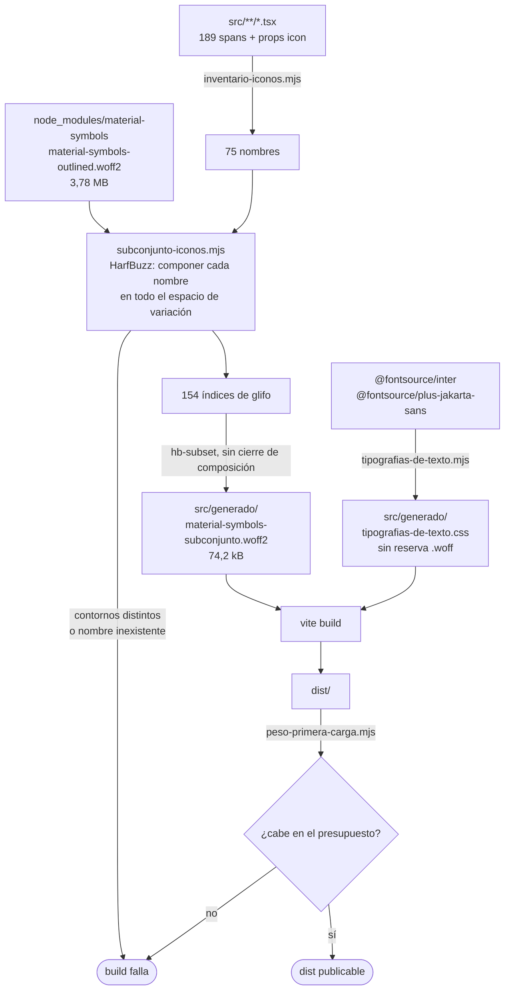

# TDD: MVP-810 — Peso de la primera carga

> **Referencia al spec**: [spec.md](./spec.md)

## Resumen técnico

El `build` genera un **subconjunto** de Material Symbols con los 75 iconos que el producto usa —
descubiertos leyendo el código, no estimados— y lo sirve autoalojado en lugar del catálogo completo.
La primera carga pasa de **4.591,4 kB a 877,9 kB** y `dist/assets` de **5.593,1 kB a 1.224,0 kB**.
Un presupuesto comprobado en cada `build` **rompe la compilación** si el peso vuelve a subir.

## Medida antes y después

Las dos columnas salen del **mismo instrumento** (`scripts/peso-primera-carga.mjs`) sobre el `build`
de producción, en la misma máquina y el mismo día (2026-08-11). Bytes sin comprimir.

| Recurso | Antes | Después | Diferencia |
|---|---:|---:|---:|
| Documento (`index.html`) | 4,4 kB | 4,4 kB | — |
| JavaScript | 591,5 kB | 591,5 kB | — |
| CSS | 74,1 kB | 62,3 kB | −11,8 kB |
| Iconos (Material Symbols) | 3.776,0 kB | 74,2 kB | **−3.701,7 kB (−98,0 %)** |
| Tipografías de texto (`Inter`, `Plus Jakarta Sans`) | 145,4 kB | 145,4 kB | — |
| **PRIMERA CARGA** | **4.591,4 kB** | **877,9 kB** | **−3.713,6 kB (−80,9 %)** |
| Tipografías que el navegador no pide | 1.006,0 kB | 350,5 kB | −655,5 kB |
| **TOTAL `dist/assets`** | **5.593,1 kB** | **1.224,0 kB** | **−4.369,0 kB (−78,1 %)** |
| Copiado de `public/` (fuera del presupuesto) | 231,1 kB | 231,1 kB | — |

Cifras exactas en bytes: primera carga `4.591.425 → 877.868`; `dist/assets`
`5.593.082 → 1.224.033`. Los 5.593,1 kB de partida son los 5,57 MB que registró `P-115` más los
21,5 kB de JavaScript que han añadido las siete historias hermanas de la épica mientras tanto:
medido sobre el mismo `origin/develop` sobre el que se apoya esta rama, no sobre el de la revisión.

**Qué significa «primera carga» aquí**: lo que el navegador descarga antes de que la aplicación sea
utilizable y que produce el `build` — el documento, todo el JavaScript y el CSS (hoy no hay rutas
diferidas: trocear el bundle está fuera de alcance) y las tipografías que **realmente se piden**,
deducidas de los `@font-face` que emite el propio build: la variante `woff2` de cada familia cuyo
`unicode-range` cubra el latín básico, o que no declare rango, que es el caso de los iconos. Lo que
se copia tal cual desde `public/` —favicon, manifest, la fotografía de la portada, la imagen
social— se informa aparte: no lo produce el build ni lo gobierna esta historia.

Una corrección sobre las cifras de `P-115`, para que no se arrastre el error: el punto decía «4,27
MB son tipografías», que es el total de los `.woff2`. Sumando también los `.woff` de reserva, las
tipografías eran **4,93 MB** de los 5,57 MB. La cifra de los iconos (3,78 MB) sí era exacta.

## Inventario de glifos (CA-2)

**75 iconos**, obtenidos escaneando los 189 `<span class="material-symbols-outlined">` del cliente
más las propiedades `icon` que los alimentan. Ninguno estimado: la lista la produce
`scripts/inventario-iconos.mjs` y es la entrada literal del subconjunto.

```text
add                 add_location_alt    agriculture         arrow_forward       auto_awesome
badge               bolt                bug_report          calculate           calendar_today
call_split          cancel              check               check_circle        checklist
chevron_left        chevron_right       close               cloud_off           content_copy
content_cut         delete              eco                 edit                edit_note
error               event_note          expand_more         explore_off         feedback
group               groups              home                info                inventory_2
landscape           lightbulb           link                local_shipping      location_on
lock                lock_open           logout              mail                manage_accounts
map                 menu                merge               monitoring          notifications
open_in_new         park                payments            percent             person
person_add          person_remove       playlist_add        post_add            receipt_long
scale               schedule            search              sell                settings
shopping_bag        swap_horiz          toggle_off          toggle_on           tune
verified_user       visibility          visibility_off      warning             water_drop
```

El subconjunto contiene **154 glifos**: los 75 iconos, sus **53 variantes rellenas** (ver más
abajo) y las 26 letras y el guion bajo con que se escriben los nombres, que son la entrada de la
ligadura.

**Cobertura demostrada, no supuesta.** Para cada uno de los 75 nombres se compara el **contorno**
del glifo entre la fuente completa y el subconjunto, en las dos instancias que declara el CSS
(`FILL 0` y `FILL 1`): 150 comparaciones, todas idénticas. La comprobación está dentro del
generador, así que corre en cada `build` y no es una verificación de una sola vez.

```text
Iconos: 75  Glifos en el subconjunto: 154
  = 75 base + 53 variantes rellenas + 26 letras
Glifos comparados: 75 x 2 variantes = 150
IDENTICOS: sin diferencias
```

## Diagrama de flujo



## Componentes afectados

| Componente | Tipo de cambio | Descripción |
|---|---|---|
| `scripts/inventario-iconos.mjs` | nuevo | Descubre en el código qué iconos usa el producto |
| `scripts/subconjunto-iconos.mjs` | nuevo | Recorta la fuente a esos glifos y verifica que pinta igual |
| `scripts/tipografias-de-texto.mjs` | nuevo | Genera los `@font-face` de texto sin la reserva `.woff` |
| `scripts/peso-primera-carga.mjs` | nuevo | Mide la primera carga y define los umbrales |
| `vite.config.ts` | modificado | Dos plugins: generar antes del build, medir después de escribirlo |
| `src/index.css` | modificado | `@font-face` propio de los iconos; importa la hoja generada |
| `src/test/inventario-iconos.test.ts` | nuevo | Impide que un icono entre por una vía que el inventario no vea |
| `package.json` | modificado | `harfbuzzjs` y `fontverter` como dependencias de desarrollo; script `peso` |
| `.gitignore` | modificado | `src/generado/` no se versiona |

## Diseño detallado

### Modelo de datos

Sin cambios: la historia no toca base de datos ni API.

### API / Contratos

Sin cambios de contrato. El único efecto visible desde fuera es **qué ficheros** sirve el estático:
donde había `material-symbols-outlined-<hash>.woff2` (3,78 MB) hay
`material-symbols-subconjunto-<hash>.woff2` (74,2 kB), y desaparecen los `.woff` de reserva. La CSP
(`font-src 'self'`) no cambia: todo sigue autoalojado, que es lo que exige `RN-042`.

### Lógica: por qué el recorte no es «subsetear por texto»

Los dos obstáculos de este trabajo no son de peso sino de **corrección**, y los dos fallan en
silencio. Quedan escritos aquí y en la cabecera del script porque son la clase de detalle que se
redescubre a base de romper una pantalla.

**1. Material Symbols pinta por ligadura.** El HTML dice `home` y la fuente sustituye ese texto por
el glifo. Si se recorta «por el texto que se usa», HarfBuzz hace el **cierre de las tablas de
composición**: conserva toda ligadura que se pueda formar con las letras retenidas. Y entre 75
nombres se usan 26 letras, es decir, casi el alfabeto — con lo que sobrevive casi el catálogo
entero. **Medido: 2.850 kB**, un recorte del 25 % que no arregla nada. Por eso el cierre va
desactivado y los glifos se piden **uno a uno**.

**2. La variante rellena es otro glifo, no una interpolación.** `.material-symbols-outlined.fill`
pide `FILL 1`, y se usa para el distintivo `eco` de la marca en cinco pantallas (lateral, login,
portada, inicio y alta de temporada). En **53 de los 75** iconos, `FILL 1` no deforma el contorno:
la fuente **sustituye el glifo por otro** mediante `rvrn`, y ese glifo alterno **no tiene punto de
código**. Un subconjunto pedido por puntos de código —que es lo único que ofrecen las envolturas
publicadas de `hb-subset`— lo deja fuera, y el resultado es un `eco` sin rellenar sin que ni el peso
ni la composición lo delaten. Se detectó comparando contornos contra la fuente original, no mirando
la pantalla; esa comparación se quedó dentro del generador precisamente por eso.

La solución a los dos: resolver los glifos **con el mismo motor que usa el navegador**. Se compone
cada nombre con HarfBuzz en **cada instancia del espacio de variación** que la fuente declara —los
extremos, el valor por defecto y el punto medio de los cuatro ejes (`wght`, `FILL`, `GRAD`,
`opsz`)— y se recogen todos los índices de glifo que aparezcan. El barrido se construye desde los
ejes que declara la fuente, no desde una lista escrita a mano, así que una sustitución por variación
nueva entraría sola. Después se recorta por **índice de glifo**, con el cierre desactivado.

Coste: **1,9 s** la primera vez. El resultado se cachea por huella (inventario + fuente de partida),
así que arrancar el servidor de desarrollo no lo paga más de una vez.

### Las tipografías de texto (`Inter`, `Plus Jakarta Sans`)

Aplicado el mismo criterio, el hallazgo es que **de los 4,93 MB de tipografías que se publicaban, la
primera carga solo pedía 145,4 kB**. El resto no se descargaba nunca, por dos motivos distintos, y
solo uno es un defecto:

- **Los alfabetos que el producto no usa** (cirílico, griego, vietnamita, extensiones latinas):
  350,5 kB. No se descargan porque `@fontsource` declara cada uno con su `unicode-range` y el
  navegador solo pide el que necesita. Eso **no** es servir de más: es cobertura que no cuesta
  descargas, y quitarla degradaría en silencio el nombre de un terreno o de un trabajador escrito en
  otro alfabeto. **Se conservan.**
- **La copia `.woff` de reserva**: 655,5 kB que duplican bytes que ya están en `woff2`, para
  navegadores sin soporte de `woff2` — soporte universal desde 2016, en un producto que ya exige
  módulos ES, React 19 y Tailwind 4. Ningún navegador capaz de ejecutar esta aplicación los pide.
  **Se quitan**, y de paso el CSS adelgaza 11,9 kB porque deja de llevar sus URL.

La hoja se **genera** desde los propios ficheros de `@fontsource` en vez de escribirse a mano: así
no hay una copia de los `unicode-range` que pueda quedarse vieja al actualizar el paquete.

Los pesos se comprobaron contra el código: se usan 400, 500, 600, 700 y 800, que son exactamente los
que se importan. No sobra ninguno.

### El presupuesto y su umbral (CA-4)

| Presupuesto | Medido | Umbral | Margen |
|---|---:|---:|---:|
| Primera carga | 877,9 kB | **1.000 kB** | 122,1 kB (13,9 %) |
| Total `dist/assets` | 1.224,0 kB | **1.400 kB** | 176,0 kB (14,4 %) |

**Cómo se eligieron.** El spec dice que fijarlos antes de medir sería inventarse un número, así que
se fijan con la medida delante y con dos criterios enfrentados:

- **Suficiente margen para no ser un trámite.** Un 14 % permite crecer con pantallas nuevas, iconos
  nuevos (unos 900 B cada uno) o una dependencia mediana sin tocar el umbral cada semana.
- **Poco margen frente a lo que de verdad vigila.** La regresión concreta que este presupuesto
  existe para cazar —volver a servir la fuente entera— son 3,70 MB: hace saltar el umbral por un
  factor de cuatro. Cualquier reincidencia de `P-115` se ve en el primer `build`.

Se miden **bytes sin comprimir** a propósito: es la medida pesimista y no depende de que quien sirva
el estático tenga la compresión activada, así que el umbral no cambia de valor por un ajuste de
infraestructura ajeno al código.

Subir un umbral es legítimo cuando el aumento está justificado; lo que el mensaje de error deja
escrito es que hay que **decirlo en el PR**.

### Manejo de errores

Todo lo que puede salir mal rompe el `build` con un mensaje que dice qué hacer, y **nada llega a una
pantalla como hueco en blanco**:

| Situación | Dónde falla | Mensaje |
|---|---|---|
| Un nombre que no existe en la fuente (errata incluida) | `buildStart` | «Estos nombres no son iconos de Material Symbols Outlined: …» |
| Un icono que el subconjunto no pinta igual que el original | `buildStart` | «El subconjunto no pinta igual que la fuente completa en: …» |
| El subconjunto pierde un eje variable | `buildStart` | «El subconjunto ha perdido el eje variable …» |
| Falta `node_modules/material-symbols` | `buildStart` | «¿Falta un `npm ci`…?» |
| El peso se pasa del presupuesto | `writeBundle` | El desglose y cuánto sobra |
| Un `<span>` de iconos que el inventario no sabe leer | `npm test` | La ruta, la línea y cómo escribirlo |

El presupuesto se comprueba en `writeBundle` y no en `closeBundle` por una razón que se descubrió
probando: `closeBundle` **también se ejecuta cuando el build ha fallado**, y entonces medía el
`dist` de la vez anterior y gritaba por un peso viejo, tapando el error de verdad.

## Alternativas descartadas

| Alternativa | Por qué se descartó |
|---|---|
| **SVG en línea aprovechando `public/icons.svg`**, como sugería el spec | La premisa no se sostiene: `public/icons.svg` **no es iconografía del producto**. Son seis marcas de terceros (Bluesky, Discord, GitHub, X y dos genéricas), en color morado `#aa3bff`, heredadas de una plantilla, y **no las referencia ni una línea de código**. No hay nada que aprovechar. Aparte de eso, pasar a SVG obligaría a extraer 128 contornos de la fuente (75 normales y 53 rellenos, porque el relleno es otro glifo), tocar los 189 puntos de uso y reproducir a mano el tamaño y la alineación de línea que hoy da la tipografía: mucho más riesgo de cambiar el aspecto, que es justo lo que `CA-2` prohíbe, a cambio de unos pocos kB frente a los 74,2 del subconjunto |
| **Subsetear «por texto» con una envoltura publicada** (`subset-font`) | Es lo primero que se probó. El cierre de composición retiene casi el catálogo: **2.850 kB**. Y aunque se desactive el cierre, la envoltura solo acepta puntos de código, con lo que se pierden las 53 variantes rellenas. Se sustituyó por una llamada directa a `hb-subset`, que sí admite índices de glifo; la dependencia sobra y se retiró |
| **`pyftsubset` (fonttools)** | Habría servido, pero mete Python y `pip` dentro de `npm run build`. El CI ya tiene Python para la KB, pero atar el build del cliente a otro ecosistema encarece el arranque en local y añade un modo de fallo que no depende del código de la aplicación. `harfbuzzjs` es WebAssembly puro: `npm ci` en Linux basta |
| **Fijar los ejes variables** (`wght` 400, `GRAD` 0, `opsz` 24) para adelgazar más | Ahorraría poco sobre 74,2 kB y convertiría el `@font-face` en una mentira: seguiría anunciando `font-weight: 100 700`. Peor aún, dejaría una trampa —el día que alguien use otro peso, se pintaría en 400 sin avisar—, que es exactamente lo que `CA-5` pide evitar |
| **Versionar el subconjunto en `public/`**, como hace `generar-iconos.mjs` con los recursos de marca | Los recursos de marca cambian una vez al año y no dependen del código; el subconjunto depende de **cada icono que se añada**. Una copia comiteada acabaría diciendo algo distinto de lo que el código usa, y el síntoma sería el hueco en blanco. Se genera en el `build` y no se versiona |
| **Quitar los alfabetos que el producto no usa** (cirílico, griego, vietnamita, latín extendido) | Ahorra 350,5 kB de disco y **cero** descargas: `unicode-range` ya impide que se pidan. A cambio, un nombre escrito en otro alfabeto pasaría a pintarse con la tipografía del sistema. Cambiar el aspecto de algo para ahorrar bytes que nadie descarga es un mal trato |
| **Medir el presupuesto en bytes comprimidos** | Más parecido a lo que viaja por la red, pero depende de la configuración de compresión de quien sirve el estático: el umbral cambiaría de valor sin que cambiara el código |
| **Trocear el JavaScript o diferir rutas** | Fuera de alcance por decisión del spec. Los 570 kB de JS no son el problema medido, y ahora que los iconos no lo tapan, si algún día lo son, el presupuesto lo dirá |

## Riesgos e impacto

| Riesgo | Probabilidad | Mitigación |
|---|---|---|
| Un icono nuevo entra por una vía que el inventario no ve y sale un hueco en blanco | media | El test `inventario-iconos.test.ts` falla con la ruta, la línea y la forma correcta de escribirlo. Documentado en `estandares-codigo.md` |
| Una errata en el nombre de un icono | media | El generador rompe el `build`: un nombre que no compone en un glifo no existe en la fuente. Antes se pintaba el hueco en silencio |
| Actualizar `material-symbols` cambia glifos o ejes | baja | El generador compara contornos contra la fuente nueva y comprueba los cuatro ejes; una divergencia rompe el `build`. La caché se invalida con la huella de la fuente |
| Actualizar `@fontsource` cambia nombres de fichero o rangos | baja | La hoja se genera desde los ficheros del paquete, así que se regenera con lo que traiga. Si un fichero deja de existir, `require.resolve` falla en el `build` |
| El umbral se sube por costumbre en vez de por criterio | media | El mensaje de error lo dice explícitamente, y el umbral vive en un fichero versionado: subirlo aparece en el diff del PR |
| Añadir un icono con el servidor de desarrollo arrancado no se ve hasta reiniciar | baja | Documentado en `desarrollo-local.md`. El fallo es visible (el icono no aparece), no engañoso |

## Plan de testing

- [x] Tests unitarios: `src/test/inventario-iconos.test.ts` — todo `<span>` de iconos declara qué
      glifo pinta, y el inventario no está vacío (una regex rota lo dejaría a cero sin que ningún
      otro caso lo notara).
- [x] Verificación en el `build` (equivale a un test de integración de la cadena completa): los 75
      nombres se recomponen contra el subconjunto y se comparan **contornos** en `FILL 0` y `FILL 1`;
      se comprueba que los cuatro ejes variables sobreviven.
- [x] Guarda de peso: el `build` falla si la primera carga o el total se pasan del presupuesto.
      Comprobado provocando el fallo, no leyendo la regla.
- [x] Regresión de `MVP-599`: `sin-recursos-externos.test.ts` sigue en verde — ningún recurso pasa a
      servirse desde un tercero (`CA-3`).
- [ ] Tests e2e: no aplica. La cobertura E2E de navegador sigue descartada (`P-064`).

Suite completa tras el cambio: **342 tests del cliente en verde** (41 ficheros) y **1.030 del
backend**, que no se toca.

## Checklist de implementación

- [x] Diseño técnico revisado
- [x] Migraciones de base de datos preparadas — no aplica, la historia no toca base de datos
- [x] Tests escritos y pasando
- [x] Documentación de API actualizada — no aplica, no hay cambios de contrato
- [x] Módulo afectado actualizado en `docs/03-modulos/` — el proceso vive en
      `docs/04-ingenieria/estandares-codigo.md` y `docs/05-infraestructura/desarrollo-local.md`,
      que es donde lo va a buscar quien añada un icono
- [x] Sin `TODO` sin resolver en este documento

## Hallazgo lateral, sin acción

`public/icons.svg` (5,0 kB) **no lo referencia nadie**: es un sprite de marcas de terceros heredado
de una plantilla, y el spec de esta historia lo daba por punto de partida para la alternativa de
SVG en línea. No se borra aquí porque retirar recursos muertos no es el alcance de esta historia y
no pesa en la primera carga —nadie lo pide—, pero conviene que conste para que la próxima persona no
vuelva a construir sobre esa premisa.
