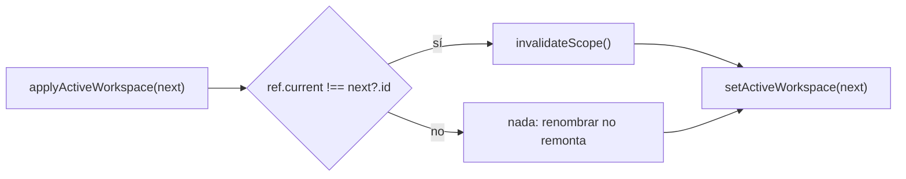

# TDD: MVP-811 — Deuda menor de la revisión

> **Referencia al spec**: [spec.md](./spec.md)

## Resumen técnico

Tres defectos pequeños y sin relación entre sí. Van juntos porque ninguno justifica una historia
propia y los tres se cierran con la misma pasada.

| Punto | Dónde | Qué se hace |
|---|---|---|
| `P-116` | `WorkspaceContext.tsx` | La comparación sale del updater de `setState`, con una prueba que **mira la consola** |
| `P-117` | `Program.cs` (fallback) | El 404 de enrutado devuelve el envoltorio canónico |
| `P-118` | `DeleteAccountPanel.tsx` + `CloseAccountHandler` | El texto concuerda, y para eso hace falta un dato que el cliente no tenía |

Lo que aporta la historia no son los tres arreglos, que son de tres líneas cada uno: es **la prueba de
`P-116`**. Que 256 tests pasaran mientras la consola avisaba en cada carga es el hallazgo real.

## Componentes afectados

| Componente | Tipo de cambio | Descripción |
|---|---|---|
| `frontend/.../contexts/WorkspaceContext.tsx` | modificado | La comparación fuera del updater, con una referencia |
| `frontend/.../contexts/WorkspaceContext.test.tsx` | nuevo | El contexto no tenía cobertura propia |
| `Program.cs` | modificado | El fallback de `/api` escribe `{ error: { code, message } }` |
| `Terrenario.Api.Tests/Integration/TransportValidationTests.cs` | modificado | Los tres bordes, más dos guardas de no-regresión |
| `Application/Account/CloseAccountHandler.cs` | modificado | `SharedMemberships` en la previsualización |
| `Controllers/AccountController.cs` | modificado | `shared_memberships` en la respuesta |
| `frontend/.../settings/DeleteAccountPanel.tsx` | modificado | Texto condicional |
| `docs/02-arquitectura/contratos-api.md` | modificado | «Siempre JSON» incluye el enrutado |

## Diseño detallado

### `P-116` — por qué no vale moverlo a un efecto

El updater de `setState` lo ejecuta React **en fase de render**, así que `invalidateScope()` dentro de
él es un `setState` sobre otro componente durante el render de este.

La corrección obvia sería mover la invalidación a un efecto que mire `activeWorkspace?.id`. **No
vale**: ese efecto también se dispararía en la **primera** resolución —de «no hay» a «este»—, que es
justo lo que `DataScopeContext` explica que no debe remontar nada, porque duplicaría la primera
petición de todas las vistas.

Lo que se hace es sacar la comparación del updater y dejarla contra una referencia que guarda el
Workspace del último render:

La referencia se sincroniza en cada render desde el propio estado, así que también refleja el
`setActiveWorkspace` directo de la carga inicial.

**La prueba es la parte que aporta.** Espía `console.error` y falla si aparece el aviso; comprobada en
rojo sin el arreglo, con el mensaje literal del punto. Y va acompañada de dos más que fijan `CA-2`: el
ámbito **sí** se invalida cuando el Workspace cambia de verdad, y **no** cuando se resincroniza el
mismo. Sin esas dos, «quitar el aviso» se podría conseguir quitando la invalidación.

### `P-117` — el mismo borde que ya cerró `MVP-502`

`contratos-api.md` dice que las respuestas de error son **siempre** JSON. El fallback de `/api`
respondía `404` con el cuerpo vacío y sin `Content-Type`.

En ese fallback caen tres cosas, y las tres se benefician del mismo envoltorio:

| Caso | Ejemplo |
|---|---|
| Ruta inexistente | `GET /api/v1/noexiste` |
| Método no permitido | `DELETE /api/v1/seasons` |
| Parámetro que no cumple su restricción | `GET /api/v1/plots/no-es-un-guid` |

Las tres siguen respondiendo **`404`**. No se introduce un `405` que el contrato no declara: lo que
cambia es que ahora dicen algo.

Dos guardas de no-regresión, porque «que todo error sea JSON» se puede aplicar de más:

- Los **404 de dominio** siguen respondiendo su código y su mensaje concretos, que son los que sirven
  para algo.
- Las rutas del **cliente** (`/app/diario`) siguen sin recibir el envoltorio: no son API, y aplicárselo
  rompería la recarga de cualquier pantalla.

### `P-118` — el dato que faltaba

El adjetivo era fijo: `Sales de {n} Workspace(s) **compartidos**`. Con uno solo salía «Sales de 1
Workspace compartidos», y quien era la única persona de su Workspace leía que lo compartía mientras la
misma pantalla le decía más arriba «eres la única persona en este Workspace».

Arreglar solo la concordancia no bastaba: **el cliente no sabe si comparte**. La lista de membresías no
dice cuánta gente hay en cada Workspace, así que la pantalla lo estaba afirmando sin dato. Se añade
`shared_memberships` a la previsualización de baja, contado con `CountActiveMembersAsync`, que ya
existía.

Con el dato, el texto expresa los tres casos que antes no podía:

| Situación | Texto |
|---|---|
| 1 Workspace, con más gente | «Sales de 1 Workspace **compartido**» |
| 1 Workspace, en solitario | «Sales de 1 Workspace» |
| 3 Workspaces, 2 compartidos | «Sales de 3 Workspaces, **2 de ellos compartidos**» |

Son N consultas para N membresías. A la escala del producto —una persona tiene unos pocos Workspaces—
no compensa una consulta agrupada; se anota por si algún día lo fuera.

## Alternativas descartadas

| Alternativa | Por qué se descartó |
|---|---|
| Mover `invalidateScope()` a un efecto sobre `activeWorkspace?.id` | Se dispararía también en la primera resolución, duplicando la primera petición de todas las vistas |
| Quitar la comparación y invalidar siempre | Renombrar un Workspace remontaría el área operativa entera para nada |
| Responder `405` al método no permitido | El contrato no declara `405`; el cambio pedido es el envoltorio, no el código |
| Aplicar el envoltorio a todo el fallback | Las rutas del cliente dejarían de servir el SPA |
| Arreglar solo la concordancia en número | Seguiría diciendo «compartido» de un Workspace en el que la persona está sola: el cliente no tiene el dato |

## Riesgos e impacto

| Riesgo | Probabilidad | Mitigación |
|---|---|---|
| Al quitar el aviso se pierde la invalidación de `P-081` | media | Dos tests que fijan `CA-2`: invalida al cambiar, no invalida al resincronizar |
| El envoltorio nuevo tapa un 404 de dominio | baja | Test de no-regresión con `PATCH /seasons/{desconocido}` |
| El fallback deja de servir el SPA | baja | Test que comprueba que `/app/diario` no recibe JSON de error |
| La cuenta de compartidos añade N consultas | baja | Una persona tiene pocos Workspaces; anotado por si cambia |

## Plan de testing

- [x] Tests de contexto (3, nuevos): la consola no avisa al cambiar de Workspace —**comprobado en
  rojo** sin el arreglo—, el ámbito se invalida al cambiar y no al resincronizar
- [x] Tests de integración (4): los tres bordes de enrutado con el envoltorio y su `Content-Type`, más
  las dos guardas de no-regresión
- [x] Tests de componente (3, nuevos): los tres casos del texto de salida
- [x] Verificación contra la API real de los tres bordes de `P-117` antes y después

## Nota sobre el alcance

La tabla de la épica asigna a esta historia «la nota de entorno de `P-069`». La entrega **`MVP-809`**,
cuyo propio alcance la incluye (`CA-6`) y que la escribe junto a la revisión de los requisitos. Se hace
constar aquí para que no parezca un olvido.

## Checklist de implementación

- [x] Diseño técnico revisado
- [x] Migraciones de base de datos preparadas — no aplica
- [x] Tests escritos y pasando
- [x] Documentación de API actualizada — el contrato de error y `shared_memberships`
- [x] Módulo afectado actualizado en `docs/03-modulos/` — no hay regla nueva: son tres defectos
- [x] Sin `TODO` sin resolver en este documento
