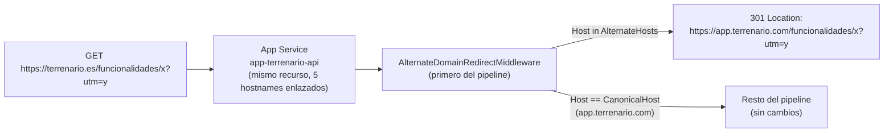

# TDD: PLT-101 — Redirección 301 de dominios alternativos a app.terrenario.com

> **Referencia al spec**: [spec.md](./spec.md)

## Resumen técnico

Mismo App Service que ya sirve `app.terrenario.com` (decisión de origen único,
`publicacion-inicial-en-azure.md`): se le enlazan cuatro hostnames más
(`terrenario.com`, `www.terrenario.com`, `terrenario.es`, `www.terrenario.es`) y un middleware nuevo,
el primero del pipeline, redirige con `301` cualquier petición cuyo `Host` sea uno de esos cuatro al
dominio canónico, conservando ruta y query string. No hay contenido nuevo que servir ni recurso de
Azure nuevo que crear: es un enlace de dominio más sobre el recurso existente.

## Diagrama de arquitectura / flujo



## Componentes afectados

| Componente | Tipo de cambio | Descripción |
| ---------- | -------------- | ------------ |
| `Common/Http/DomainRedirectOptions.cs` | nuevo | `CanonicalHost` y `AlternateHosts`, vacío por defecto |
| `Common/Http/AlternateDomainRedirectMiddleware.cs` | nuevo | Redirige `301` por `Host`, antes de cualquier otro middleware |
| `Program.cs` | modificado | Registro de `DomainRedirectOptions` y del middleware como el primero del pipeline |
| `appsettings.json` | modificado | `Domains:CanonicalHost` y `Domains:AlternateHosts` con los cuatro dominios reales |
| `appsettings.Development.json` | modificado | `Domains:AlternateHosts: []` — sin redirección en desarrollo |
| `infra/azure/crear-infraestructura.sh` | modificado | Imprime también los registros DNS (`A`/`ALIAS` para el apex, `CNAME` para `www`) de los dominios de redirección |
| `infra/azure/enlazar-dominios.sh` | modificado | Generaliza el enlace + certificado gestionado a los cinco hostnames (refactor a función reutilizable) |
| `docs/05-infraestructura/runbooks/publicacion-inicial-en-azure.md` | modificado | Registros DNS de los cuatro dominios de redirección |
| `docs/05-infraestructura/entornos.md` | modificado | Variables `Domains__CanonicalHost` y `Domains__AlternateHosts` |

## Diseño detallado

### Modelo de datos

Ninguno.

### API / Contratos

Ningún endpoint nuevo. El comportamiento observable es a nivel de transporte HTTP:

```text
GET https://terrenario.com/cualquier-ruta?query=x
  -> 301 Moved Permanently
     Location: https://app.terrenario.com/cualquier-ruta?query=x
```

Igual para `www.terrenario.com`, `terrenario.es` y `www.terrenario.es`. Cualquier petición a
`app.terrenario.com` sigue el pipeline de siempre, sin ningún cambio.

### Lógica de negocio

- `AlternateDomainRedirectMiddleware` va **el primero de todo el pipeline**, antes incluso de
  `RequestIdMiddleware`: un dominio que no es el canónico no necesita traza, métricas ni CORS
  propios, solo la redirección. Ponerlo después habría contado esas peticiones en `api.requests` sin
  que fueran tráfico real de la API.
- Comparación de `Host` **sin puerto** (se recorta antes de comparar) y **sin distinguir
  mayúsculas/minúsculas** (`StringComparer.OrdinalIgnoreCase`), igual criterio que el resto de
  comparaciones de host en el proyecto (`ReferrerClassifier`, `MKT-106`).
- Con `Domains:AlternateHosts` vacío (el caso de desarrollo y de cualquier entorno que no sirva detrás
  de esos dominios), el middleware no hace nada y sigue el pipeline: el comportamiento por defecto es
  no redirigir.
- El destino se construye siempre con `https://`, independientemente del esquema de la petición
  entrante: un salto único desde HTTP en el dominio alternativo hasta HTTPS en el canónico, en vez de
  dos saltos (HTTP→HTTPS del alternativo, luego alternativo→canónico).

### Infraestructura (Azure)

Mismo recurso `app-terrenario-api`, cinco hostnames enlazados en vez de uno. Lo único que cambia según
el hostname es el **registro DNS** que hay que crear, no el comando de Azure:

| Hostname | Registro DNS | Motivo |
| -------- | ------------ | ------ |
| `app.terrenario.com` (sin cambios) | `CNAME` | Subdominio, ya montado |
| `www.terrenario.com`, `www.terrenario.es` | `CNAME` | Subdominio, mismo caso que `app` |
| `terrenario.com`, `terrenario.es` (apex) | `A` (o `ALIAS`/`ANAME`) | Un dominio raíz no admite `CNAME`; se apunta a la IP de entrada del App Service |

Cada hostname lleva además su propio `asuid.*` (`TXT`) para la verificación de propiedad y su propio
certificado gestionado (gratuito, autorrenovable) — son recursos independientes en Azure aunque
compartan App Service.

## Alternativas descartadas

| Alternativa | Por qué se descartó |
| ----------- | -------------------- |
| Redirección a nivel de DNS (registro `URL redirect` de algunos proveedores) | Depende de que el proveedor de DNS lo soporte y de mantener la configuración fuera del código versionado; el middleware queda en el mismo sitio que el resto de la lógica de la plataforma y se prueba con los mismos tests |
| Web.config / `URL Rewrite` de IIS | El App Service Plan Linux (`publicacion-inicial-en-azure.md`) no ejecuta IIS |
| Azure Front Door / Application Gateway delante del App Service | Añade un recurso de pago y una capa nueva de operación para un caso de uso —cuatro redirecciones fijas— que un middleware de una decena de líneas resuelve sin dependencias nuevas |

## Riesgos e impacto

| Riesgo | Probabilidad | Mitigación |
| ------ | ------------ | ---------- |
| El certificado gestionado del dominio raíz tarda más en emitirse que el de un subdominio | media | Mismo mecanismo de espera con reintentos que ya usa `enlazar-dominios.sh` para `app.$DOMINIO` |
| `terrenario.es` no resuelve todavía cuando se ejecuta `enlazar-dominios.sh` | baja | El script comprueba el DNS de los cinco hostnames antes de tocar nada y se detiene si alguno no propagó |
| Un despliegue nuevo olvida configurar `Domains:AlternateHosts` | baja | Por defecto vacío: el middleware no hace nada, no falla de forma insegura (no redirige a un dominio no configurado) |

## Plan de testing

- [x] Tests unitarios: `AlternateDomainRedirectMiddlewareTests` (redirige los cuatro dominios y su
  variante en mayúsculas, mantiene ruta y query, ignora el puerto, no toca `app.terrenario.com`, no
  hace nada sin `AlternateHosts` configurado)
- [ ] Tests de integración: no aplica (el middleware no depende de servicios de la API; cubierto por
  el test unitario contra `HttpContext`)
- [ ] Verificación manual: tras ejecutar `enlazar-dominios.sh` en producción, comprobar con `curl -I`
  que los cuatro dominios responden `301` con el `Location` esperado

## Checklist de implementación

- [x] Diseño técnico revisado y aprobado
- [x] Migraciones de base de datos preparadas — no aplica
- [x] Tests escritos y pasando
- [x] Documentación de API actualizada — no aplica (no hay endpoint nuevo); contrato HTTP documentado arriba
- [x] Módulo afectado actualizado — `docs/03-modulos/plataforma-de-aplicacion/README.md`
- [x] Sin `TODO` sin resolver en este documento
